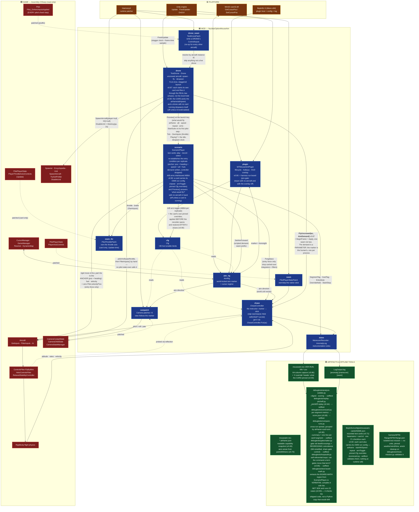
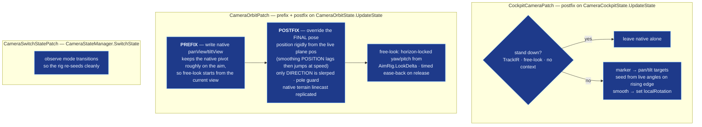
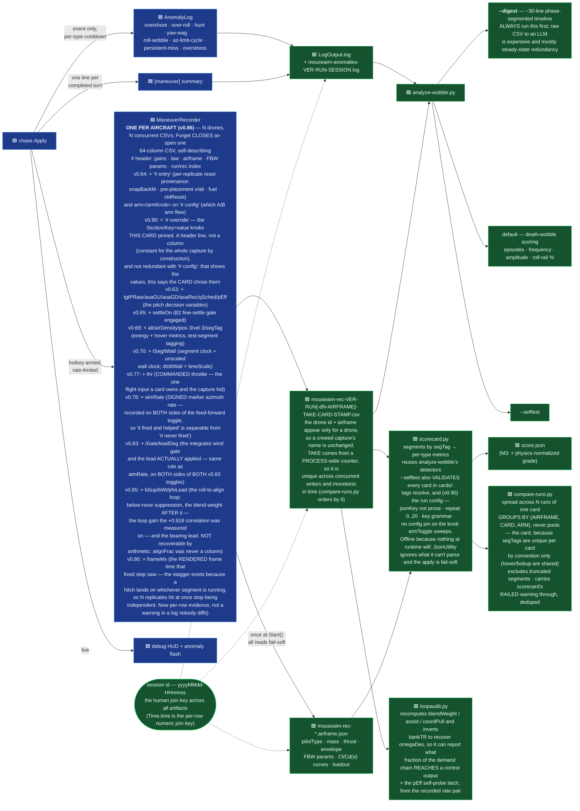
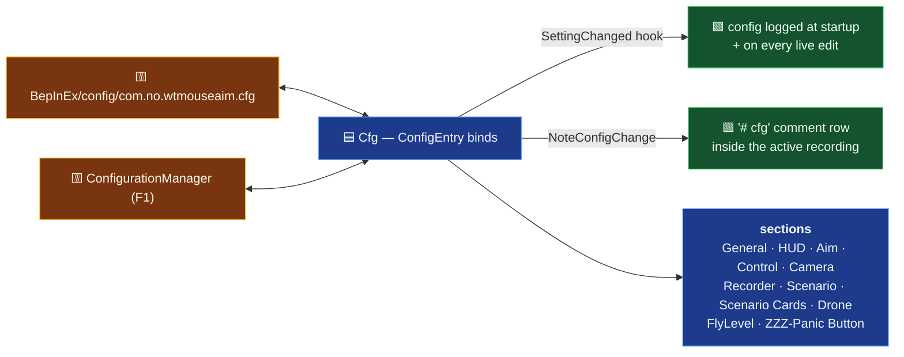

# Architecture — WT Mouse Aim

<!-- ARCH-VERSION: 0.90.0 -->

The system diagram for this mod. **L0** is the at-a-glance map; **L1** sections zoom into each box.
Every box carries a stable node id (`aim_rig`, `chase_apply`, …) — the [Node index](#node-index) maps
each id to the file and type that implements it, and that table is what keeps the diagram honest.

> **Agents: this file is part of the code.** When you change structure, add a subsystem, move a stage
> in the `Apply` pipeline, or add/remove a Harmony patch, update the matching L1 diagram and the node
> index in the *same* change. See [Keeping this current](#keeping-this-current).

**Colour convention, used in every diagram on this page:**

| | meaning |
|---|---|
| 🟦 **blue** | **Mod** — code in this repo |
| 🟥 **red** | **Game** — Nuclear Option `Assembly-CSharp` (read-only; we patch or read it) |
| 🟨 **amber** | **Platform** — Unity, BepInEx, Harmony, Win32 |
| 🟩 **green** | **Artifacts & offline tools** — logs, CSVs, the Python analyser |

---

## L0 — System map



**The one-sentence version:** the mouse moves a **world-locked point** in front of the aircraft
(`aim_rig`); an autopilot-like "instructor" (`chase`) computes the stick deflections that fly the
nose onto that point; a Harmony patch (`seam`) writes those deflections instead of the game's native
mouse-joystick input; the camera looks where the marker is (`campatch`); and everything the
instructor does is instrumented (`telem`) so misbehaviour is diagnosable offline rather than guessed at.

---

## L1.1 — Frame timeline (who runs when)

The single most load-bearing fact about this mod: **aiming and flying run on different clocks.**
The marker moves on the render frame (`Update`), the stick is written on the physics tick
(`FixedUpdate`), and the HUD draws in `OnGUI`.

```mermaid
flowchart TB
    subgraph U["🟨 Update — once per rendered frame"]
        direction TB
        u1["plugin.Update<br/>hotkeys: master toggle · fly-level · record<br/>cards: run · record · abort · on-condition"]
        u2["aim_rig.Update<br/>1. pick cursor regime<br/>2. read raw Win32 mouse delta<br/>3. rotate world aim vector<br/>4. clamp into MaxAimAngle cone<br/>STEP 2-3 SKIPPED while a card plays —<br/>mouse and card would otherwise SUM"]
        u3["🟥 PilotPlayerState.PlayerThrottleAxis1Controls"]
        u4["🟦 seam_thr PREFIX<br/>card running? write ci.throttle + skip native,<br/>so the pilot's lever never reaches ControlInputs.<br/>Must be HERE, not only on the fixed step:<br/>🟥 Airbrake.Update opens the boards on<br/>throttle == 0 every rendered frame"]
        u1 --> u2 --> u3 --> u4
    end

    subgraph F["🟨 FixedUpdate — physics tick"]
        direction TB
        f0["🟦 plugin.FixedUpdate → drone.FixedTick<br/>launch stagger countdown · prune dead drones ·<br/>sample Time.unscaledDeltaTime (FrameDt).<br/>The mod's only fixed-step hook that exists<br/>with no aircraft — everything else below hangs<br/>off a pilot that may not be there yet"]
        f1["🟥 PilotPlayerState.PlayerAxisControls"]
        f2["🟦 seam PREFIX → scenario.Tick → chase.BeginFrame<br/>Tick advances the card clock + writes the scripted<br/>demand FIRST, so Apply's read below is same-tick<br/>then: decide ownership; return false to SKIP native<br/>(cockpit only — orbit needs native's view axes)"]
        f3["🟥 native body — runs only if not skipped"]
        f4["🟦 seam POSTFIX → chase.Apply<br/>always runs; writes ci.pitch/roll/yaw"]
        f5["🟥 Aircraft.FilterInputs<br/>RelaxedStabilityController → FBW → surfaces"]
        f6["🟥 JobManager.FixedUpdateEarly<br/>ScheduleJobs() FIRST, then PilotAeroInputs()"]
        f7["🟥 Pilot.Pilot_OnAeroInputsApplied — every pilot"]
        f8["🟦 drone_seam POSTFIX — live drone only<br/>1. first step? scenario.StartSuite (its own card)<br/>2. scenario.Tick → this drone's AimDemand<br/>3. Drone.Fly → <b>chase.FlyUncrewed(ac, demand)</b><br/>&nbsp;&nbsp;&nbsp;(= BeginFrame + Apply; level-hold if no card)<br/>4. scenario.OwnInputs → throttle/brake<br/>5. Aircraft.FilterInputs OURSELVES — an uncrewed<br/>aircraft has no pilot state, and FilterInputs is<br/>only ever called FROM one, so the FBW would<br/>otherwise never run on it.<br/>Same ORDER as the player's f2..f5, one seam<br/>instead of two"]
        f9["🟥 Rigidbody integration"]
        f1 --> f2 --> f3 --> f4 --> f5 --> f6 --> f7 --> f8 --> f9
        f0 --> f1
    end

    subgraph L["🟨 Camera state update"]
        l1["🟥 CameraCockpitState / CameraOrbitState .UpdateState"]
        l2["🟦 campatch prefix/postfix<br/>override view toward the marker"]
        l1 --> l2
    end

    subgraph G["🟨 OnGUI — IMGUI draw"]
        g1["plugin.OnGUI<br/>PRE-GATE (no aircraft needed, ignores ShowOverlay):<br/>REC badge · notices · card indicator ·<br/><b>harness run board</b> (v0.90)<br/>THEN gated on ShowOverlay + a local aircraft:<br/>reticle · cone ring · boresight<br/>toasts · G-LOC fade · debug HUD"]
    end

    U --> F --> L --> G
    F -.->|"attitude feeds back next tick"| F

    classDef mod fill:#1e3a8a,stroke:#60a5fa,color:#eff6ff
    classDef game fill:#7f1d1d,stroke:#f87171,color:#fef2f2
    class u1,u2,f0,f2,f4,f8,l2,g1 mod
    class f1,f3,f5,f6,f7,f9,l1 game
```



**Why the prefix is conditional.** Returning `false` from the prefix skips the native body — which is
what stops the game's own mouse virtual-joystick from fighting us for the stick. But that same native
body also processes *view* axes, so skipping it in third-person killed free-look. Hence:
**skip native only in the cockpit**; in orbit let it run and simply overwrite the flight controls in
the postfix. Harmony runs postfixes even when a prefix skipped the original, so `Apply` always lands.

---

## L1.2 — `aim_rig`: the world-locked marker

The marker is **not** a joystick. It is a direction in *world space*. You place it; the aircraft flies
its nose onto it; the offset eases to zero on arrival. Nothing in the rig ever snaps it back to the
nose — the only two things that move it are the mouse nudge and the cone clamp.


**Why Win32 instead of Unity's mouse axis.** Unity's legacy `Mouse X/Y` is focus-gated — it stays dead
until the window receives a focus event (an alt-tab), so aiming was broken on a fresh launch. Reading
the OS cursor gives a true hardware delta from frame 1. The recentre-each-frame trick also means big
sweeps never clamp at the desktop edge. `lockState = None` during capture is essential: `Locked` would
let Unity warp the cursor too and zero our own delta.

**Writers of the aim vector** (there are only three, deliberately): the mouse nudge above; the cone
clamp; and `SetAimForward`, which the chase calls during manual flight so that releasing the stick
leaves the instructor holding the heading you ended on.

---

## L1.3 — `chase`: the instructor (the heart of the mod)

`ChaseController.Apply` is one pipeline per physics tick: measure → estimate regime → probe what the
airframe can do → pick a control law → condition the output → hand off to manual if the pilot is on
the stick → instrument.

**One controller per aircraft (v0.82).** Everything the pipeline below carries between ticks —
integrators, low-pass filters, the anomaly ring buffer, the probe caches, the phase/maneuver
trackers — is *per-aircraft state*, so `ChaseController` is an ordinary instance class and you get
one with **`ChaseController.For(aircraft)`** (keyed by `Aircraft.GetInstanceID()`, the same key the
drone harness uses). Never construct one directly: a second instance for the same aircraft is a
silently-reset integrator. `Forget(ac)` drops one, and `For` sweeps out controllers whose aircraft
Unity has destroyed — on the dictionary-**miss** path only, which runs once per aircraft rather than
once per fixed step. Two things stay `static` on purpose and say so at their declarations: the
Rewired player-0 cache (one input device per process) and the anomaly stream's index/flash fields
plus the trail-dump throttle (one log stream per process). Because `OnGUI` has no aircraft in hand,
`BeginFrame` publishes itself as **`ChaseController.Player`** when — and only when — its aircraft is
the one `GameManager.GetLocalAircraft` calls local, and the HUD reads that; a drone can never satisfy
that test, so the overlay cannot end up showing a drone's numbers.

**Crewed and uncrewed run the same law (v0.87).** `Apply` was written for the local player and reached
for exactly **three** things that are one-per-*process* and all of them the human's: the `AimRig`
marker, the Rewired player-0 stick, and the `FlightHud` virtual-joystick crosshair. Nothing else in
the pipeline is player-scoped. So:

- the **aim direction is now a parameter**. `Apply(ac)` is a one-line wrapper that passes
  `AimRig.AimForward`; `Apply(ac, aimTarget)` is the real body. A drone passes its own
  `ScenarioPlayer.For(ac).AimDemand`. No global sits between N aircraft and N demands.
- the **stick and the crosshair are gated on `_uncrewed`**, a per-instance bool whose only writer is
  `FlyUncrewed`. Without that gate a drone would be flown by whatever the human's stick was doing,
  and `ManualReorients` would drag *his* marker onto the *drone's* nose.
- **`FlyUncrewed(ac, aimDir)`** = `BeginFrame` + `Apply`, in that order, in one call — because a drone
  has one seam (`drone_seam`) where the player has two (prefix + postfix). It returns false, having
  written nothing, when `BeginFrame` declines; it deliberately does **not** run the disengage ramp,
  which exists to hand back to a native stick an uncrewed aircraft does not have. `pilotStrength` is
  passed as 1: G-LOC is a property of the human in the seat.

The crewed path cannot reach any of it, and that is structural rather than argued: the only writer of
`_uncrewed` is `FlyUncrewed`, whose only caller is `TestDrone`, whose dictionary an aircraft can only
enter through `Spawn`, which asserts `ac.Player == null`. `check-architecture.py` enforces the two
link conditions (one writer, one calling file) because neither fails to compile.

```mermaid
flowchart TB
    subgraph MEAS["1 · MEASURE"]
        m1["aimDir = marker, or the latched<br/>heading when Fly Level is active<br/>(flown as TRUE level: pitched up by live AoA<br/>so the velocity vector, not the nose, sits level)"]
        m2["body-frame marker: local = InverseTransformDirection<br/>x=right y=up z=fwd · off = angle(nose, aim)<br/>phi = bearing around the boresight · alignFrac = belowness<br/>v0.85: + alignFracH — the SAME belowness in a<br/>HORIZON-referenced frame around the nose (axes from<br/>t.forward alone, so roll cannot move it). alignFrac is<br/>body-frame: at 90° bank a straight-down target reads<br/>abeam, so rolling erased the reason not to roll"]
        m3["nose rates from Δforward/Δup per tick<br/>pitchRate · yawRate · rollRate · noseTurnDeg"]
        m1 --> m2 --> m3
    end

    subgraph EST["2 · ESTIMATE REGIME"]
        e1["bigTurn blend — continuous ramp<br/>fine direct-nudge ↔ bank-and-pull"]
        e2["azErr — world azimuth error<br/>+ vertical deprojection (v0.58)"]
        e3["heading-rate LPF (v0.51)<br/>nose-only, so lead can't fight a mouse flick<br/>v0.78: + MARKER azimuth-rate LPF, signed,<br/>same tau (one shared const) — the demand rate,<br/>Atan2/DeltaAngle so the ±180° wrap is a no-op<br/>v0.85: + BEARING-rate LPF (d phi/dt), same tau —<br/>the align channel's own derivative. TOTAL rate<br/>(roll + pitch/yaw closure + marker motion), so the<br/>lead tracks a sweeping marker instead of braking it.<br/>Dropped + invalidated under the atan2 conditioning<br/>floor, where phi is junk"]
        e4["yaw-weakness estimate (v0.35)<br/>is the rudder actually CLOSING the error?"]
        e5["hover blend heliBlend (v0.43)<br/>fwd airspeed + AutoHover + tilt angle"]
        e1 --> e2 --> e3 --> e4 --> e5
    end

    subgraph PROBE["3 · PROBE THE AIRFRAME (reflection, all fail-soft)"]
        p1["<b>FBW probe</b> v0.55<br/>ControlsFilter.FlyByWire<br/>cornerSpeed · maxPitchAngularVel<br/>gLimit · alphaLimit"]
        p2["<b>canard probe</b> v0.57<br/>RelaxedStabilityController<br/>KR-67 Ifrit only"]
        p3["<b>helo probe</b> v0.58<br/>private heloFlyByWire + TiltWing /<br/>SwivelDuct / Compound archetypes"]
    end

    subgraph LAW["4 · CONTROL LAW (one law — EvolvedLegacy; Unified removed v0.65)"]
        l1["<b>ApplyEvolvedLegacy</b> ← the only law<br/>speed-aware bank target · slew limit<br/>v0.64: pErrTerm scaled by measured _pitchEff,<br/>reversal-gated floor v0.65 C1, latch-fixed v0.67<br/>(fixed-wing only — rotorcraft untouched)<br/>q + AoA demand schedules · helo rate normalisation<br/>(forced for all rotorcraft)<br/>v0.65 B2: sub-0.5° fine-settle micro-bank; v0.67:<br/>turn demand RAMPS in over [0.5°,2°] (no gate-exit step)<br/>v0.67: down-hemisphere roll-to-align suppressed →<br/>bounded pushover closes below-targets (no 90° hang)<br/><b>v0.85: that suppressor was itself a feedback path</b> —<br/>keyed on BODY-frame belowness (so roll erased it) and<br/>multiplied by (1−lateralHold), i.e. gated on the azimuth<br/>error roll-to-align itself generates: 51% of the intended<br/>suppression removed, corr(|azErr|,blendWeight) = +0.918,<br/>elDn 6.92° standing error at ±43° bank vs elUp 0.03°.<br/>Now keyed on alignFracH and the (1−lateralHold) factor<br/>is DELETED — belowness is already a continuous taper<br/>and bigTurn already returns roll-and-pull for big<br/>reorientations. Gated by Cfg.BelowAlignSuppress.<br/><b>v0.85: eAlign gets a rate lead</b> — phi + RollDamping ×<br/>measured d phi/dt before the /90 map (was pure P against<br/>a plant with roll inertia). Stands down in the ±180 wrap<br/>region, where the anti-relay slew owns the dynamics.<br/>Gated by Cfg.AlignRateLead"]
    end

    subgraph COND["5 · CONDITION"]
        c1["anticipatory lead → brake-only clamp<br/>→ proportional floor → settle-exit ramp<br/>→ <b>marker-rate feed-forward (v0.78)</b><br/>→ achievability cap<br/>(v0.67: cap also folds the LIVE alpha margin,<br/>not just gLimit — turn demand ≤ what the wing<br/>can pull at this AoA)<br/>v0.78 order is load-bearing: the feed-forward is<br/>added BEFORE the cap, so the probed omegaMax<br/>bounds it too and yawCapped sees the TOTAL demand.<br/>Both lockstep omega sites do it identically.<br/><b>v0.83: the lead leads on the RELATIVE rate</b><br/>(headingRateFilt − aimAzRateFilt) — d(azErr)/dt is<br/>markerRate − noseRate, so the absolute form was the<br/>true derivative ONLY against a stationary marker;<br/>tracking a sweep it braked the tracking rotation and<br/>cancelled 60% of the v0.78 feed-forward.<br/>predFloor STAYS (it guards the v0.54 rectifier,<br/>which lives in the stationary-marker regime) —<br/>it just stops binding in a matched turn"]
        c2["<b>AoA envelope</b> — ceiling gates (v0.55)<br/>predictive lead; cut only the command<br/>driving AoA OUTWARD"]
        c2b["<b>AoA-utilization demand schedule</b> (v0.59)<br/>live AoA vs this airframe's PROBED ceiling,<br/>folded into qSched. Fast-attack / slow-release<br/>so demand can't snap hot again as AoA falls<br/>back through the ceiling — the loaded-jet fix"]
        c2c["<b>AoA recovery bias</b> (v0.59, damped v0.62)<br/>restoring pitch ∝ predicted excess past either<br/>ceiling. Continuous + symmetric, exactly zero<br/>inside the envelope — the gates only CUT,<br/>so past the ceiling nothing flew it back in.<br/>v0.62: uses the TWO-SIDED predicted AoA<br/>(AoA + rate·lead), NOT the gates' one-sided<br/>preds — the lead is its damping term, so it<br/>fades as recovery develops instead of holding<br/>to the crossing (that was the +43→-47 bang-bang)"]
        c2d["fine-capture boost, gated by that schedule<br/>(NOT by speed — a slow LIGHT jet keeps its feel;<br/>only genuine near-ceiling AoA softens it)"]
        c3["fine leaky integrator (v0.24)<br/>FBW is a RATE law, so P alone parks short<br/><b>v0.83: gated on PERSISTENCE, not magnitude</b><br/>gate = max(fineBlend, stall), stall = the DIMENSIONLESS<br/>fraction of the nose's own rotation NOT closing the<br/>error, held through a slow-attack/fast-release filter.<br/>fineBlend alone was identically 0 at off &gt; FineAngle —<br/>the anti-residual term, off because a residual existed.<br/>The persistence filter IS the anti-windup; yawCapped<br/>suppresses the new path only"]
        c4["invert canard remap (v0.57)<br/>so the game delivers the pitch we meant"]
        c5["output slew limit"]
        c1 --> c2 --> c2b --> c2c --> c2d --> c3 --> c4 --> c5
    end

    subgraph MAN["6 · MANUAL HANDOFF"]
        h1{"ManualHandoffTime > 0 ?"}
        h1 -->|yes| h2["<b>global hard handoff</b> v0.49<br/>any axis past deadzone → instructor fully OFF<br/>on all axes; re-engages after a hold timer<br/>(shorter while aiming, longer while free-looking)"]
        h1 -->|no| h3["<b>per-axis blend</b> v0.05–v0.48<br/>touch an axis → own that axis instantly<br/>ease back over ManualReturnTime"]
        h2 --> h4["while manual: SetAimForward drags the<br/>marker onto the nose, so release holds<br/>the heading you ended on"]
    end

    subgraph WRITE["7 · WRITE + INSTRUMENT"]
        w1["ci.pitch / ci.roll / ci.yaw<br/>(nose-up = NEGATIVE pitch)"]
        w2["ClassifyPhase → LEVEL/FINE/ALIGN/PULL/TURN/HOLD"]
        w3["DetectAnomalies — 8 detectors<br/>+ 64-frame ring buffer trail dump"]
        w4["TrackManeuver — one summary per turn"]
        w5["ManeuverRecorder.Sample"]
        w1 --> w2 --> w3 --> w4 --> w5
    end

    MEAS --> EST --> PROBE --> LAW --> COND --> MAN --> WRITE

    classDef mod fill:#1e3a8a,stroke:#60a5fa,color:#eff6ff
    class m1,m2,m3,e1,e2,e3,e4,e5,p1,p2,p3,l1,c1,c2,c2b,c2c,c2d,c3,c4,c5,h1,h2,h3,h4,w1,w2,w3,w4,w5 mod
```



### Why the probes exist

The mod does not model the aircraft — it **asks the game** what the aircraft can do, then commands only
that. The game's FBW reads pitch/yaw as a commanded **angular rate**, and that rate authority collapses
below corner speed; commanding more than the airframe can deliver is what produced the low-speed
oscillation and windup. Three airframe families need three different questions:

| probe | reads | fixes |
|---|---|---|
| **FBW** (v0.55) | `ControlsFilter.FlyByWire` public params + private `gLimit`/`alphaLimit` trio via `AccessTools` field refs | achievability cap + AoA ceiling |
| **canard** (v0.57) | `RelaxedStabilityController.canardRange` | KR-67 Ifrit's ~5.3 Hz fine-aim limit cycle — the game *replaces* pitch with a quadratic, locally-reversed remap before the FBW sees it, so the mod pre-inverts it |
| **helo** (v0.58) | private nested `heloFlyByWire` via `Traverse` + tilt/nozzle archetype components | rotorcraft rate normalisation; tilt angle drives the hover regime |

**Every probe fails soft.** A missing component, a disabled FBW, or a renamed field after a game update
leaves the probe not-ok and the previous version's behaviour exactly intact. That contract is
non-negotiable for new probes — reflection against game internals is the one part of this mod that a
patch can silently break.

**The FBW rate pair also feeds a measured signal (v0.60).** Beyond the static probe params, `Apply`
reads the FBW's *live* commanded-vs-achieved pitch rate (`GetTargetPitchAngVel` / `GetPitchAngVel` —
the same pair the recorder logs) and low-passes the **signed** ratio into `_pitchEff`, the pitch twin
of `_yawWeak`: fast-attack / slow-release so load, mush, density and damage all show up generically as
achieved &lt; commanded. **v0.64: the ratio is signed, not magnitude-only.** Through v0.63 both sides
were `Abs`'d, which blinded it to a REVERSED plant — the FS-12 departure case, where the airframe
pitches opposite the command at ~3x magnitude and the old estimator read a confident `1.00`. `Clamp01`
now floors a reversed plant to `0`. The noise gate stays on magnitude (gating on the signed command
would skip every nose-down frame). `ApplyEvolvedLegacy` (the only law) consumes it — it scales
`pErrTerm` by an `effFloor`-floored factor (fixed-wing only; the estimator is not measured for
`_collective`, so rotorcraft are untouched). **v0.65 C1: the floor is reversal-gated** — below a
`revThresh` (0.15) the floor is dropped and demand collapses to the measured near-0 value, so on a
reversed plant (`_pitchEff ≈ 0`) the law stops forcing 30% pitch into a plant moving the opposite way
(the sustained rec04/rec05 relay). Healthy and genuine low-q mush cases are byte-identical to v0.64.
**v0.67: the C1 floor could latch.** A gated-out command (`|cmd| < 0.05`, e.g. after C1 collapsed the
pitch to ~0) carries no information, and pure-holding `_pitchEff` there pinned a *transient* low-q mush
at ~0 forever — C1 kept pitch ×0, so the stick stayed ~0, so `cmd` stayed dead and it could never
re-measure (rec14 froze the pull ~4 s at railed bank). The dead-command branch now floors the estimate
at `Max(_pitchEff, revThresh)`: a latched-low estimate rises toward ~15% (the slow release tau) so the
pitch re-establishes a self-probe → `cmd > 0.05` → re-measure; a healthy estimate is untouched, so a
brief neutral stick never drags a good jet down. The v0.59 AoA recovery bias is scaled by it too,
unfloored — a reversed plant cannot be recovered by commanding more, and the traces show that term
sustaining the limit cycle. Fail-soft: holds its last value on any read miss (probe unavailable / manual
/ read error — distinct from the dead-command self-probe above, which only fires with a live FBW).

### The generality rule (the reason the probes carry so much weight)

**No per-airframe constants, ever.** Every gain, schedule and gate must key off either (a) a parameter
*probed from the game's own components* for the airframe being flown, or (b) *live physical state* —
dynamic pressure, AoA, measured rates and effectiveness. Loadout and mass are never constants; they
show up as achieved-vs-commanded discrepancy and must be handled that way.

A fix that only works because a tuned constant happens to suit one plane is **wrong even if it closes
the report**. Before shipping a control-law change, check it against a light jet at high q, a loaded
jet mushing near its alpha limit above corner speed, a low-limit STOL trainer, and a hovering helo.

This is what the v0.59 demand schedule is an instance of: `qSched` keyed off dynamic pressure *alone*,
so a loaded airframe needing high AoA to make its commanded G read as high-q while the plant was
actually mushing — gain stayed hot, the nose departed, and the gate plus damping relay-cycled it.
The fix folds *live* AoA against the *probed* ceiling into the same schedule, so it is airframe-
agnostic by construction. `GENERALITY-REVIEW.md` is the standing audit of the law against this rule.

---

## L1.4 — `campatch`: camera follow



**The v0.22 lesson encoded here:** steering the orbit camera purely through native `panView`/`tiltView`
left the view off the aim by up to ~25–33° of elevation-dependent error, because native's tilt orbits
the camera through an arm that already carries a built-in downward angle and *then* re-aims at the
plane. Not fixable with a better tilt formula. So the work is split: prefix keeps the native pivot
approximately right (for free-look hand-off), postfix overrides the final pose outright.

---

## L1.5 — `telem`: the instrumentation loop

Diagnostics here are **instrument-first** — the mod reports what it did rather than leaving you to
guess. This is the loop that turns "it felt wrong" into a number.



---

## L1.6 — `drone`: the uncrewed harness (v0.81 harness, v0.87 phase 2)

Every measurement this project has taken cost a human sitting in a cockpit for the length of the
card. This subsystem removes that: the mod spawns its own aircraft, owns their `ControlInputs`, and
destroys them again. **Phase 2 (v0.87) closed the loop.** The structural blockers went first —
**v0.82** made `chase` one instance per aircraft and **v0.86** did the same for `scenario` and
`telem` — leaving only the consumer, which is now wired: a drone **starts its own test card on its
first pilot step** and flies that card's demand through `ChaseController.Apply` via `FlyUncrewed`,
with `ScenarioPlayer.OwnInputs` taking the throttle between the stick write and `FilterInputs`, and
its own `ManeuverRecorder` writing its own CSV. Same law, same pipeline, same per-aircraft state the
human flies — which is the only reason a drone capture is comparable to a crewed one.

The card start is **per drone, at its own spawn instant**, and both halves of that are load-bearing:
on the *first pilot step* rather than at `Spawn`, because a card's first act is a placement that
rigid-moves every part rigidbody and a half-built assembly is exactly what that must not be done to;
and *per drone* rather than from one key, because starting N cards together would align every
replicate's segment boundaries — the thing the launch stagger exists to prevent. `StartSuite` is the
same body the player's run key calls, so there is no second copy to drift; it refuses with its own
`[card]` line when no card is enabled for that airframe class, and the drone then just level-holds.

**v0.90 — the card configures the batch, and the batch cleans up after itself.** A card already knew
the airframe it was designed on and the speed/altitude it intends; `DroneAirframe`, `DroneSpawnAlt`,
`DroneSpawnSpeed`, `ScenarioRepeat` and `ScenarioArmToggle` had to be matched to it **by hand**, and a
mismatch does not refuse — it writes a capture that scores fine and answers a different question. So
`RequestLaunch` now asks `ScenarioPlayer.Preview()` once per batch (once, not per lane: a checkbox
ticked mid-stagger would otherwise change the airframe half way through) and the spawn reads the
card's values in preference to the knobs, logging **which source won for each one**. Three matching
things:

- **Auto-despawn.** `PruneDead` despawns any drone that has had no card running for `IdleDespawnSec`
  (5 s) — one rule, so suite-complete, aborted, refused and never-started are all covered and nothing
  is left circling. The grace window is the gap between `NextCard` closing one recorder and
  `StartCard` opening the next; shorter would despawn a drone *between its own replicates*. It is not
  housekeeping: a live drone holds a full complex-physics aero job and three per-aircraft registries,
  i.e. the same frame budget the stagger protects and `frameMs` measures.
- **A shot-down drone is caught at the pilot, not in `PruneDead`.** That predicate is
  `Aircraft == null || Aircraft.disabled`, and the game **never self-disables an `Aircraft` on
  damage** — `Unit.disabled` is written only by `ServerDisableUnit`/`ReturnToInventory`/`OnDestroy`,
  and `WaitRemoveAircraft` fires *from* the disabled hook, so a destroyed drone keeps a live
  GameObject reading `disabled == false` (R25: one stayed registered until the mission quit).
  `OnPilotStep` holds the `Pilot` the damage lands on, so `p.dead || p.ejected` despawns there — ahead
  of every write, since the patched method early-returns on both.
- **Lanes fall back to `Camera.main`, not the scene origin.** The origin is the *same point on every
  press*, so a second launch while spectating stacked lane *k* on the first launch's lane *k*, and
  each drone's card anchor is its own spawn point. `_slot` starts at `_live.Count` for the same
  reason.

```mermaid
flowchart TB
    key["🟦 spawn key (F2)<br/>drone.RequestLaunch"]
    key --> cap["capture the lane geometry ONCE<br/>player position + flat heading at key-press —<br/>or Camera.main's when he is in no aircraft (v0.90:<br/>the old Vector3.zero fallback was the SAME point<br/>on every press, so relaunching restacked the lanes).<br/>Lanes are laid out from THERE, not from<br/>wherever he has flown to by drone N"]
    cap --> plan["<b>ScenarioPlayer.Preview()</b> — ONCE per batch (v0.90)<br/>the card's airframe/startAlt/startSpeed beat the<br/>Drone knobs; repeat + arm are reported.<br/>Per BATCH, not per lane: a checkbox ticked mid-<br/>stagger would change the airframe half way through.<br/>The launch line names WHICH SOURCE WON per value —<br/>'4000 m' looks the same either way, and that<br/>difference is the whole point"]
    plan --> pend["pending = DroneCount<br/>slot starts at _live.Count, not 0"]

    tick["🟨 plugin.FixedUpdate → drone.FixedTick"]
    tick --> ft["sample Time.unscaledDeltaTime → FrameDt<br/>log '[drone] frame hitch' on the RISING edge<br/>(a hitch runs several FixedUpdates back to back<br/>with the SAME dt — edge-gate or one 300 ms stall<br/>prints fifteen identical lines)"]
    tick --> due{"pending > 0 and<br/>Time.time >= nextAt ?"}
    due -->|yes| sp["spawn ONE, lane = Abeam + Lane*slot<br/>airframe = the CARD's jsonKey if it names one<br/>(v0.90 — one test, one airframe: it overrides the<br/>WHOLE list, since a mixed batch is not replicates<br/>of anything), else DroneAirframe[slot % list],<br/>wrapping (v0.86: a comma list ⇒ a MIXED batch)<br/>alt/speed likewise card-first<br/>nextAt += DroneStaggerSec"]
    tick --> prune["prune drones the game removed<br/>(shot down, hit the sea, mission cleanup) —<br/>Unity reports a destroyed object as null WITHOUT<br/>throwing, so a stale dict entry is silent.<br/>+ v0.90 AUTO-DESPAWN: no card running for<br/>IdleDespawnSec (5 s) ⇒ despawn. ONE rule covers<br/>suite-complete / aborted / refused / never-started;<br/>the window is the NextCard→StartCard gap, so a<br/>drone is never dropped between its own replicates.<br/>BOTH removal paths (this and Despawn) call<br/>ONE ForgetState(id): scenario + telem + chase.<br/>One function, so the next per-aircraft registry<br/>cannot be forgotten on one of the two paths"]

    sp --> gate{"gates, in order —<br/>any failure spawns NOTHING"}
    gate --> g1["Spawner in scene?"]
    gate --> g2["<b>Spawner.IsServer?</b><br/>SpawnAircraft has no [Server] attribute; the gate<br/>is inside ServerObjectManager.Spawn. Asking the<br/>Spawner's own NetworkBehaviour asks the same<br/>question that will be enforced.<br/>SP is a HOST, so SP + hosting work, MP client never"]
    gate --> g3["Encyclopedia.TryGetPrefab(DroneAirframe)"]
    g1 --> call
    g2 --> call
    g3 --> call
    call["<b>SpawnAircraft(player=null, HQ=null, …)</b><br/>fuel 1.0, unique name 'wtm-drone-N'.<br/><b>HQ=null IS THE AI SWITCH</b>: SetStartingAiState<br/>bails to parkedState when NetworkHQ == null, so the<br/>AI states are never even constructed.<br/>+ belt-and-braces SwitchState(null)"]
    call --> assert["<b>ac.Player != null ⇒ DESTROY IT</b><br/>the one check that must never be skipped"]
    assert --> reg["register: list + dict keyed by<br/>aircraft.GetInstanceID()"]

    post["🟦 drone_seam POSTFIX on Pilot.Pilot_OnAeroInputsApplied"]
    post --> idle{"TestDrone.Idle ?<br/>(one int compare)"}
    idle -->|yes| out1["return — the cost of this file<br/>with no drone alive"]
    idle -->|no| look["dict probe on the pilot's aircraft id.<br/>MISS ⇒ return. This is what keeps the player's<br/>aircraft out: it can only enter the dict via Spawn,<br/>which spawns with player=null and asserts it"]
    look --> dead{"v0.90 — p.dead / p.ejected / ac.disabled ?<br/>the game NEVER self-disables an Aircraft on damage<br/>(Unit.disabled is written only by ServerDisableUnit /<br/>ReturnToInventory / OnDestroy, and WaitRemoveAircraft<br/>fires FROM that hook), so PruneDead cannot see a<br/>shot-down drone — this is the one place holding the<br/>Pilot the damage landed on. AHEAD of every write<br/>below: the original early-returns on both flags"}
    dead -->|yes| gone["Despawn(d, reason)"]
    dead -->|no| start["<b>first pilot step? ScenarioPlayer.StartSuite</b><br/>(v0.87) THIS drone's card, at ITS spawn instant —<br/>one key starting N cards would align every<br/>replicate's segment boundaries, which is what the<br/>stagger exists to prevent. Not at Spawn: the card's<br/>first act rigid-moves every part rigidbody.<br/>Refuses with its own [card] line when no card is<br/>enabled for this airframe class"]
    start --> card["<b>ScenarioPlayer.For(ac).Tick(ac)</b><br/>THIS drone's card, written HERE so it gets the<br/>same zero-tick property the player's card gets<br/>from the seam prefix: the demand for this step<br/>lands immediately before Fly reads it"]
    card --> fly["<b>Drone.Fly(d) = TestDrone.ChaseCard</b> (v0.87)<br/>card running ⇒ <b>chase.FlyUncrewed(ac, AimDemand)</b><br/>— the REAL law, BeginFrame + Apply, per aircraft.<br/>no card ⇒ the trivial level-hold (nothing to chase).<br/>declined ⇒ ABORT the card with the reason in the<br/>CSV's '# stop' line, never finish it on the<br/>level-hold and write a capture that reads clean.<br/>Per DRONE, not one static: N drones, N controllers"]
    fly --> thr["<b>ScenarioPlayer.OwnInputs(ac)</b><br/>throttle/brake, mirroring the player's seam<br/>postfix. Without it a card flies at whatever<br/>throttle happened to be set — and 0 is the game's<br/>airbrake trigger (the R18 false energy failure)"]
    thr --> filt["<b>ac.FilterInputs()</b> — by hand.<br/>RelaxedStabilityController + FBW are only ever<br/>called FROM a pilot state, and this aircraft has<br/>none, so raw inputs would reach the surfaces —<br/>a DIFFERENT plant from the one the law is tuned<br/>against (the FBW reads pitch/yaw as a RATE)"]

    classDef mod fill:#1e3a8a,stroke:#60a5fa,color:#eff6ff
    classDef plat fill:#78350f,stroke:#fbbf24,color:#fffbeb
    class key,cap,plan,pend,ft,due,sp,prune,gate,g1,g2,g3,call,assert,reg,post,idle,out1,look,dead,gone,start,card,fly,thr,filt mod
    class tick plat
```

**Why the launch is staggered.** The unit of measurement is a *replicate set*, not a run — a single
capture has no spread. Replicates flown side by side cost one card length instead of N, but only if
they stay **independent samples**. A frame hitch lands on whatever segment is running when it
happens; launch N drones on the same instant and one hitch corrupts the *same* segment in all N
identically, which is exactly the independence they were flown for. Offsetting the launches offsets
their segment boundaries. `DroneStaggerSec` (default 3 s) only has to exceed a typical hitch — and
because that is an assumption, `FrameDt` is sampled every fixed step and hitches over 50 ms are
logged, so it stays a measurement.

**Physics is full fidelity, with one documented difference.** `CheckIfLocalSim` is
`Player != null ? IsLocalPlayer : Server.Active`, so on an SP host an unowned aircraft is LocalSim →
`SetComplexPhysics()`, gravity on, every AeroPart in the aero job. The distance LOD `CheckPhysicsLod`
has **zero call sites** in 0.34. The one real difference: with no player reference,
`rb.collisionDetectionMode` stays `Discrete` instead of `Continuous` — aerodynamics unaffected, only
high-speed tunnelling.

**Two things to know rather than fix.** `Aircraft.ServerDisableUnit` calls `ReportKilled()` unless
the aircraft is landed at a friendly airbase, so despawning posts a kill message to the HUD
(cosmetic — and with v0.90's auto-despawn that is now one per drone at the end of every batch). And `UnitRegistry.persistentUnitLookup` is **never pruned** by the game, so every spawn
leaks one dictionary entry for the life of the mission — a few hundred entries is nothing, and that
dictionary is read from several places, so do not reach into it.

**The built-in level-hold is NOT the mod's control law.** It is a two-gain cascade (altitude →
climb rate → stick, plus a P wings-leveler) sharing nothing with `chase` — no probes, no schedules,
no achievability cap, no AoA envelope. Since v0.87 it flies only a drone with **no card running**
(nothing to chase, and an aircraft nobody flies falls into the sea) — and since v0.90 that is at most
the `IdleDespawnSec` window before the drone despawns itself. Do not tune it, and never compare a
level-hold capture against a card capture: they are not the same controller.

---

## L1.7 — `cfg`: configuration & live tuning



The tuning loop this enables: **fly → F1 → change a gain → feel it immediately → write the good value
back into `Cfg.cs` defaults.** A config change made mid-recording is stamped into the CSV, so a
recording always explains what it was flown with.

**A card is the second writer of this config (v0.90).** `scenario` pins the knobs a card's `config`
list names and hands them back when the card ends — process-global entries the human's own flying
reads too, so a card that left them set would silently retune the mod for the rest of the session.
That write goes through the same `SettingChanged` → `NoteConfigChange` path as an F1 edit, which is
why the ordering is fixed: **pins on before the recorder opens, off after it closes.** Otherwise a
card's own setup lands in its own capture as a mid-run `# cfg` change — the exact signal that line
exists to flag. What the card chose is recorded once, in the `# override` header.

---

## Node index

The contract between the diagrams and the code. **Every `.cs` file and every top-level type in the
repo must appear here.** `debugtests/check-architecture.py` enforces exactly that.

| node id | implemented by | type(s) | role |
|---|---|---|---|
| `plugin` | `WTMouseAimPlugin.cs` | `WTMouseAimPlugin` | BepInEx entry point, hotkeys, IMGUI overlay, `PluginVersion` SoT, session id, and the `FixedUpdate` that drives `drone.FixedTick` (the mod's only fixed-step hook that exists before any aircraft does). **v0.90 — the harness run board**: `DrawRunBoard`, top-left, drawn in the **pre-gate** band before `ShowOverlay`/`Enabled` and before the local-aircraft resolve, because the operator watching an unattended batch is usually in no aircraft at all — which is exactly when every gate below has already returned. Gated on `Cfg.DroneEnabled` alone, so the whole cost when the harness is idle is one bool read. FLYING draws one row per aircraft flying a card (`ScenarioPlayer.CollectRunning` into a reused list — `OnGUI` runs twice a frame, so nothing on this path may allocate) with the header aggregating over the **max**, since a staggered batch ends when the slowest lane does; PREFLIGHT draws what the spawn key *would* fly, every value from `ScenarioPlayer.Preview()` and `TestDrone.AirframeOf/AltOf/SpeedOf` — the same pair the launch uses — polled at 2 Hz and marked `[from card]` / `[from F1]` per value |
| `cfg` | `Cfg.cs` | `Cfg`, `ConfigurationManagerAttributes` | every config bind + F1 metadata |
| `aim_rig` | `AimRig.cs` | `AimRig`, `Guards` | world-locked marker, Win32 raw mouse, cursor regimes; `Guards` = "should the mod be passive" |
| `chase` | `ChaseController.cs` | `ChaseController` | the instructor: measure → estimate → probe → law → condition → handoff → write. **An instance class since v0.82, one per aircraft** — every integrator, filter, ring buffer and probe cache in it is per-aircraft state, so N aircraft flown at once (the drone harness) need N controllers or they share one integrator and every capture is meaningless. Obtain one with `ChaseController.For(ac)` (keyed by `Aircraft.GetInstanceID()`), release one with `Forget`; `For` also sweeps controllers whose aircraft Unity destroyed, on the miss path so the hot path pays nothing. `ChaseController.Player` is the local player's controller, published from `BeginFrame` only when `GameManager.GetLocalAircraft` names that aircraft — it exists because `OnGUI` has no aircraft in hand and must never render a drone's numbers. **v0.87 — the same law now flies uncrewed aircraft.** `Apply` reached for exactly three one-per-*process* things, all the human's: the `AimRig` marker, the Rewired player-0 stick and the `FlightHud` crosshair. The marker became a **parameter** (`Apply(ac)` wraps `Apply(ac, aimTarget)`; a drone passes its own `ScenarioPlayer.AimDemand`), and the other two are gated on `_uncrewed` — a per-instance bool whose ONLY writer is `FlyUncrewed`, the drone entry point that runs `BeginFrame` + `Apply` in one call because a drone has one seam where the player has two. So the crewed path cannot reach the uncrewed branches by construction: `FlyUncrewed` is called only from `TestDrone`, whose dictionary an aircraft can only enter through `Spawn`, which asserts `ac.Player == null`. `check-architecture.py` enforces the one-writer / one-caller pair, because neither fails to compile |
| `seam` | `ChaseController.cs` | `PilotPlayerStatePatch` | Harmony prefix/postfix on `PilotPlayerState.PlayerAxisControls` |
| `seam_thr` | `ChaseController.cs` | `PilotThrottlePatch` | Harmony prefix on `PilotPlayerState.PlayerThrottleAxis1Controls` (**Update**, not FixedUpdate). Skips native while a card plays, so the pilot's throttle/customAxis1 axes never reach `ControlInputs` — the game's airbrake reads `throttle == 0` every rendered frame, so owning throttle on the fixed step alone left it half-open |
| `campatch` | `CameraPatches.cs` | `CockpitCameraPatch`, `CameraOrbitPatch`, `CameraSwitchStatePatch` | view follows the marker in cockpit + orbit |
| `telem` | `Recording.cs` | `ManeuverRecorder`, `AnomalyLog` | CSV capture (64 cols) + `.airframe.json` sidecar + event-only anomaly sink. **`ManeuverRecorder` is an instance class since v0.86, one per aircraft** — same registry as `chase` (`For(ac)` / `Forget` / `Sweep` / `Player`), because N drones writing one `StreamWriter` is not a worse capture but one file with N aircraft's rows interleaved under one header. `Forget` **closes an open capture** with a reason, so a drone despawned mid-card cannot leave a writer open and a truncated file that reads as a clean completion. Only `_recSeq` stays static, and it is not the `LastPhase` trap: it counts *files opened this run*, one artifact-stream numbering per process — which keeps take numbers unique across concurrent writers **and** keeps `rec=` monotonic in time, the key `compare-runs.py` orders its A/B balance check by. The header block now describes *this recorder's* aircraft rather than `GetLocalAircraft`'s (a drone capture used to name the player's airframe, which would have silently defeated `compare-runs.py`'s refusal to pool across airframes). **v0.90 added `OverrideNote`**, written as a `# override Section/Key=value …` header line under `# card`: the knobs THAT CARD pinned for itself. A header line rather than a 65th column because the value is constant for the whole capture by construction, and not redundant with `# config` — that reports the live values, and what it cannot report is that the *card* chose them, which is what separates "configured by its card" from "someone left a knob set". `AnomalyLog` stays static: one log stream per process |
| `scenario` | `ScenarioPlayer.cs` | `ScenarioPlayer` | test-card playback + card recording. **An instance class since v0.86, one per aircraft** (`For(ac)` / `Forget` / `Sweep` / `Player`), so N drones each fly their own card: every bit of playback state — queue, segment index, segment clock, heading frame, entry anchor, placement audit, card-recording buffers — is per-instance. Three things stay static and each says why in place: the **card library** (`_cards`/`_enable`/`_cf`, shared read-only config), the **on-screen notice** (one screen per process), and the **A/B arm schedule** (below). Hotkey doors stay static and resolve the local aircraft, then call the instance body, so a phase-2 drone runner drives the same code with no second copy to drift. `Tick` runs from the seam prefix for the player and from `TestDrone.OnPilotStep` **immediately before `Drone.Fly`** for a drone — the same zero-tick property at that aircraft's own seam. Each instance publishes `AimDemand`; the local one *also* writes `AimRig.SetAimForward` (that marker is the human's, one per process). **v0.87 gave `AimDemand` its consumer**: a drone's `Drone.Fly` passes it straight into `ChaseController.FlyUncrewed`, and `TestDrone.OnPilotStep` calls `StartSuite` on the drone's first pilot step and `OwnInputs` between the stick write and `FilterInputs` — the same three entry points the player's seam uses, driven from the drone's own seam. The **entry anchor is per aircraft**, which is the only reading that survives N of them: one shared anchor would stack every drone on one spot on the first replicate. Lateral separation stays the one `drone` already builds (`AbeamM + LaneM * slot`, on the launch stagger) rather than a second spacing constant fighting the first. Writes the aim demand from the seam prefix, tags rows via `ManeuverRecorder.SegmentTag`. **The one place the mod writes aircraft PHYSICS state** (`rb.position/rotation/velocity` + fuel, at card start only — see below) rather than only control inputs. That write has **two** mandatory pairings, both learned by destroying the aircraft: (1) zero `Pilot.velocityPrev` — the game derives G by differencing velocity across fixed steps and destroys the airframe past 20 g, so an unpaired velocity step reads as ~870 g; (2) move the WHOLE ASSEMBLY — an aircraft under complex physics is one rigidbody per part joined by FixedJoints, so moving only `Aircraft.rb` stretches every joint by the displacement and PhysX pays it back as ~`err/dt` of velocity (measured 19x err). Apply the same rigid transform to every `partLookup[].rb` and no joint sees a relative change. **Do not** merge via `SetSimplePhysics` instead: its `Destroy` is deferred to end-of-frame (so a FixedUpdate caller still simulates with live stretched joints) and destroying components invalidates whatever the game cached. **v0.84 — the placement is a full RESET, not just a speed/altitude write.** A batch of ten identical replicates was found non-exchangeable (`terminalOffDeg` vs run index r = −0.824; a first-half/second-half split of one unchanged arm beat its own detection threshold), and the three leaks were all *around* the placement, landing on the state the scored segment starts from: position was never reset (30 km of downrange walk), the aim demand was **stale for one tick** (the postfix `Apply` chased the previous card's marker from the freshly levelled attitude — measured `outP` −0.487 at the first sample of the late runs), and the per-*aircraft* `ChaseController` (v0.82) carried integrators/filters/`_pitchEff` across replicates flown by the same aircraft. So the placement now snaps back to an **anchor** (position + heading, captured on the first placement of a run, held in the datum-relative `GlobalPosition` frame so a floating-origin rebase cannot move it), writes the demand the card is about to ask for, and calls `ChaseController.Forget(ac)`. Engine spool is deliberately *not* reset (`OwnInputs` pins throttle across the card boundary, so it does not drift); damage and session age are unresettable and are **recorded** in the new `# entry` CSV header line (`snapBackM`, pre-placement `v`/`alt`, fuel, `ctrlReset`) so an analysis can covary them out. Also owns the **A/B arm schedule**: `Cfg.ScenarioArmToggle` names a bool knob, alternated **ABBA** by queue index (`((i+1)>>1)&1`) so a monotonic session drift lands on both arms equally instead of loading onto the second block; each capture self-identifies via `arm=`/`armKnob=` on its `# config` line. **v0.86 — that schedule stays static, and it is forced.** The knob is a `Cfg` entry the law reads *globally*, so N aircraft cannot fly different arms in the same instant. The invariant ABBA exists for is *both arms have the same mean position in the batch*; the queue index is still exactly that, because the schedule is only honoured while one aircraft is flying a card. It has one owner (`_armOwner`): a second suite neither resolves its own (it would save the first suite's already-written value as the "original") nor restores one on finish, and `ApplyArm` stands the schedule **down loudly** if another aircraft is mid-card rather than flipping a global knob under it. Both alternatives are worse — flipping mid-card silently mislabels part of the other capture, and "don't advance while anyone else flies" degenerates to arm A forever under a launch stagger. Concurrent A/B needs the swept knob to become per-aircraft state read through `chase` instead of through `cfg`. **v0.88 trimmed the placement; v0.89 REVERTED it.** v0.88 wrote the velocity one measured trim-AoA below the level nose, on the theory that AoA = 0 is zero lift and the ~1 g catch was the entry thump. Gate B (R23) disproved it: run 01 is the run's first placement, so it was written **untrimmed** — the exact condition v0.88 blamed — and had the cleanest entry of the four (no AoA overshoot at all, `off` peak 0.59° against 1.72–1.97°). It also coupled each replicate's entry to a value measured during the previous replicate, in a rig built for replicate independence. The `# entry` line no longer carries `aoaTrim=`. **The measured, still-unfixed defect: `ChaseController.Forget(ac)` does not take effect on the placement tick** — at `tSeg=0.000` of every placed capture the controller holds pre-placement state (`rollRate` −58.99 vs −0.16 unplaced, `rollRateF` −12.83, `headingRateFilt` 10.4–19.3, `leadDeg` 6.8–12.5° of phantom lead). `rollRate = (t.up − _prevUp)/dt` reading −59 needs `_prevUp` at the *banked* attitude: the placement snaps ~79° of bank level in one step and the difference straddles it. Direct measurements on that row are all correctly post-placement; only derivatives are poisoned. Left unfixed on purpose — a guard on the finite difference would clean `rollRate` and hide the cause. **v0.90 — a card is the whole test, not just the stimulus.** `Card` gained `repeat`, `armToggle` and a `config` list of `{key, value}` knobs pinned for that card's duration, each falling back to its `Cfg` global when absent, so a card that declares nothing behaves exactly as it did in v0.89. One grammar for all three (`SplitSpec`: `"Key"` or `"Section/Key"`, bare ⇒ `Control`), values parsed by BepInEx's own `TomlTypeConverter` so one path covers every bindable type. **Order is load-bearing**: `ApplyOverrides` → `ApplyArm` → `StartCard`, and `RestoreOverrides` *after* `_rec.Stop` in both `Finish` and `NextCard` — because `SettingChanged` drives `NoteConfigChange`, which stamps a `# cfg` line into every open capture, so a card configuring itself after its own recorder opened would read as the law changing mid-run. Pinning the knob the A/B schedule sweeps is **refused loudly** (it flies every replicate on one arm while each capture still labels itself `arm=0`/`arm=1`); everything else is fail-soft, one warning per bad override. `Validate` **blanks a prose `airframe`** (whitespace ⇒ not a jsonKey) with a named warning, because the field was documentation in all 16 shipped cards until this release gave it behaviour. `Preview()` answers "what would a run fly?" with **no aircraft in hand** — its caller is choosing what metal to spawn — so it applies no `cls` filter and no replicate expansion, and never throws. Also publishes the read-only run-board accessors (field reads only; `IndexCard()` caches segment durations and must follow every write to `_card`/`_qi`/`_queue`) and keeps the two non-trivial ETA functions between `BOARD-MATH` markers in plain floats, because `debugtests/test-board-math.py` extracts and compiles that region verbatim |
| `drone` | `TestDrone.cs` | `TestDrone`, `Drone` | uncrewed test aircraft: spawn / AI-disable / start a card / fly it with the mod's real law / despawn, so a card is flown by the harness instead of by a human (**v0.87, phase 2** — `Drone.Fly` is `ChaseCard`, which chases this aircraft's `ScenarioPlayer.AimDemand` through `ChaseController.FlyUncrewed`; the built-in level-hold flies only a drone with no card, and is not the control law). Holds **N drones at once**, keyed by `Aircraft.GetInstanceID()` — the player's aircraft is never in that dictionary, which is the failure this subsystem is built to make impossible. Launches on a **stagger** (`DroneCount` × `DroneStaggerSec`): replicates that fly the same segment at the same instant are not independent samples, so one frame hitch would corrupt all of them identically and read as a *tighter* noise floor. Inert unless `DroneEnabled`. Also samples `Time.unscaledDeltaTime` per fixed step (`FrameDt`) — during a hitch Unity runs several FixedUpdates back to back at the same value, so that one number identifies a hitch rather than leaving it inferred. `TestDrone` is the manager (live list + dictionary + launch countdown + `FrameDt`); `Drone` is one aircraft — its id, its **cached** instance id (the dict key must outlive the aircraft), its spawn altitude, its idle clock, and its **own** `Fly` delegate, per drone rather than one static because N drones need N independent controllers. **The second place the mod writes aircraft state that is not the player's stick**, and the only one that creates and destroys units: it spawns with `player=null, HQ=null`, which is what turns the AI off *by construction* (`SetStartingAiState` bails to `parkedState` when `NetworkHQ == null`), and refuses cleanly with no active server — SP is a host, an MP client is not. **v0.86**: `Cfg.DroneAirframe` is a **comma list** indexed by lane and wrapping, so a batch can be heterogeneous while a single value behaves exactly as before; an unknown `jsonKey` refuses that lane with its log line (with one key it cancels the launch, because the next lane would fail identically). Loadout is still `null` — the game's parameter is a `Loadout` object, not a name; the lane index is the hook when that API is known. Both removal paths call one `ForgetState(id)` dropping **every** per-aircraft registry (`scenario`, `telem`, `chase`), so the next one added cannot be forgotten on one of the two. **v0.90 — the card configures the batch and the batch cleans up after itself.** `RequestLaunch` resolves one `ScenarioPlayer.Preflight` per batch (not per lane — a checkbox ticked mid-stagger would change the airframe half way through) and `AirframeOf`/`AltOf`/`SpeedOf` prefer the card's `airframe`/`startAlt`/`startSpeed` over the `Drone*` knobs, with the launch log naming which source won for each; those three take the `Preflight` as an **argument** so the run board can ask them of a fresh preview and be unable to promise something the spawn will not do. A card's `airframe` overrides the **whole** lane list, because one test on a mix of airframes is not replicates of anything (`compare-runs.py` refuses to pool across `jsonKey`s). `PruneDead` also despawns any drone with no card running for `IdleDespawnSec` (5 s) — one rule for suite-complete / aborted / refused / never-started, windowed by the `NextCard`→`StartCard` gap so a drone is never dropped between its own replicates, and motivated by the aero job and three registries a circling drone keeps alive. A **dead or ejected pilot** is caught in `OnPilotStep` instead, ahead of every write: the game never self-disables an `Aircraft` on damage, so `PruneDead` structurally cannot see a shot-down drone (R25 — one stayed registered until the mission quit). Lane geometry falls back to `Camera.main` rather than the scene origin, and `_slot` starts at `_live.Count` |
| `drone_seam` | `TestDrone.cs` | `TestDronePatch` | Harmony postfix on `Pilot.Pilot_OnAeroInputsApplied`. This fires for **every** pilot's fixed step, player included, so it resolves `aircraft.GetInstanceID()` against the drone dictionary and returns immediately for anything else — the mod writing the player's stick from the drone path is the worst failure this file can have, so the guard is a dictionary miss rather than a heuristic. Chosen over a `MonoBehaviour.FixedUpdate` because `JobManager.FixedUpdateEarly` schedules the aero jobs *before* `PilotAeroInputs()`, so this is the seam where an input write still reaches the current tick — and it is the same seam the player path writes from (`PilotPlayerState.FixedUpdateState` is called from inside it), which is why a drone capture is comparable to a human one. Then calls `Aircraft.FilterInputs()` by hand: the FBW and `RelaxedStabilityController` are only ever run *from a pilot state*, and an uncrewed aircraft has none |

### Game types we patch or read

| game type | how | where |
|---|---|---|
| `PilotPlayerState.PlayerAxisControls` | **patched** (prefix + postfix) | `seam` |
| `Pilot.Pilot_OnAeroInputsApplied` | **patched** (postfix) — writes `GetInputs()` then calls `FilterInputs()` for **drone aircraft only**; a no-op for anything not in the drone dictionary | `drone` |
| `Spawner.SpawnAircraft` | called via `NetworkSceneSingleton<Spawner>.i` (not `[Server]` itself, but ends in `ServerObjectManager.Spawn`, so it needs an active server — works single-player/hosting, refuses cleanly as an MP client). Spawned with `HQ = null` so `SetStartingAiState` bails before constructing any AI state | `drone` spawn |
| `Encyclopedia.i.TryGetPrefab` | read — resolves the airframe prefab by json key | `drone` spawn |
| `Pilot.SwitchState(null)` | called — belt-and-braces AI detach (spawning airborne with a null HQ already leaves the pilot stateless) | `drone` spawn |
| `Aircraft.FilterInputs` | called **manually** — the FBW/stability filter runs only from pilot states, so a drone with no pilot state would fly completely unfiltered without this | `drone` per-tick |
| `Unit.DisableUnit` + `Object.Destroy(go, 2f)` | called — the game's own removal path from `RemoveUnitOutcome.RemoveUnit`, minus the ejection branch (that fires only for an aircraft with a `Player`) | `drone` despawn |
| `PilotPlayerState.PlayerThrottleAxis1Controls` | **patched** (prefix, skip-native, card only) | `seam_thr` |
| `Pilot.Pilot_OnAeroInputsApplied` | **patched** (postfix) — fires for every pilot in the mission; no-ops unless the pilot's aircraft is in the drone dictionary | `drone_seam` |
| `Spawner.SpawnAircraft` | **called** (public) via `NetworkSceneSingleton<Spawner>.i`, with `player=null, loadout=null, HQ=null, hangar=null` — the encyclopedia browser's own throwaway-aircraft call shape. Gated on `Spawner.IsServer`; refuses cleanly otherwise | `drone` |
| `Encyclopedia.TryGetPrefab` | **called** (public) to resolve `DroneAirframe` (a mission-file `jsonKey`) to a prefab; a miss refuses the launch | `drone` |
| `Pilot.SwitchState(null)`, `Pilot.dead` / `.ejected` / `.aircraft` | **called / read** (public) — belt-and-braces AI-off, and the two flags the patched method itself early-returns on | `drone` |
| `Unit.DisableUnit` + `Object.Destroy(go, 2f)` | **called** (public) — the game's own removal path, copied from `RemoveUnitOutcome.RemoveUnit`. `Unit.OnDestroy` unregisters by itself | `drone` |
| `Aircraft.GetInputs()`, `Aircraft.FilterInputs()` | **written / called** (public) on a DRONE only — the live `ControlInputs` instance, then the FBW pass no pilot state is there to run | `drone_seam` |
| `Aircraft.pilots[].velocityPrev`, `Aircraft.velocityPrev` | **written** (public fields), one tick, at entry force only | `scenario` entry force |
| `Aircraft.partLookup[].rb` | **written** (public) — every part rigidbody gets the SAME rigid transform as the root, so no joint sees a relative change | `scenario` entry force |
| `CameraCockpitState.UpdateState` | **patched** (postfix) | `campatch` |
| `CameraOrbitState.UpdateState` | **patched** (prefix + postfix) | `campatch` |
| `CameraStateManager.SwitchState` | **patched** (prefix + postfix) | `campatch` |
| `ControlsFilter.FlyByWire` | read via `AccessTools` field refs | `chase` FBW probe |
| `HeloControlsFilter.heloFlyByWire` | read via `Traverse` (private nested) | `chase` helo probe |
| `RelaxedStabilityController` | read via `AccessTools` field refs | `chase` canard probe |
| `TiltWingController`, `SwivelDuctSystem`, `CompoundHeloController` | `GetComponentInChildren` | `chase` archetype fingerprint |
| `CursorManager.visible` | read **and written** via reflection | `aim_rig` cache resync |
| `Aircraft`, `GameManager`, `CameraStateManager`, `Rewired`, `DynamicMap`, `RadialMenuMain`, `NuclearOption.UI.LeaderboardMenu`, `TargetCalc`, `PlayerSettings` | public API | various |

---

## Sign conventions

Verify against the decompiled source before changing any of these.

| quantity | convention |
|---|---|
| `local` | `InverseTransformDirection(aimDir)` — x = right, y = up, z = forward |
| `ci.pitch` | **nose-up = NEGATIVE** |
| `ci.roll` | positive = roll right |
| `ci.yaw` | positive = yaw right |
| `azErr` | positive = marker right of heading |
| `t.right.y` | negative = right wing down |
| FBW pitch/yaw | a commanded **angular rate**, not a deflection |

---

## Keeping this current

This diagram rots the moment code moves, and a stale map causes wrong-file edits. Three mechanisms,
weakest to strongest:

**1. The rule (in `CLAUDE.md`).** Structural changes update `ARCHITECTURE.md` in the *same* change —
same standing rule as `CLAUDE.md` itself. "Structural" means: a file added/removed/renamed; a
top-level type added/removed; a Harmony patch added/removed/retargeted; a stage added, removed, or
reordered in the `Apply` pipeline; a new game type read by reflection; a new artifact or offline tool.

**2. The checker (runs in seconds).**

```
python debugtests/check-architecture.py          # verify
python debugtests/check-architecture.py --fix-version   # sync the version stamp only
```

It fails if a `.cs` file or top-level type is missing from the node index, if the index names a type
that no longer exists, if a `[HarmonyPatch]` target isn't listed in the game-types table, or if the
`ARCH-VERSION` stamp has drifted from `PluginVersion`. It is stdlib-only and needs no game install —
same contract as the other tools in `debugtests/`.

**3. The gates.** Two, so this doesn't rely on anyone remembering:
- a **Stop hook** in the committed `.claude/settings.json` runs the checker when an agent finishes a
  turn and feeds any drift back to it (exit 2) before it can hand back — silent when clean, and
  end-of-turn rather than per-edit so a multi-step refactor isn't nagged mid-flight;
- **`release.ps1`** runs the checker before it builds, so a drifted diagram can't ship.

**When the checker passes but the diagram is still wrong** — a reordered pipeline stage, a changed
signal name, a law that now does something different — the checker cannot see that. Re-read the L1
section you touched. The node index is mechanically enforceable; the prose and the arrows are not.
