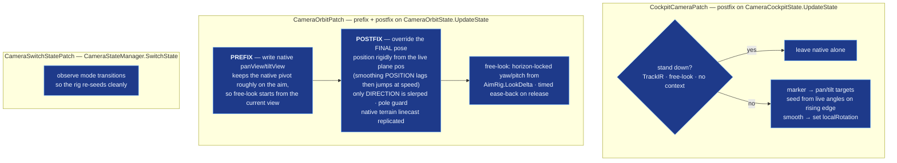
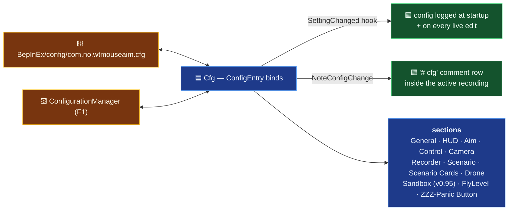

# Architecture — WT Mouse Aim

<!-- ARCH-VERSION: 1.0.3 -->

The system diagram for this mod. **L0** is the at-a-glance map; **L1** sections zoom into each box.
Every box carries a stable node id (`aim_rig`, `chase_apply`, …) — the [Node index](#node-index) maps
each id to the file and type that implements it, and that table is what keeps the diagram honest.

> **Agents: this file is part of the code.** When you change structure, add a subsystem, move a stage
> in the `Apply` pipeline, or add/remove a Harmony patch, update the matching L1 diagram and the node
> index in the *same* change. See [Keeping this current](#keeping-this-current).

## Index — read a slice, not the file

This file is ~190 KB. **Never read it whole**; that is ~47k tokens for one answer. Find your subsystem
below, then read only that line region (`Read` with `offset`/`limit`, or grep for the heading).

| you want | section | what is in it |
|---|---|---|
| the whole system at a glance | [L0 — System map](#l0--system-map) | one mermaid map, mod / game / platform coloured |
| **who runs when** in a frame | [L1.1 — Frame timeline](#l11--frame-timeline-who-runs-when) | Update / FixedUpdate / OnGUI order, the seams |
| the aim marker + raw mouse | [L1.2 — `aim_rig`](#l12--aim_rig-the-world-locked-marker) | world-locking, cursor regimes, `Guards` |
| **the control law** | [L1.3 — `chase`](#l13--chase-the-instructor-the-heart-of-the-mod) | the `Apply` pipeline **in order**, the probes |
| ↳ per-airframe probes | [Why the probes exist](#why-the-probes-exist) | FBW / canard / helo, all fail-soft |
| ↳ the ONE-LAW rule | [The generality rule](#the-generality-rule-the-reason-the-probes-carry-so-much-weight) | why no constant may suit one plane |
| ↳ instance model, A/B arm | [`chase` detail](#chase--instance-model-seams-and-the-ab-arm) | one controller per aircraft, `Arm()` seam |
| the camera patches | [L1.4 — `campatch`](#l14--campatch-camera-follow) | cockpit + orbit follow |
| **the recorder / CSV** | [L1.5 — `telem`](#l15--telem-the-instrumentation-loop) | sinks, anomaly log |
| ↳ every CSV column | [`telem` detail](#telem--the-csv-contract-column-by-column) | the 72-column contract, sidecar fields |
| **the drone harness** | [L1.6 — `drone`](#l16--drone-the-uncrewed-harness-v081-harness-v087-phase-2) | spawn, ring, decks, batch queue |
| ↳ card playback + placement | [`scenario` detail](#scenario--playback-placement-cards-and-arms) | safe teleport, card config, arm schedule |
| ↳ **the `MoveAssembly` graveyard** | [v0.97.2](#v0972--moveassembly-is-a-rigid-transform-and-nothing-else-the-graveyard) | **read before touching placement** — two dead fixes |
| ↳ spawn + entry gates | [`drone` detail](#drone--spawn-lanes-and-the-entry-gates) | lanes, envelope refusal, corner speed |
| ↳ hand-flying (F4) | [`sandbox` detail](#sandbox--hand-flying-the-law) | operator placement, no card |
| config + live tuning | [L1.7 — `cfg`](#l17--cfg-configuration--live-tuning) | binds, card pins, refcounting |
| **which file/type is which** | [Node index](#node-index) | node id → file → type → role (the checker's contract) |
| what game code we touch | [Game types we patch or read](#game-types-we-patch-or-read) | every patched/read member, with `:citations` |
| pitch/roll/yaw signs | [Sign conventions](#sign-conventions) | verify before changing any sign |
| how to keep this honest | [Keeping this current](#keeping-this-current) | the drift rules + `check-architecture.py` |

Offline tools are **not** in this file — see [`debugtests/TOOLS.md`](debugtests/TOOLS.md).

**Colour convention, used in every diagram on this page:**

| | meaning |
|---|---|
| 🟦 **blue** | **Mod** — code in this repo |
| 🟥 **red** | **Game** — Nuclear Option `Assembly-CSharp` (read-only; we patch or read it) |
| 🟨 **amber** | **Platform** — Unity, BepInEx, Harmony, Win32 |
| 🟩 **green** | **Artifacts & offline tools** — logs, CSVs, the Python analyser |

---

## L0 — System map

```mermaid
flowchart TB
    subgraph PLAT["🟨 PLATFORM"]
        direction LR
        unity["Unity engine<br/>Update · FixedUpdate · OnGUI"]
        bepin["BepInEx 5 (Mono x64)<br/>plugin host + config + log"]
        harmony["HarmonyX<br/>runtime patcher"]
        win32["Win32 user32.dll<br/>GetCursorPos / SetCursorPos"]
    end

    subgraph MOD["🟦 MOD — NuclearOptionMouseAim"]
        direction TB
        plugin["<b>plugin</b><br/>WTMouseAimPlugin<br/>lifecycle · hotkeys · HUD overlay<br/>v0.90: + harness run board (pre-gate:<br/>drawn with no aircraft and with the overlay off)"]
        cfg["<b>cfg</b><br/>Cfg<br/>~80 live-tunable binds"]
        aim_rig["<b>aim_rig</b><br/>AimRig<br/>world-locked aim marker<br/>+ cursor regime"]
        chase["<b>chase</b><br/>ChaseController<br/>the instructor: marker → stick<br/>ONE INSTANCE PER AIRCRAFT (v0.82)<br/>get it via ChaseController.For(ac)<br/>v0.94: the 5 A/B levers are read as Arm(Cfg.X) —<br/>a PER-AIRCRAFT arm that survives Forget, so a<br/>whole fleet sweeps concurrent A/Bs"]
        seam["<b>seam</b><br/>PilotPlayerStatePatch<br/>own/skip the native stick"]
        seam_thr["<b>seam_thr</b><br/>PilotThrottlePatch<br/>own the throttle axis<br/>(card only, Update-time)"]
        campatch["<b>campatch</b><br/>Camera patches ×3<br/>view follows the marker"]
        telem["<b>telem</b><br/>ManeuverRecorder · AnomalyLog<br/>instrumentation sinks"]
        scenario["<b>scenario</b><br/>ScenarioPlayer<br/>test cards: play · record · select<br/>re-establishes the entry condition per replicate<br/>(anchor: pos + heading + speed + alt + fuel,<br/>demand written, controller dropped)<br/>A/B arms interleaved ABBA<br/>v0.90: a card carries its OWN run config<br/>(repeat · armToggle · pinned Cfg overrides)<br/>and Preview() answers 'what would fly?'<br/>with no aircraft in hand<br/>v0.91: + the FLEET (count · airframe LIST),<br/>so a batch needs nothing set in F1<br/>v0.93: entry speed may be startSpeedCorner,<br/>a multiple of THAT LANE's corner speed<br/>v0.94: the A/B schedule is PER AIRCRAFT —<br/>it writes chase, not cfg, so N lanes each<br/>run their own ABBA at the same time<br/>v0.96: a SECOND safety abort beside the altitude<br/>floor — any part detachment ends the replicate<br/>(off unless a card is running)<br/>v0.99.1: an abort ends the REPLICATE, not the lane<br/>(Finish nulls _queue and _queue IS the replicate<br/>expansion — 13 of 40 captures on the STOL batch);<br/>card config pins are REFCOUNTED across the fleet"]
        drone["<b>drone</b><br/>TestDrone · Drone<br/>uncrewed aircraft: spawn · fly · despawn<br/>N at once, staggered launch<br/>v0.87: each starts its own card and flies it<br/>through the REAL law (chase), not the level-hold<br/>v0.90: the CARD picks the airframe/alt/speed,<br/>and a drone with no card running despawns itself<br/>v0.90.1: one step per AIRCRAFT, not per pilot —<br/>a two-seater ran everything twice per fixed step<br/>v0.91: the card picks HOW MANY and WHICH —<br/>airframe is a per-lane LIST, count defaults to it<br/>v0.92: a lane whose airframe CANNOT fly the card's<br/>entry speed is refused BEFORE it spawns<br/>v0.96: that check uses the FBW's cornerSpeed,<br/>not the AI's — they differ by up to 2.2x<br/>v0.99: lanes fly a RING, each heading OUTWARD along<br/>its own radius, so origDist (a measured noise axis,<br/>r = 0.948 with gJitterG) is matched across lanes at<br/>EVERY instant, not just at spawn.<br/>+ optional two altitude decks — packing, and<br/>altitude as a factor crossed with airframe<br/><b>the COLLECTIVE: on a rotorcraft lane whose card<br/>declares a hover, the harness holds the altitude<br/>on the throttle axis</b> — a PI whose integrator<br/>LEARNS that airframe's hover collective, because<br/>one fixed throttle is not a hover for more than<br/>one airframe (R41: 0.60 climbed two rotorcraft and<br/>sank the third at −25 m/s into 16 of 16 aborts)<br/>(off unless DroneEnabled)"]
        drone_seam["<b>drone_seam</b><br/>TestDronePatch<br/>write a DRONE's ControlInputs<br/>(no-op for every other aircraft)"]
        sandbox["<b>sandbox</b><br/>PlayerSpawn<br/>v0.95: put the OPERATOR airborne on one key,<br/>to hand-fly the law with no mission built.<br/>In an aircraft ⇒ PLACE it (alt/speed/level,<br/>position + heading KEPT — no anchor, no card).<br/>Not in one ⇒ SPAWN one WITH player + HQ<br/>and let the game seat you.<br/>Reuses scenario's safe-teleport pair;<br/>never touches the drone registry"]
    end

    subgraph GAME["🟥 GAME — Assembly-CSharp (read-only)"]
        direction TB
        pps["PilotPlayerState<br/>PlayerAxisControls"]
        pps_thr["PilotPlayerState<br/>PlayerThrottleAxis1Controls<br/>(Update)"]
        pilot_fx["Pilot<br/>Pilot_OnAeroInputsApplied<br/>(EVERY pilot's fixed step)"]
        spawner["Spawner · Encyclopedia · Unit<br/>SpawnAircraft · TryGetPrefab<br/>DisableUnit"]
        aircraft["Aircraft<br/>GetInputs · FilterInputs · rb"]
        filters["ControlsFilter.FlyByWire<br/>HeloControlsFilter<br/>RelaxedStabilityController"]
        camstates["CameraCockpitState<br/>CameraOrbitState<br/>CameraStateManager"]
        misc["CursorManager · GameManager<br/>Rewired · DynamicMap"]
        phys["Rigidbody flight physics"]
    end

    subgraph OUT["🟩 ARTIFACTS & OFFLINE TOOLS"]
        direction LR
        log["LogOutput.log<br/>[anomaly] [maneuver] [seam]"]
        csv["mouseaim-rec-VER-RUN-NN-*.csv<br/><b>72-column capture (v1.0.0)</b><br/>+ '# override' header: what the CARD pinned (v0.90)"]
        sidecar["mouseaim-rec-*.airframe.json<br/>readable capability snapshot (v0.69)<br/>aero areas from partsWithAero (v0.70)<br/>v0.92: + infoStallSpeed/infoMaxSpeed (m/s) —<br/>the two numbers a flyability check needs.<br/>NOT the same as maxSpeed, which is a normalizer<br/>v0.96: + detachedRatioAtStart — did this<br/>replicate START bent? (dmgFrac only reports NOW).<br/>Fail-soft to ABSENT, never 0"]
        pytool["debugtests/*.py — offline tools<br/>digest · score · index · compare · preflight<br/>+ the source-region tests<br/><b>full catalogue: debugtests/TOOLS.md</b>"]
        cards["BepInEx/config/wtmouseaim-cards/NAME.json<br/>recorded test cards (v0.71)<br/>basename = card id · one F1 checkbox each<br/>v0.90: each card also carries its OWN run config —<br/>airframe · startAlt/Speed · repeat · armToggle ·<br/>pinned Cfg overrides (scorecard.py --selftest<br/>validates them; nothing at runtime will)<br/>v0.91: + count, and airframe is a COMMA LIST<br/>(one jsonKey per drone lane) — the card is now<br/>the whole test, F1 only the fallback"]
        range["harness/WTM-Range/WTM-Range.json<br/>isolated test mission — no units, pinned<br/>weather/wind/time, wreck cleanup on<br/>debugtests/check-mission.py validates it"]
    end

    bepin --> plugin
    unity --> plugin
    harmony --> seam
    harmony --> seam_thr
    harmony --> drone_seam
    harmony --> campatch
    win32 <--> aim_rig
    unity -->|"FixedUpdate<br/>(stagger clock + frame-time sample)"| drone

    plugin --> cfg
    plugin --> aim_rig
    cfg -.->|"reads"| aim_rig
    cfg -.->|"reads"| chase
    cfg -.->|"reads"| campatch

    scenario -->|"SetAimForward<br/>(scripted demand,<br/>seam prefix)"| aim_rig
    scenario -->|"SegmentTag · CardTag · EntryNote<br/>OverrideNote · Start/Stop"| telem
    scenario -->|"Forget(ac)<br/>(entry force only:<br/>drop carried-over<br/>integrators + filters)"| chase
    scenario -->|"the card's own pinned overrides,<br/>applied BEFORE the recorder opens<br/>and restored AFTER it closes (v0.90).<br/>NOT the A/B arm any more (v0.94)"| cfg
    scenario -->|"SetArm(ac, knob, value) — the A/B arm,<br/>ABBA per replicate, PER AIRCRAFT (v0.94).<br/>The law reads the lever via Arm(Cfg.X),<br/>so N aircraft sweep N arms at once and<br/>the global knob is never written.<br/>v0.99.1: indexed ArmOf(_qi / _block), i.e. by<br/>REPLICATE. The queue is blocked (c1,c2,c1,c2),<br/>so indexing by queue position gave every card<br/>A,B,A,B internally while the queue-wide balance<br/>check reported balanced — and compare-runs.py<br/>groups by (airframe, CARD, arm).<br/>v1.0.1/v1.0.2: ArmOfRun(_qi / _block, _resumeRep)<br/>— the ANCHOR-CAPTURING replicate is armed as<br/>NEITHER (arm=-1): replicate 0, and the one a<br/>respawned lane resumes on. No scored replicate<br/>may fly from the spawn state (ledger X27)"| chase
    aim_rig -->|"aim direction<br/>(world unit vector)"| chase
    aim_rig -->|"aim direction"| campatch
    aim_rig -->|"marker + boresight"| plugin

    pps -.->|"patched"| seam
    pps_thr -.->|"patched (card only)"| seam_thr
    scenario -->|"throttle · brake<br/>(OwnInputs)"| seam_thr
    scenario -->|"rigid move of ALL part rbs to the<br/>ANCHOR (pos + heading) · fuel · velocity<br/>+ zero Pilot.velocityPrev<br/>(entry force only)<br/>v0.97.2: the partLookup loop (skipping pr == rb:<br/>the root and any part merged onto it), then the root,<br/>then ONE trailing Physics.SyncTransforms —<br/>a rigid transform and NOTHING else"| aircraft
    seam --> chase
    chase -->|"pitch / roll / yaw"| aircraft
    aircraft --> filters --> phys
    phys -->|"attitude · rates · velocity"| chase
    filters -.->|"probed via reflection"| chase

    drone -->|"SpawnAircraft(player=null, HQ=null)<br/>DisableUnit + Destroy(go, 2s)"| spawner
    pilot_fx -.->|"patched (postfix)"| drone_seam
    drone_seam -->|"resolve by aircraft instance id;<br/>skip anything not a live drone"| drone
    drone -->|"Preview() at the launch key (what would fly:<br/>airframe · alt · speed · repeat · arm) ·<br/>StartSuite on its first pilot step ·<br/>Tick · OwnInputs (throttle) ·<br/>CardAltM (the altitude the placement WROTE —<br/>the collective hold's target) ·<br/>Playing? = the idle-despawn clock"| scenario
    drone -->|"<b>FlyUncrewed(ac, AimDemand)</b> v0.87<br/>= BeginFrame + Apply, one seam not two.<br/>The demand is a PARAMETER: the marker is<br/>the human's, one per process"| chase
    drone -->|"pitch/roll/yaw/throttle,<br/>then FilterInputs() by hand —<br/>no pilot state ever calls it"| aircraft

    plugin -->|"SandboxKey (v0.95) — read OUTSIDE<br/>the DroneEnabled gate: this is hand-flying,<br/>not the harness"| sandbox
    sandbox -->|"ResetGLoadTrackers + MoveAssembly<br/>(internal since v0.95) — the safe-teleport<br/>pair is SHARED, never copied"| scenario
    sandbox -->|"Forget(ac) after a placement:<br/>every filter and finite difference<br/>straddles the teleport"| chase
    sandbox -->|"SpawnAircraft(player, HQ) — the drone call<br/>with both filled in. Pilot state, camera, HUD,<br/>map icon and gear are then the GAME's"| spawner

    camstates -.->|"patched"| campatch
    campatch --> camstates
    misc <--> aim_rig

    chase --> telem
    telem --> log
    telem --> csv
    csv --> pytool
    log --> pytool

    classDef mod fill:#1e3a8a,stroke:#60a5fa,color:#eff6ff
    classDef game fill:#7f1d1d,stroke:#f87171,color:#fef2f2
    classDef plat fill:#78350f,stroke:#fbbf24,color:#fffbeb
    classDef art fill:#14532d,stroke:#4ade80,color:#f0fdf4
    class plugin,cfg,aim_rig,chase,seam,seam_thr,campatch,telem,scenario,drone,drone_seam,sandbox mod
    class pps,pps_thr,pilot_fx,spawner,aircraft,filters,camstates,misc,phys game
    class unity,bepin,harmony,win32 plat
    class log,csv,sidecar,pytool,cards,range art
```



**The one-sentence version:** the mouse moves a **world-locked point** in front of the aircraft
(`aim_rig`); an autopilot-like "instructor" (`chase`) computes the stick deflections that fly the
nose onto that point; a Harmony patch (`seam`) writes those deflections instead of the game's native
mouse-joystick input; the camera looks where the marker is (`campatch`); and everything the
instructor does is instrumented (`telem`) so misbehaviour is diagnosable offline rather than guessed at.

---

## L1.1 — Frame timeline (who runs when)

The single most load-bearing fact about this mod: **aiming and flying run on different clocks.**
The marker moves on the render frame (`Update`), the stick is written on the physics tick
(`FixedUpdate`), and the HUD draws in `OnGUI`.

```mermaid
flowchart TB
    subgraph U["🟨 Update — once per rendered frame"]
        direction TB
        u1["plugin.Update<br/>hotkeys: master toggle · fly-level · record<br/>cards: run · record · abort · on-condition<br/>drone: launch · despawn (only if DroneEnabled)<br/>sandbox: put ME airborne — v0.95, NOT gated<br/>on DroneEnabled: it is not part of the harness"]
        u2["aim_rig.Update<br/>1. pick cursor regime<br/>2. read raw Win32 mouse delta<br/>3. rotate world aim vector<br/>4. clamp into MaxAimAngle cone<br/>STEP 2-3 SKIPPED while a card plays —<br/>mouse and card would otherwise SUM"]
        u3["🟥 PilotPlayerState.PlayerThrottleAxis1Controls"]
        u4["🟦 seam_thr PREFIX<br/>card running? write ci.throttle + skip native,<br/>so the pilot's lever never reaches ControlInputs.<br/>Must be HERE, not only on the fixed step:<br/>🟥 Airbrake.Update opens the boards on<br/>throttle == 0 every rendered frame"]
        u1 --> u2 --> u3 --> u4
    end

    subgraph F["🟨 FixedUpdate — physics tick"]
        direction TB
        f0["🟦 plugin.FixedUpdate → drone.FixedTick<br/>launch stagger countdown · prune dead drones.<br/>The mod's only fixed-step hook that exists<br/>with no aircraft — everything else below hangs<br/>off a pilot that may not be there yet.<br/>FrameDt is NOT sampled here — see Update (v0.92.1)"]
        f1["🟥 PilotPlayerState.PlayerAxisControls"]
        f2["🟦 seam PREFIX → scenario.Tick → chase.BeginFrame<br/>Tick advances the card clock + writes the scripted<br/>demand FIRST, so Apply's read below is same-tick<br/>then: decide ownership; return false to SKIP native<br/>(cockpit only — orbit needs native's view axes)"]
        f3["🟥 native body — runs only if not skipped"]
        f4["🟦 seam POSTFIX → chase.Apply<br/>always runs; writes ci.pitch/roll/yaw"]
        f5["🟥 Aircraft.FilterInputs<br/>RelaxedStabilityController → FBW → surfaces"]
        f6["🟥 JobManager.FixedUpdateEarly<br/>ScheduleJobs() FIRST, then PilotAeroInputs()"]
        f7["🟥 Pilot.Pilot_OnAeroInputsApplied — every pilot"]
        f8["🟦 drone_seam POSTFIX — live drone only<br/>0. v0.90.1 — ALREADY RUN THIS FIXED STEP? return.<br/>this fires once per PILOT and pilots is an ARRAY,<br/>so a two-seater ran 1..5 twice per physics step<br/>1. first step? scenario.StartSuite (its own card)<br/>2. scenario.Tick → this drone's AimDemand<br/>3. Drone.Fly → <b>chase.FlyUncrewed(ac, demand)</b><br/>&nbsp;&nbsp;&nbsp;(= BeginFrame + Apply; level-hold if no card)<br/>4. scenario.OwnInputs → throttle/brake, and when it<br/>DECLINES (a card declaring a hover, where a pinned<br/>throttle would be a commanded climb) →<br/>drone.HoldCollective on a rotorcraft lane<br/>5. Aircraft.FilterInputs OURSELVES — an uncrewed<br/>aircraft has no pilot state, and FilterInputs is<br/>only ever called FROM one, so the FBW would<br/>otherwise never run on it.<br/>Same ORDER as the player's f2..f5, one seam<br/>instead of two"]
        f9["🟥 Rigidbody integration"]
        f1 --> f2 --> f3 --> f4 --> f5 --> f6 --> f7 --> f8 --> f9
        f0 --> f1
    end

    subgraph L["🟨 Camera state update"]
        l1["🟥 CameraCockpitState / CameraOrbitState .UpdateState"]
        l2["🟦 campatch prefix/postfix<br/>override view toward the marker"]
        l1 --> l2
    end

    subgraph G["🟨 OnGUI — IMGUI draw"]
        g1["plugin.OnGUI<br/>PRE-GATE (no aircraft needed, ignores ShowOverlay):<br/>REC badge · notices · card indicator ·<br/><b>harness run board</b> (v0.90)<br/>THEN gated on ShowOverlay + a local aircraft:<br/>reticle · cone ring · boresight<br/>toasts · G-LOC fade · debug HUD"]
    end

    U --> F --> L --> G
    F -.->|"attitude feeds back next tick"| F

    classDef mod fill:#1e3a8a,stroke:#60a5fa,color:#eff6ff
    classDef game fill:#7f1d1d,stroke:#f87171,color:#fef2f2
    class u1,u2,f0,f2,f4,f8,l2,g1 mod
    class f1,f3,f5,f6,f7,f9,l1 game
```



**Why the prefix is conditional.** Returning `false` from the prefix skips the native body — which is
what stops the game's own mouse virtual-joystick from fighting us for the stick. But that same native
body also processes *view* axes, so skipping it in third-person killed free-look. Hence:
**skip native only in the cockpit**; in orbit let it run and simply overwrite the flight controls in
the postfix. Harmony runs postfixes even when a prefix skipped the original, so `Apply` always lands.

---

## L1.2 — `aim_rig`: the world-locked marker

The marker is **not** a joystick. It is a direction in *world space*. You place it; the aircraft flies
its nose onto it; the offset eases to zero on arrival. Nothing in the rig ever snaps it back to the
nose — the only two things that move it are the mouse nudge and the cone clamp.


**Why Win32 instead of Unity's mouse axis.** Unity's legacy `Mouse X/Y` is focus-gated — it stays dead
until the window receives a focus event (an alt-tab), so aiming was broken on a fresh launch. Reading
the OS cursor gives a true hardware delta from frame 1. The recentre-each-frame trick also means big
sweeps never clamp at the desktop edge. `lockState = None` during capture is essential: `Locked` would
let Unity warp the cursor too and zero our own delta.

**Writers of the aim vector** (there are only three, deliberately): the mouse nudge above; the cone
clamp; and `SetAimForward`, which the chase calls during manual flight so that releasing the stick
leaves the instructor holding the heading you ended on.

---

## L1.3 — `chase`: the instructor (the heart of the mod)

`ChaseController.Apply` is one pipeline per physics tick: measure → estimate regime → probe what the
airframe can do → pick a control law → condition the output → hand off to manual if the pilot is on
the stick → instrument.

**One controller per aircraft (v0.82).** Everything the pipeline below carries between ticks —
integrators, low-pass filters, the anomaly ring buffer, the probe caches, the phase/maneuver
trackers — is *per-aircraft state*, so `ChaseController` is an ordinary instance class and you get
one with **`ChaseController.For(aircraft)`** (keyed by `Aircraft.GetInstanceID()`, the same key the
drone harness uses). Never construct one directly: a second instance for the same aircraft is a
silently-reset integrator. `Forget(ac)` drops one, and `For` sweeps out controllers whose aircraft
Unity has destroyed — on the dictionary-**miss** path only, which runs once per aircraft rather than
once per fixed step. Two things stay `static` on purpose and say so at their declarations: the
Rewired player-0 cache (one input device per process) and the anomaly stream's index/flash fields
plus the trail-dump throttle (one log stream per process). Because `OnGUI` has no aircraft in hand,
`BeginFrame` publishes itself as **`ChaseController.Player`** when — and only when — its aircraft is
the one `GameManager.GetLocalAircraft` calls local, and the HUD reads that; a drone can never satisfy
that test, so the overlay cannot end up showing a drone's numbers.

**Crewed and uncrewed run the same law (v0.87).** `Apply` was written for the local player and reached
for exactly **three** things that are one-per-*process* and all of them the human's: the `AimRig`
marker, the Rewired player-0 stick, and the `FlightHud` virtual-joystick crosshair. Nothing else in
the pipeline is player-scoped. So:

- the **aim direction is now a parameter**. `Apply(ac)` is a one-line wrapper that passes
  `AimRig.AimForward`; `Apply(ac, aimTarget)` is the real body. A drone passes its own
  `ScenarioPlayer.For(ac).AimDemand`. No global sits between N aircraft and N demands.
- the **stick and the crosshair are gated on `_uncrewed`**, a per-instance bool whose only writer is
  `FlyUncrewed`. Without that gate a drone would be flown by whatever the human's stick was doing,
  and `ManualReorients` would drag *his* marker onto the *drone's* nose.
- **`FlyUncrewed(ac, aimDir)`** = `BeginFrame` + `Apply`, in that order, in one call — because a drone
  has one seam (`drone_seam`) where the player has two (prefix + postfix). It returns false, having
  written nothing, when `BeginFrame` declines; it deliberately does **not** run the disengage ramp,
  which exists to hand back to a native stick an uncrewed aircraft does not have. `pilotStrength` is
  passed as 1: G-LOC is a property of the human in the seat.

The crewed path cannot reach any of it, and that is structural rather than argued: the only writer of
`_uncrewed` is `FlyUncrewed`, whose only caller is `TestDrone`, whose dictionary an aircraft can only
enter through `Spawn`, which asserts `ac.Player == null`. `check-architecture.py` enforces the two
link conditions (one writer, one calling file) because neither fails to compile.

**One config read in this pipeline is not a config read: the A/B lever (v0.94).** Four `Cfg` bools are
marked `(A/B lever)` — the knobs an attribution card sweeps — and the law now reads each of them as
**`Arm(Cfg.X)`**, not `Cfg.X.Value`. `Arm` returns *this aircraft's* assigned arm when the schedule is
sweeping that entry and the live config value otherwise, so N aircraft can fly N different arms in the
same instant; before this, the knob was a process-global `ConfigEntry` the law read globally and
`scenario` had to stand the whole schedule down whenever a second aircraft was mid-card, making every
A/B a one-drone serial run. Exactly **five** sites are converted — the four levers, with
`MarkerRateFeedForward` counted twice because it is added at both lockstep `omega` sites
(`RelativeTurnLead` was the fifth lever and the sixth site until **v0.99.1** deleted it: R39-D spent
its A/B, so the knob went and the term hardwired to its shipped default) — and nothing
else is: this is the sweep seam, not a general indirection layer over `cfg`. **A new A/B lever must be
read through `Arm()` to be sweepable**; `Cfg.X.Value` compiles, flies, and is simply invisible to the
schedule, which reads as "the A/B found nothing".

The assignment lives in a **static map keyed by aircraft** (`_armByAircraft`), not in the controller
instance, and that is load-bearing rather than incidental: `scenario`'s per-replicate reset calls
`Forget(ac)` on **every** replicate, so an instance field would be wiped at the start of every single
one and the sweep would silently do nothing while each capture still labelled itself `arm=0`/`arm=1`.
It is also the right home semantically — the arm is a property of *the aircraft's current test
assignment*, not of the controller's integrator state. `For(ac)` seeds a freshly built controller from
the map; **`Forget` deliberately does not clear it**; exactly two things do, the suite's own `Finish`
and `TestDrone.ForgetState` on despawn. The pure part sits between `ARM-SEAM` markers so
`debugtests/test-arm-schedule.py` can compile and exercise it verbatim.

```mermaid
flowchart TB
    subgraph MEAS["1 · MEASURE"]
        m1["aimDir = marker, or the latched<br/>heading when Fly Level is active<br/>(flown as TRUE level: pitched up by live AoA<br/>so the velocity vector, not the nose, sits level)"]
        m2["body-frame marker: local = InverseTransformDirection<br/>x=right y=up z=fwd · off = angle(nose, aim)<br/>phi = bearing around the boresight · alignFrac = belowness<br/>v0.85: + alignFracH — the SAME belowness in a<br/>HORIZON-referenced frame around the nose (axes from<br/>t.forward alone, so roll cannot move it). alignFrac is<br/>body-frame: at 90° bank a straight-down target reads<br/>abeam, so rolling erased the reason not to roll"]
        m3["nose rates from Δforward/Δup per tick<br/>pitchRate · yawRate · rollRate · noseTurnDeg"]
        m1 --> m2 --> m3
    end

    subgraph EST["2 · ESTIMATE REGIME"]
        e1["bigTurn blend — continuous ramp<br/>fine direct-nudge ↔ bank-and-pull"]
        e2["azErr — world azimuth error<br/>+ vertical deprojection (v0.58)"]
        e3["heading-rate LPF (v0.51)<br/>nose-only, so lead can't fight a mouse flick<br/>v0.78: + MARKER azimuth-rate LPF, signed,<br/>same tau (one shared const) — the demand rate,<br/>Atan2/DeltaAngle so the ±180° wrap is a no-op<br/>v0.85: + BEARING-rate LPF (d phi/dt), same tau —<br/>the align channel's own derivative. TOTAL rate<br/>(roll + pitch/yaw closure + marker motion), so the<br/>lead tracks a sweeping marker instead of braking it.<br/>Dropped + invalidated under the atan2 conditioning<br/>floor, where phi is junk"]
        e4["yaw-weakness estimate (v0.35)<br/>is the rudder actually CLOSING the error?"]
        e5["hover blend heliBlend (v0.43)<br/>fwd airspeed + AutoHover + tilt angle"]
        e1 --> e2 --> e3 --> e4 --> e5
    end

    subgraph PROBE["3 · PROBE THE AIRFRAME (reflection, all fail-soft — and since v1.0.0 each publishes a LIVENESS BIT)"]
        p1["<b>FBW probe</b> v0.55<br/>ControlsFilter.FlyByWire<br/>cornerSpeed · maxPitchAngularVel<br/>gLimit · alphaLimit<br/>ResolveFbw's RETURN is recorded as <b>fbwOk</b>"]
        p2["<b>canard probe</b> v0.57<br/>RelaxedStabilityController<br/>KR-67 Ifrit only<br/>bound-or-not recorded as <b>canOk</b>"]
        p3["<b>helo probe</b> v0.58<br/>private heloFlyByWire + TiltWing /<br/>SwivelDuct / Compound archetypes<br/><b>RETRYABLE since v1.0.0 — and until then it had<br/>NEVER RUN.</b> It reads _collective, which BeginFrame<br/>latches, but it was reachable only from ResolveFbw's<br/>AIRCRAFT-CHANGE edge. On the drone path that edge<br/>fires from the recorder's '# fbw' header write<br/>(StartCard → Toggle → FbwHeader → ResolveFbw),<br/>BEFORE that aircraft's first BeginFrame — so the<br/>probe hit 'if (!_collective) return;' and the edge<br/>was CONSUMED. Wrong edge for an input written after<br/>it: _heloOk stayed false for the aircraft's life and<br/>the v0.58 branch was dead on all 48 rotorcraft<br/>captures, 40 versions (debugtests/LAW-LEDGER.md H1).<br/>Now the probe carries its own trigger — it records<br/>the _collective it ran under (_heloProbedAs, set on<br/>EVERY path incl. the early return) and ResolveFbw<br/>re-probes when that changes. At most once per<br/>aircraft; fixed-wing byte-identical.<br/>resolved-or-not recorded as <b>heloOk</b>"]
    end

    subgraph LAW["4 · CONTROL LAW (one law — EvolvedLegacy; Unified removed v0.65)"]
        l1["<b>ApplyEvolvedLegacy</b> ← the only law<br/>v0.96: its unused off/targetBank parameters are<br/>GONE (dead since v0.60 removed Legacy); Apply still<br/>holds both as locals, for DetectAnomalies' over-roll<br/>check and the tBankE recorder column<br/>speed-aware bank target · slew limit<br/>v0.64: pErrTerm scaled by measured _pitchEff,<br/>reversal-gated floor v0.65 C1, latch-fixed v0.67<br/>(fixed-wing only — rotorcraft untouched)<br/>q + AoA demand schedules · helo rate normalisation<br/>(forced for all rotorcraft)<br/>v0.65 B2: sub-0.5° fine-settle micro-bank; v0.67:<br/>turn demand RAMPS in over [0.5°,2°] (no gate-exit step)<br/>v0.67: down-hemisphere roll-to-align suppressed →<br/>bounded pushover closes below-targets (no 90° hang)<br/><b>v0.85: that suppressor was itself a feedback path</b> —<br/>keyed on BODY-frame belowness (so roll erased it) and<br/>multiplied by (1−lateralHold), i.e. gated on the azimuth<br/>error roll-to-align itself generates: 51% of the intended<br/>suppression removed, corr(|azErr|,blendWeight) = +0.918,<br/>elDn 6.92° standing error at ±43° bank vs elUp 0.03°.<br/>Now keyed on alignFracH and the (1−lateralHold) factor<br/>is DELETED — belowness is already a continuous taper<br/>and bigTurn already returns roll-and-pull for big<br/>reorientations. Gated by Cfg.BelowAlignSuppress.<br/><b>v0.85: eAlign gets a rate lead</b> — phi + RollDamping ×<br/>measured d phi/dt before the /90 map (was pure P against<br/>a plant with roll inertia). Stands down in the ±180 wrap<br/>region, where the anti-relay slew owns the dynamics.<br/>Gated by Cfg.AlignRateLead"]
    end

    subgraph COND["5 · CONDITION"]
        c1["anticipatory lead → brake-only clamp<br/>→ proportional floor → settle-exit ramp<br/>→ <b>marker-rate feed-forward (v0.78)</b><br/>→ achievability cap<br/>(v0.67: cap also folds the LIVE alpha margin,<br/>not just gLimit — turn demand ≤ what the wing<br/>can pull at this AoA)<br/>v0.78 order is load-bearing: the feed-forward is<br/>added BEFORE the cap, so the probed omegaMax<br/>bounds it too and yawCapped sees the TOTAL demand.<br/>Both lockstep omega sites do it identically.<br/><b>v0.83: the lead leads on the RELATIVE rate</b><br/>(headingRateFilt − aimAzRateFilt) — d(azErr)/dt is<br/>markerRate − noseRate, so the absolute form was the<br/>true derivative ONLY against a stationary marker;<br/>tracking a sweep it braked the tracking rotation and<br/>cancelled 60% of the v0.78 feed-forward.<br/>predFloor STAYS (it guards the v0.54 rectifier,<br/>which lives in the stationary-marker regime) —<br/>it just stops binding in a matched turn"]
        c2["<b>AoA envelope</b> — ceiling gates (v0.55)<br/>predictive lead; cut only the command<br/>driving AoA OUTWARD"]
        c2b["<b>AoA-utilization demand schedule</b> (v0.59)<br/>live AoA vs this airframe's PROBED ceiling,<br/>folded into qSched. Fast-attack / slow-release<br/>so demand can't snap hot again as AoA falls<br/>back through the ceiling — the loaded-jet fix"]
        c2c["<b>AoA recovery bias</b> (v0.59, damped v0.62)<br/>restoring pitch ∝ predicted excess past either<br/>ceiling. Continuous + symmetric, exactly zero<br/>inside the envelope — the gates only CUT,<br/>so past the ceiling nothing flew it back in.<br/>v0.62: uses the TWO-SIDED predicted AoA<br/>(AoA + rate·lead), NOT the gates' one-sided<br/>preds — the lead is its damping term, so it<br/>fades as recovery develops instead of holding<br/>to the crossing (that was the +43→-47 bang-bang)"]
        c2d["fine-capture boost, gated by that schedule<br/>(NOT by speed — a slow LIGHT jet keeps its feel;<br/>only genuine near-ceiling AoA softens it)"]
        c3["fine leaky integrator (v0.24)<br/>FBW is a RATE law, so P alone parks short<br/><b>v0.83: gated on PERSISTENCE, not magnitude</b><br/>gate = max(fineBlend, stall), stall = the DIMENSIONLESS<br/>fraction of the nose's own rotation NOT closing the<br/>error, held through a slow-attack/fast-release filter.<br/>fineBlend alone was identically 0 at off &gt; FineAngle —<br/>the anti-residual term, off because a residual existed.<br/>The persistence filter IS the anti-windup; yawCapped<br/>suppresses the new path only"]
        c4["invert canard remap (v0.57)<br/>so the game delivers the pitch we meant"]
        c5["output slew limit"]
        c1 --> c2 --> c2b --> c2c --> c2d --> c3 --> c4 --> c5
    end

    subgraph MAN["6 · MANUAL HANDOFF"]
        h1{"ManualHandoffTime > 0 ?"}
        h1 -->|yes| h2["<b>global hard handoff</b> v0.49<br/>any axis past deadzone → instructor fully OFF<br/>on all axes; re-engages after a hold timer<br/>(shorter while aiming, longer while free-looking)"]
        h1 -->|no| h3["<b>per-axis blend</b> v0.05–v0.48<br/>touch an axis → own that axis instantly<br/>ease back over ManualReturnTime"]
        h2 --> h4["while manual: SetAimForward drags the<br/>marker onto the nose, so release holds<br/>the heading you ended on"]
    end

    subgraph WRITE["7 · WRITE + INSTRUMENT"]
        w1["ci.pitch / ci.roll / ci.yaw<br/>(nose-up = NEGATIVE pitch)"]
        w2["ClassifyPhase → LEVEL/FINE/ALIGN/PULL/TURN/HOLD"]
        w3["DetectAnomalies — 8 detectors<br/>+ 64-frame ring buffer trail dump"]
        w4["TrackManeuver — one summary per turn"]
        w5["ManeuverRecorder.Sample"]
        w1 --> w2 --> w3 --> w4 --> w5
    end

    MEAS --> EST --> PROBE --> LAW --> COND --> MAN --> WRITE

    classDef mod fill:#1e3a8a,stroke:#60a5fa,color:#eff6ff
    class m1,m2,m3,e1,e2,e3,e4,e5,p1,p2,p3,l1,c1,c2,c2b,c2c,c2d,c3,c4,c5,h1,h2,h3,h4,w1,w2,w3,w4,w5 mod
```



### Why the probes exist

The mod does not model the aircraft — it **asks the game** what the aircraft can do, then commands only
that. The game's FBW reads pitch/yaw as a commanded **angular rate**, and that rate authority collapses
below corner speed; commanding more than the airframe can deliver is what produced the low-speed
oscillation and windup.

**And nothing downstream will catch it if the mod gets this wrong (corrected in v0.96).** The FBW is a
rate **setpoint**, not a governor: `targetPitchAngVel = pitch · gLimitPositive · 9.81 / max(V, 0.75·Vc)`
(`:65032`) is *scaled by* a g-limit with no feedback on achieved G, and `ControlsFilter.GLimiter` is
**dead code** — the identifier occurs exactly once in the 183,315-line 0.34.1 decompile (`:65242`), as its
own class declaration, never instantiated, `LimitG` never called. Worse, the FBW's own alpha limiter is
gated `if (num2 < 1f)` (`:65033`) and is therefore **inactive above corner q**, which is where every
shipped card flies (97.7% of R32's rows). So the achievability cap and the AoA ceiling below are not a
polite second opinion on top of the game's protection — at card speeds they are the **only** protection
in the loop. See CLAUDE.md Conventions and `LAW-LEDGER.md` P1–P3 (the R32 batch).

Three airframe families need three different questions:

| probe | reads | fixes |
|---|---|---|
| **FBW** (v0.55) | `ControlsFilter.FlyByWire` public params + private `gLimit`/`alphaLimit` trio via `AccessTools` field refs | achievability cap + AoA ceiling |
| **canard** (v0.57) | `RelaxedStabilityController.canardRange` | KR-67 Ifrit's ~5.3 Hz fine-aim limit cycle — the game *replaces* pitch with a quadratic, locally-reversed remap before the FBW sees it, so the mod pre-inverts it |
| **helo** (v0.58) | private nested `heloFlyByWire` via `Traverse` + tilt/nozzle archetype components | rotorcraft rate normalisation; tilt angle drives the hover regime. **RETRYABLE since v1.0.0 — before that it never fired at all; see below** |

**Every probe fails soft.** A missing component, a disabled FBW, or a renamed field after a game update
leaves the probe not-ok and the previous version's behaviour exactly intact. That contract is
non-negotiable for new probes — reflection against game internals is the one part of this mod that a
patch can silently break.

**And that is exactly why each probe now publishes a LIVENESS BIT (v1.0.0) — `fbwOk` / `canOk` /
`heloOk`, CSV columns 70–72.** Fail-soft is right and is *also* what makes a miss invisible: the law
falls back, the capture looks plausible, and nothing anywhere reads differently. The helo probe proved
it. **It had never executed — not once, on any aircraft, for 40 versions.** `ResolveHelo` reads
`_collective`, which `BeginFrame` latches, but it was reachable only from `ResolveFbw`'s
**aircraft-change edge**; on the drone path that edge fires from the recorder's `# fbw` header write
(`StartCard` → `Toggle` → `FbwHeader` → `ResolveFbw`) *before* that aircraft's first `BeginFrame`, so the
probe hit `if (!_collective) return;` and the edge was **consumed**. `_heloOk` stayed false for the
aircraft's life and rotorcraft flew the pre-v0.58 direct-P path. The trigger was simply the wrong edge
for an input written after it, so the probe now carries its own: `ResolveHelo` records the `_collective`
it ran under (`_heloProbedAs`, assigned as its **first** statement on **every** path — before the early
return so a fixed-wing records "probed as fixed-wing" and never retries, and before the `try` so a
throwing probe is not re-run every fixed step), and `ResolveFbw` re-probes when that answer changes.
At most once per aircraft, one bool compare on the hot path; fixed-wing is byte-identical, and **the
fixed-wing early return is kept deliberately** — `VTOLTrainer1` is a fixed-wing VTOL and removing it
would start moving `heliBlend` on an airframe that has always flown with it at 0.

**Data consequence: every rotorcraft capture on disk measures the pre-v0.58 law** (48/48,
`LAW-LEDGER.md` H1) and must not be cited as evidence about the shipped one. Order is not
something a compiler checks, so `debugtests/test-helo-probe-order.py` checks it — with the *pre-fix*
trigger as a counterfactual that must fail the drone case, or the test would pass against the bug.

**The FBW rate pair also feeds a measured signal (v0.60).** Beyond the static probe params, `Apply`
reads the FBW's *live* commanded-vs-achieved pitch rate (`GetTargetPitchAngVel` / `GetPitchAngVel` —
the same pair the recorder logs) and low-passes the **signed** ratio into `_pitchEff`, the pitch twin
of `_yawWeak`: fast-attack / slow-release so load, mush, density and damage all show up generically as
achieved &lt; commanded. **v0.64: the ratio is signed, not magnitude-only.** Through v0.63 both sides
were `Abs`'d, which blinded it to a REVERSED plant — the FS-12 departure case, where the airframe
pitches opposite the command at ~3x magnitude and the old estimator read a confident `1.00`. `Clamp01`
now floors a reversed plant to `0`. The noise gate stays on magnitude (gating on the signed command
would skip every nose-down frame). `ApplyEvolvedLegacy` (the only law) consumes it — it scales
`pErrTerm` by an `effFloor`-floored factor (fixed-wing only; the estimator is not measured for
`_collective`, so rotorcraft are untouched). **v0.65 C1: the floor is reversal-gated** — below a
`revThresh` (0.15) the floor is dropped and demand collapses to the measured near-0 value, so on a
reversed plant (`_pitchEff ≈ 0`) the law stops forcing 30% pitch into a plant moving the opposite way
(the sustained rec04/rec05 relay). Healthy and genuine low-q mush cases are byte-identical to v0.64.
**v0.67: the C1 floor could latch.** A gated-out command (`|cmd| < 0.05`, e.g. after C1 collapsed the
pitch to ~0) carries no information, and pure-holding `_pitchEff` there pinned a *transient* low-q mush
at ~0 forever — C1 kept pitch ×0, so the stick stayed ~0, so `cmd` stayed dead and it could never
re-measure (rec14 froze the pull ~4 s at railed bank). The dead-command branch now floors the estimate
at `Max(_pitchEff, revThresh)`: a latched-low estimate rises toward ~15% (the slow release tau) so the
pitch re-establishes a self-probe → `cmd > 0.05` → re-measure; a healthy estimate is untouched, so a
brief neutral stick never drags a good jet down. The v0.59 AoA recovery bias is scaled by it too,
unfloored — a reversed plant cannot be recovered by commanding more, and the traces show that term
sustaining the limit cycle. Fail-soft: holds its last value on any read miss (probe unavailable / manual
/ read error — distinct from the dead-command self-probe above, which only fires with a live FBW).

### The generality rule (the reason the probes carry so much weight)

**No per-airframe constants, ever.** Every gain, schedule and gate must key off either (a) a parameter
*probed from the game's own components* for the airframe being flown, or (b) *live physical state* —
dynamic pressure, AoA, measured rates and effectiveness. Loadout and mass are never constants; they
show up as achieved-vs-commanded discrepancy and must be handled that way.

A fix that only works because a tuned constant happens to suit one plane is **wrong even if it closes
the report**. Before shipping a control-law change, check it against a light jet at high q, a loaded
jet mushing near its alpha limit above corner speed, a low-limit STOL trainer, and a hovering helo.

This is what the v0.59 demand schedule is an instance of: `qSched` keyed off dynamic pressure *alone*,
so a loaded airframe needing high AoA to make its commanded G read as high-q while the plant was
actually mushing — gain stayed hot, the nose departed, and the gate plus damping relay-cycled it.
The fix folds *live* AoA against the *probed* ceiling into the same schedule, so it is airframe-
agnostic by construction. `GENERALITY-REVIEW.md` is the standing audit of the law against this rule.

---


### `chase` — instance model, seams and the A/B arm

the instructor: measure → estimate → probe → law → condition → handoff → write. **An instance class
since v0.82, one per aircraft** — every integrator, filter, ring buffer and probe cache in it is
per-aircraft state, so N aircraft flown at once (the drone harness) need N controllers or they share
one integrator and every capture is meaningless. Obtain one with `ChaseController.For(ac)` (keyed by
`Aircraft.GetInstanceID()`), release one with `Forget`; `For` also sweeps controllers whose aircraft
Unity destroyed, on the miss path so the hot path pays nothing. `ChaseController.Player` is the
local player's controller, published from `BeginFrame` only when `GameManager.GetLocalAircraft`
names that aircraft — it exists because `OnGUI` has no aircraft in hand and must never render a
drone's numbers.

#### v0.87 — the same law now flies uncrewed aircraft

`Apply` reached for exactly three one-per-*process* things, all the human's: the `AimRig` marker,
the Rewired player-0 stick and the `FlightHud` crosshair. The marker became a **parameter**
(`Apply(ac)` wraps `Apply(ac, aimTarget)`; a drone passes its own `ScenarioPlayer.AimDemand`), and
the other two are gated on `_uncrewed` — a per-instance bool whose ONLY writer is `FlyUncrewed`, the
drone entry point that runs `BeginFrame` + `Apply` in one call because a drone has one seam where
the player has two. So the crewed path cannot reach the uncrewed branches by construction:
`FlyUncrewed` is called only from `TestDrone`, whose dictionary an aircraft can only enter through
`Spawn`, which asserts `ac.Player == null`. `check-architecture.py` enforces the one-writer /
one-caller pair, because neither fails to compile.

#### v0.94 — the A/B sweep seam

The four `(A/B lever)` bools are read as `Arm(Cfg.X)` rather than `Cfg.X.Value` at exactly five
sites (`MarkerRateFeedForward` counts twice — both lockstep `omega` sites), so a swept aircraft
flies *its* arm and everything else reads the live config. (Five levers / six sites until
**v0.99.1** retired `RelativeTurnLead` — a spent A/B lever is deleted outright, knob and branch,
rather than left defaulted.) Before this the knob was a process-global `ConfigEntry` read globally,
so `scenario` had to stand the whole schedule down under concurrency and every A/B was a one-drone
serial run. **A new lever must be read through `Arm()` to be sweepable** — `Cfg.X.Value` compiles
and flies, it is just invisible to the schedule. The assignment lives in a static map **keyed by
aircraft** (`_armByAircraft`, the third and last static here), NOT in the instance, because
`scenario`'s per-replicate reset calls `Forget(ac)` every replicate and an instance field would be
wiped at the start of each one — and because the arm is a property of the aircraft's current test
assignment rather than of integrator state. `For` seeds a new controller from the map, `Forget`
deliberately does not clear it, and exactly two things do: the suite's `Finish` and
`TestDrone.ForgetState`. `debugtests/test-arm-schedule.py` compiles the `ARM-SEAM` region verbatim
and also asserts those three source properties, none of which fails to compile

#### Additional file-level notes

- Contents: the control law in `Apply`, nested `AnFrame`; also `DetectAnomalies`/`TrackManeuver`,
  the v0.55 FBW probe — per-airframe stick→pitch-rate params read from the game's
  `ControlsFilter.FlyByWire`, fail-soft — and the v0.57 canard probe/`InvertCanardRemap` — undoes
  the KR-67's `RelaxedStabilityController` pitch remap, fail-soft — and the v0.58 helo
  probe/`ResolveHelo` — reads the private `heloFlyByWire` of `HeloControlsFilter` + tilt/nozzle
  archetype components to rate-normalize rotorcraft commands and drive the hover regime by tilt
  angle, fail-soft; rotorcraft are force-flown with EvolvedLegacy — and the v0.59 AoA-utilization
  demand schedule/recovery bias — folds live AoA vs the probed alpha ceiling into `qSched`, gates
  `FineGainBoost`, and adds a restoring pitch past the ceiling; the loaded-jet pitch-relay fix.

- **v0.78** adds the marker-rate feed-forward: `_aimAzRateFilt` (signed marker azimuth rate, same
  `HdgRateTau` LPF as `_headingRateFilt`) is added at UNIT gain to `omega` at **both** lockstep
  sites, before the achievability cap so `omegaMax` bounds it — the fix for the standing 9.5° lag a
  P-only loop must hold to fly a sweeping marker; gated by `Cfg.MarkerRateFeedForward` as the
  in-session A/B lever.

- **Do not "restore" it from the R39 null.** (b) `Cfg.IntegralStallGate` — `_iPitch`/`_iYaw` wound
  on `fineBlend`, i.e. on error **magnitude**, so the anti-residual term was identically zero at
  `off > FineAngle` (R21: ±0.001 against a 0.12 cap for a whole 30 s turn).

- Two independent checkboxes, both default ON: (a) `Cfg.BelowAlignSuppress` — the v0.67
  `belowSuppress` keyed on **body-frame** belowness, so the aircraft's own roll erased it (at 90° of
  bank a straight-down target reads abeam), and its `(1 − lateralHold)` factor gated it on the very
  azimuth error roll-to-align creates (51% of the suppression removed, on 88% of ticks).

- (b) `Cfg.AlignRateLead` — the `eAlign` channel was a pure `phi/90` P map; `phi` is now led by the
  new measured `_phiRateFilt` (same `HdgRateTau`, zeroed **and invalidated** under `EAlignLatGate`)
  times `Cfg.RollDamping` as the lead time, stood down inside `phiWrapGate` where the two-rate
  anti-relay slew owns the dynamics.

- `For(ac)` seeds a freshly built controller from the map (`SeedArm`); **`Forget` must NOT clear
  it**; exactly two things do — the suite's own `Finish` and `TestDrone.ForgetState` on despawn.

## L1.4 — `campatch`: camera follow



**The v0.22 lesson encoded here:** steering the orbit camera purely through native `panView`/`tiltView`
left the view off the aim by up to ~25–33° of elevation-dependent error, because native's tilt orbits
the camera through an arm that already carries a built-in downward angle and *then* re-aims at the
plane. Not fixable with a better tilt formula. So the work is split: prefix keeps the native pivot
approximately right (for free-look hand-off), postfix overrides the final pose outright.

---

## L1.5 — `telem`: the instrumentation loop

Diagnostics here are **instrument-first** — the mod reports what it did rather than leaving you to
guess. This is the loop that turns "it felt wrong" into a number.

**Every number leaving this subsystem is formatted `InvariantCulture` (v1.0.1), and that is a
contract, not a detail.** Interpolation renders through the *ambient* culture, so before v1.0.1 a
comma-decimal locale wrote `0,22` into the comma-delimited CSV and the capture parsed as **zero
rows** — the `# config`/`# fbw` headers and every `[anomaly]`/`[maneuver]` line had it too. Two
mechanisms, by site shape: `WTMouseAimPlugin.Inv(FormattableString)` wraps the fixed-piece lines, and
a scoped `CurrentCulture` swap restored in `finally` encloses `ManeuverRecorder.Sample`,
`Cfg.SnapshotString` and the `[chase]` trace — the row's column count keeps growing, and enclosing
the write covers columns that do not exist yet. `ChaseController.Anomaly` takes its `detail` as a
`FormattableString` so all eight detectors are invariant with no call-site code. **Adding a column or
a detector requires nothing new; adding a *new artifact writer* does.** (`ScenarioPlayer`/`TestDrone`
build the `# entry`/`# override` notes and are **not** yet converted — harness-side, comment lines.)

**The row is 72 columns as of v1.0.0** (69 → 72), and the three new ones are not measurements — they are
**liveness bits for the three reflection probes**: `fbwOk`, `canOk`, `heloOk`. They exist because
fail-soft is the right contract for reflection against game internals *and* is exactly what makes a miss
invisible: the probe returns not-ok, the law falls back to the previous version's path, and the recorder
writes a perfectly plausible capture. Nothing throws, nothing warns, and no column reads differently.
That is how the v0.58 rotorcraft branch stayed dead for 40 versions — establishing it needed a
row-by-row reconstruction of `outY` against both candidate formulas plus a grep of `LogOutput.log`, a
file overwritten every session, because the probe's own log line sits *after* the early return that was
firing, so its **absence** was the only evidence and absence is not greppable per capture.

Read them precisely, because two of the three are narrower than they look. `fbwOk` is `ResolveFbw`'s
**return** — "the FBW block was readable", nothing more — and deliberately **not** `Apply`'s local of the
same name, which is that AND `!_collective` and therefore reads 0 on every rotorcraft. `canOk` says a
`RelaxedStabilityController` was **bound**, not that the remap is live this frame (that also needs
engine-on and V > 30 m/s). `heloOk` is the gate on the whole v0.58 rate normalisation, so **0 on a
rotorcraft means the capture measures the pre-v0.58 law** and must not be quoted as evidence about the
shipped one. All three are constant for a whole capture in the normal case, and that is not a defect:
R40's dead-column invariant withdraws any numeric column that is identically 0.0 across a capture, so an
all-zero `heloOk` comes back as a **DEAD COLUMN** warning — and that withdrawal *is* the finding, which
is the whole reason a constant column earns three bytes a row.

```mermaid
flowchart LR
    chase["🟦 chase.Apply"]

    chase -->|"event only,<br/>per-type cooldown"| an["🟦 AnomalyLog<br/>overshoot · over-roll · hunt · yaw-wag<br/>roll-wobble · az-limit-cycle · persistent-miss · overstress"]
    chase -->|"one line per<br/>completed turn"| mv["🟦 [maneuver] summary"]
    chase -->|"hotkey-armed,<br/>rate-limited"| rec["🟦 ManeuverRecorder<br/><b>ONE PER AIRCRAFT (v0.86)</b> — N drones,<br/>N concurrent CSVs; Forget CLOSES an open one<br/><b>72-column CSV (v1.0.0)</b>, self-describing<br/># header: gains · law · airframe · FBW params · run/rec index<br/>v0.84: + '# entry' (per-replicate reset provenance:<br/>snapBackM · pre-placement v/alt · fuel · ctrlReset)<br/>and arm=/armKnob= on '# config' (which A/B arm flew)<br/>v0.90: + '# override' — the Section/Key=value knobs<br/>THIS CARD pinned. A header line, not a column<br/>(constant for the whole capture by construction),<br/>and not redundant with '# config': that shows the<br/>values, this says the CARD chose them<br/>v0.63: + tgtPRaw/aoaGU/aoaGD/aoaRec/qSched/pEff<br/>(the pitch decision variables)<br/>v0.65: + settleOn (B2 fine-settle gate engaged)<br/>v0.69: + alt/airDensity/pos·3/vel·3/segTag<br/>(energy + hover metrics, test-segment tagging)<br/>v0.70: + tSeg/tWall (segment clock + unscaled<br/>wall clock; dt/dtWall = timeScale)<br/>v0.77: + thr (COMMANDED throttle — the one<br/>flight input a card owns and the capture hid)<br/>v0.78: + aimRate (SIGNED marker azimuth rate —<br/>recorded on BOTH sides of the feed-forward toggle,<br/>so 'it fired and helped' is separable from<br/>'it never fired')<br/>v0.83: + iGate/leadDeg (the integrator wind gate<br/>and the lead ACTUALLY applied — same rule as<br/>aimRate, on BOTH sides of BOTH v0.83 toggles)<br/>v0.85: + bSup/bWt/phiLead (the roll-to-align loop:<br/>below-nose suppression, the blend weight AFTER it —<br/>the loop gain the +0.918 correlation was measured<br/>on — and the bearing lead. NOT recoverable by<br/>arithmetic: alignFrac was never a column)<br/>v0.86: + frameMs (the RENDERED frame time that<br/>fixed step saw — the stagger exists because a<br/>hitch lands on whichever segment is running,<br/>so N replicates hit at once stop being<br/>independent. Now per-row evidence, not a<br/>warning in a log nobody diffs)<br/>v0.92.1: frameMs is sampled in Update(), NOT<br/>FixedUpdate — unscaledDeltaTime read there is<br/>fixedUnscaledDeltaTime, a CONSTANT. R27 read<br/>16.70 ms on all 223,899 rows and missed a<br/>logged 119 ms hitch. Pre-v0.92.1 captures carry<br/>the fixed step in that column, not the frame<br/>v0.96: + dmgFrac (col 65) — the fraction of THIS<br/>aircraft's parts DETACHED, from the game's own<br/>partDamageTracker.GetDetachedRatio(). -1 = COULD<br/>NOT READ IT, never 0 (0 is intact). v0.84 named<br/>damage as one of two things the per-replicate<br/>reset cannot undo and must therefore RECORD.<br/><b>v1.0.0: the abort now WAITS for that row.</b> Tick<br/>runs in the Harmony PREFIX and Sample in the POSTFIX<br/>of the same invocation, so aborting on the tick the<br/>ratio went non-zero closed the CSV before the row<br/>carrying it existed — 641,555 rows, ZERO non-zero,<br/>against 8 known damage aborts<br/>v0.96.2: + origDist (col 66) — metres from the UNITY<br/>WORLD ORIGIN, the one thing datum-relative pos·3<br/>structurally cannot report. A step in it IS an<br/>origin shift. Fail-soft to 0 (a lane never spawns<br/>at 0, so 0 self-evidently means 'not measured')<br/>v0.97: + datumX/Y/Z (cols 67–69) — Datum.<br/>originPosition, so the frame is recoverable:<br/>world = pos + datum. A step in datum with none in<br/>pos is an OriginShift, the reverse is the aircraft<br/>moving. NO sentinel and it cannot have one —<br/>Vector3.zero is a real reading before the first shift<br/><b>v1.0.0: + fbwOk/canOk/heloOk (cols 70–72) — PROBE<br/>LIVENESS, one bit each.</b> Every probe fails soft,<br/>which is right, and is exactly WHY a silent miss<br/>looks like nothing: the law falls back and writes a<br/>plausible capture. Establishing that the v0.58 helo<br/>branch was dead took a row-by-row reconstruction<br/>plus a log overwritten every session — the probe's<br/>own log line sits AFTER the early return that was<br/>firing, so its ABSENCE was the only evidence, and<br/>absence is not greppable per capture. These make it<br/>'select heloOk from rows limit 1'.<br/>fbwOk is ResolveFbw's RETURN, deliberately NOT<br/>Apply's narrower local of the same name (that one is<br/>this AND !_collective, so it reads 0 on EVERY<br/>rotorcraft). canOk = a RelaxedStabilityController<br/>was bound, NOT that the remap is live this frame.<br/>heloOk = 0 on a rotorcraft ⇒ that capture measures<br/>the PRE-v0.58 law.<br/>Constant for a whole capture in the normal case, and<br/>that is fine: R40's dead-column invariant withdraws<br/>an identically-zero column, and an all-zero heloOk<br/>BEING withdrawn is itself the finding"]
    chase -->|"live"| hud["🟦 debug HUD + anomaly flash"]

    an --> logf["🟩 LogOutput.log<br/>+ mouseaim-anomalies-VER-RUN-SESSION.log"]
    mv --> logf
    rec --> csvf["🟩 mouseaim-rec-VER-RUN[-dN-AIRFRAME]-TAKE-CARD-STAMP.csv<br/>the drone id + airframe appear only for a drone,<br/>so a crewed capture's name is unchanged.<br/>TAKE comes from a PROCESS-wide counter, so it is<br/>unique across concurrent writers and monotonic<br/>in time (compare-runs.py orders by it)"]
    rec -->|"once at Start()<br/>all reads fail-soft"| sidef["🟩 mouseaim-rec-*.airframe.json<br/>pilotType · mass · thrust · envelope<br/>FBW params · Cl/Cd(α) curves · loadout<br/>v0.92: + aircraftInfo Vstall/Vmax in m/s<br/>v0.96: + detachedRatioAtStart — did this replicate<br/>START bent? (dmgFrac only reports NOW).<br/>Fail-soft to ABSENT, never 0"]

    logf --> tool["🟩 analyze-wobble.py"]
    csvf --> tool
    csvf --> sc["🟩 scorecard.py<br/>segments by segTag → per-type metrics<br/>reuses analyze-wobble's detectors<br/>--selftest also VALIDATES every card in cards/:<br/>tags resolve, and (v0.90) the run config —<br/>jsonKey not prose · repeat 0..20 · key grammar ·<br/>no config pin on the knob armToggle sweeps.<br/>Offline because nothing at runtime will: the<br/>deserializer ignores what it can't map and the apply is fail-soft<br/>v0.96: DAMAGED warning — any capture whose dmgFrac<br/>exceeds 0, whole-capture (detachment is permanent).<br/>Same warnings channel as RAILED; -1 and an absent<br/>column never warn<br/><b>v1.0.0: THREE-STATE EXPOSURE.</b> A metric whose<br/>exposure PRECONDITION is unmet is WITHDRAWN from<br/>'metrics' with the reason in 'skipped' under a<br/>'NOT EXPOSED: ' prefix — so SQL reads NULL and it<br/>cannot be ranked, diffed or thresholded. NOT 0.0:<br/>a 0.0 from 'the law behaved' and a 0.0 from 'the<br/>condition was never created' print the same<br/>character and average the same way, and five<br/>documented cases were read as passes. 'exposed'<br/>must be FALSE when it cannot be EVALUATED<br/>v1.0.0: wobble_scan now reaches the hover_hold /<br/>bobup arms — infer_type resolved them since v0.71<br/>but the dispatch never called the detector, so the<br/>one batch with a measured limit cycle is the one<br/>batch it never ran on<br/>v1.0.0: + stickRailPct{P,R,Y} — the FOURTH limit.<br/>A bang-bang pedal moves none of the three existing<br/>occupancy metrics. Only Y is in RAIL_METRICS<br/><b>A SCORER CHANGE NEEDS index-captures.py --rebuild</b><br/>— the warm path skips captures whose (mtime, size)<br/>are unchanged, and a scorer edit moves neither"]
    sidef --> sc
    sc --> scj["🟩 score.json<br/>(M3: + physics-normalized grade)"]
    sc --> cmp["🟩 compare-runs.py<br/>spread across N runs of one card<br/>GROUPS BY (AIRFRAME, CARD, ARM), never pools<br/>— the card, because segTags are unique per card<br/>by convention only (hover/bobup are shared)<br/>excludes truncated segments · carries scorecard's<br/>RAILED warning through, deduped"]
    csvf --> la["🟩 loopaudit.py<br/>recomputes blendWeight / assist / coordPull and inverts<br/>bankTR to recover omegaDes, so it can report what<br/>fraction of the demand chain REACHES a control output<br/>+ the pEff self-probe latch, from the recorded rate pair"]
    csvf --> fs["🟩 flightscore.py<br/>physics-normalized quality — every normalizer from<br/>the sidecar probe + live state, never a constant.<br/>Owns opposed(), the ONE roll/yaw cross-fight predicate<br/>gatechatter and scorecard both call"]
    sidef --> fs
    sc --> idx["🟩 index-captures.py → captures.db (SQLite)<br/>one row per capture, one per (capture, segment).<br/>EVERY metric comes from scorecard.score_run, so the<br/>tag→metric table and the RAILED predicate stay in ONE place<br/>--stats · --check (dead-lane detector) · --diff A B ·<br/>--cards · --archive · --query (READ-ONLY by default)<br/>reference: debugtests/CAPTURES-DB.md"]
    tool --> d1["<b>--digest</b> — ~30-line phase-segmented timeline<br/>ALWAYS run this first; raw CSV to an LLM<br/>is expensive and mostly steady-state redundancy"]
    tool --> d2["default — death-wobble scoring<br/>episodes · frequency · amplitude · roll-rail %"]
    tool --> d3["--selftest"]

    sess(["session id — yyyyMMdd-HHmmss<br/>the human join key across all artifacts<br/>(Time.time is the per-row numeric join key)"])
    sess -.-> logf
    sess -.-> csvf
    sess -.-> sidef

    classDef mod fill:#1e3a8a,stroke:#60a5fa,color:#eff6ff
    classDef art fill:#14532d,stroke:#4ade80,color:#f0fdf4
    class chase,an,mv,rec,hud mod
    class logf,csvf,sidef,tool,sc,scj,cmp,la,fs,idx,d1,d2,d3,sess art
```



---


### `telem` — the CSV contract, column by column

CSV capture (**69 cols** as of v0.97.0) + `.airframe.json` sidecar + event-only anomaly sink.
**`ManeuverRecorder` is an instance class since v0.86, one per aircraft** — same registry as `chase`
(`For(ac)` / `Forget` / `Sweep` / `Player`), because N drones writing one `StreamWriter` is not a
worse capture but one file with N aircraft's rows interleaved under one header. `Forget` **closes an
open capture** with a reason, so a drone despawned mid-card cannot leave a writer open and a
truncated file that reads as a clean completion. Only `_recSeq` stays static, and it is not the
`LastPhase` trap: it counts *files opened this run*, one artifact-stream numbering per process —
which keeps take numbers unique across concurrent writers **and** keeps `rec=` monotonic in time,
the key `compare-runs.py` orders its A/B balance check by. The header block now describes *this
recorder's* aircraft rather than `GetLocalAircraft`'s (a drone capture used to name the player's
airframe, which would have silently defeated `compare-runs.py`'s refusal to pool across airframes).
**v0.90 added `OverrideNote`**, written as a `# override Section/Key=value …` header line under `#
card`: the knobs THAT CARD pinned for itself. A header line rather than a 65th column because the
value is constant for the whole capture by construction, and not redundant with `# config` — that
reports the live values, and what it cannot report is that the *card* chose them, which is what
separates "configured by its card" from "someone left a knob set". **v0.92 added three SIDECAR
fields and no column** (64 at the time): `infoStallSpeed`/`infoMaxSpeed` (`aircraftInfo`, converted
from km/h) and the advisory `infoMaxWeight`. The block recorded every capability *except* the two
numbers a flyability question needs, so no capture was self-contained on "could this airframe fly
the entry condition it was given?" — the question `drone`'s pre-spawn gate now asks, and the one an
unflyable lane's capture looks innocent under. Distinct keys from the existing `maxSpeed`, which is
the `aircraftParameters` normalizer and a different quantity; `infoMaxWeight`'s sibling
`emptyWeight` is documented template junk, so normalise by `massKg`. **v0.96 added column 65,
`dmgFrac`** — the fraction of THIS aircraft's parts currently DETACHED, from the game's own
`Aircraft.partDamageTracker.GetDetachedRatio()` (event-driven, self-throttled to 1 Hz, so it hands
back a cached float and is free per row). Read off the recorder's OWN aircraft, in its own
try/catch, with **−1 = could not read it, never 0** — 0 is the ordinary "intact" reading, which is
also why it is not folded into the M0 state block whose catch leaves zeros. v0.84 named damage as
one of the two things the per-replicate reset cannot undo and must therefore *record*; this is that
record. `aeroPartCount` is not a substitute: nothing on the detach path calls `RemoveFromUnit()`,
the only caller of `DeregisterAeroPart` (`AeroPart:74749-74755`), so it never decreases. The sidecar
gained `detachedRatioAtStart` (did this replicate START bent? — the column only reports *now*),
fail-soft to **absent**, not 0. **v0.96.2 added column 66, `origDist`** — metres from the **Unity
world origin**, the one quantity `posX/Y/Z` cannot express (those are DATUM-relative by design, so a
floating-origin rebase leaves no step in them). Float32 grain at distance *d* is ~`d·1.2e-7` m and
`Aircraft.gForce` = `|v−vPrev|/(dt·9.81)` off the cockpit part's rigidbody multiplies it by 60; R33
tied the resulting `gJitterG` to `terminalOffDeg` replicate scatter at r = 0.886 and traced the
datum itself to `OriginShift(cameraPosition)` (`:19365`) — **the world origin follows the OPERATOR'S
CAMERA**, so one operator moving mid-batch re-bands every lane at once. Previously recoverable only
from `LogOutput.log` spawn lines, overwritten every session; as a column it is per-row and **a step
in it IS an origin shift**. Fail-soft to **0** — the opposite of `dmgFrac`'s −1, and correct here
because a lane spawns 8–68 km out, so 0 m cannot be mistaken for data. **v0.97 corrects that entry's
conclusion and adds columns 67–69, `datumX/Y/Z`.** The v0.96.2 note read the R29/R33 inversion as
ruling distance out; R35 measured r(`origDist`, `gJitterG`) = **0.948** across 16 lanes with a
log-log slope of **0.885**, which is the *d*·1.2e-7 grain prediction — distance IS the driver, and
the inversion was measuring the wrong **radius**, since distance to the lane base and distance to
the world origin acquire opposite orderings once the origin drifts (within R35's near six lanes,
−0.810 nominal against +0.962 flown). `origDist` alone says a shift *happened*; it cannot say
whether the lane moved or the origin did. `Datum.originPosition` (`:19234`, public static on the
static class at `:19215`) is precisely what the game subtracts to make `GlobalPosition`, so
recording the vector alongside `pos` makes the whole frame recoverable — world = `pos` + `datum`, a
step in `datum` with none in `pos` is an `OriginShift`, and the reverse is the aircraft actually
moving. R35 needed that distinction 237 times in one card. **No sentinel, and it cannot have one**:
`Vector3.zero` is a genuine reading before the first shift and after a reset (`:19267`), which costs
nothing because `origDist` failing to 0 beside a plausible datum already reads as a failed probe.
`AnomalyLog` stays static: one log stream per process

#### Additional file-level notes

- **`ManeuverRecorder` is an instance class, ONE PER AIRCRAFT (v0.86)** — same registry as
  `ChaseController`: `For(aircraft)`, `Forget(aircraft)`/`Forget(int id)` (which **closes an open
  capture** so a despawned drone doesn't leave a writer open with no `# stop` line), `Sweep()`, and
  `ManeuverRecorder.Player` (derived from `GameManager.GetLocalAircraft`) for the HUD and the
  RecordKey hotkey (`ToggleLocal`).

- **New columns are appended at the END** — the Python tools index by header name but the contract
  in `Recording.cs` is positional-safe; keep it. v0.84 added no column: it added the `# entry`
  **header line** (`EntryNote`, set by `ScenarioPlayer` at its placement) carrying the per-replicate
  reset provenance — `snapBackM`, the pre-placement speed/altitude, the fuel write, `ctrlReset` —
  i.e. the record of what the reset had to undo, so a batch can covary out what it *couldn't* undo
  (session age; airframe damage — **fully** so again as of v0.97.2, since the `Repair` pass that
  used to reset hit points was reverted with the rest of the failed placement fix) instead of being
  poisoned by it. v0.86 added `frameMs` (the rendered-frame time that fixed step saw, from
  `TestDrone.FrameDt` — **sampled in `Update()`, and it must stay there**: `Time.unscaledDeltaTime`
  read from `FixedUpdate` returns `fixedUnscaledDeltaTime`, a CONSTANT, which is what it did from
  v0.86 to v0.92 — R27 read exactly 16.70 ms on all 223,899 rows of a 352-capture batch and missed a
  logged 119 ms hitch.

- Sanitised on assignment like `EntryNote`; absent entirely for a hand-flown capture or a card that
  pins nothing.

## L1.6 — `drone`: the uncrewed harness (v0.81 harness, v0.87 phase 2)

Every measurement this project has taken cost a human sitting in a cockpit for the length of the
card. This subsystem removes that: the mod spawns its own aircraft, owns their `ControlInputs`, and
destroys them again. **Phase 2 (v0.87) closed the loop.** The structural blockers went first —
**v0.82** made `chase` one instance per aircraft and **v0.86** did the same for `scenario` and
`telem` — leaving only the consumer, which is now wired: a drone **starts its own test card on its
first pilot step** and flies that card's demand through `ChaseController.Apply` via `FlyUncrewed`,
with `ScenarioPlayer.OwnInputs` taking the throttle between the stick write and `FilterInputs`, and
its own `ManeuverRecorder` writing its own CSV. Same law, same pipeline, same per-aircraft state the
human flies — which is the only reason a drone capture is comparable to a crewed one.

The card start is **per drone, at its own spawn instant**, and both halves of that are load-bearing:
on the *first pilot step* rather than at `Spawn`, because a card's first act is a placement that
rigid-moves every part rigidbody and a half-built assembly is exactly what that must not be done to;
and *per drone* rather than from one key, because starting N cards together would align every
replicate's segment boundaries — the thing the launch stagger exists to prevent. `StartSuite` is the
same body the player's run key calls, so there is no second copy to drift; it refuses with its own
`[card]` line when no card is enabled for that airframe class, and the drone then just level-holds.

**v0.90 — the card configures the batch, and the batch cleans up after itself.** A card already knew
the airframe it was designed on and the speed/altitude it intends; `DroneAirframe`, `DroneSpawnAlt`,
`DroneSpawnSpeed`, `ScenarioRepeat` and `ScenarioArmToggle` had to be matched to it **by hand**, and a
mismatch does not refuse — it writes a capture that scores fine and answers a different question. So
`RequestLaunch` now asks `ScenarioPlayer.Preview()` once per batch (once, not per lane: a checkbox
ticked mid-stagger would otherwise change the airframe half way through) and the spawn reads the
card's values in preference to the knobs, logging **which source won for each one**. Three matching
things:

- **Auto-despawn.** `PruneDead` despawns any drone that has had no card running for `IdleDespawnSec`
  (5 s) — one rule, so suite-complete, aborted, refused and never-started are all covered and nothing
  is left circling. The grace window is the gap between `NextCard` closing one recorder and
  `StartCard` opening the next; shorter would despawn a drone *between its own replicates*. It is not
  housekeeping: a live drone holds a full complex-physics aero job and three per-aircraft registries,
  i.e. the same frame budget the stagger protects and `frameMs` measures.
- **A shot-down drone is caught at the pilot, not in `PruneDead`.** That predicate is
  `Aircraft == null || Aircraft.disabled`, and the game **never self-disables an `Aircraft` on
  damage** — `Unit.disabled` is written only by `ServerDisableUnit`/`ReturnToInventory`/`OnDestroy`,
  and `WaitRemoveAircraft` fires *from* the disabled hook, so a destroyed drone keeps a live
  GameObject reading `disabled == false` (R25: one stayed registered until the mission quit).
  `OnPilotStep` holds the `Pilot` the damage lands on, so `p.dead || p.ejected` despawns there — ahead
  of every write, since the patched method early-returns on both.
- **Lanes fall back to `Camera.main`, not the scene origin.** The origin is the *same point on every
  press*, so a second launch while spectating stacked lane *k* on the first launch's lane *k*, and
  each drone's card anchor is its own spawn point. `_slot` starts at `_live.Count` for the same
  reason.

**v0.91 finished that: the card also decides HOW MANY drones and WHICH.** `airframe` became a comma
list read by the same `AirframeList` splitter the `Cfg` knob already used — one jsonKey per lane,
wrapping — and `Card.count` says how many lanes to launch. `ScenarioPlayer.ResolveCount` answers in
three steps and the middle one is why the field exists: the card's own `count` if it declares one;
**else the number of keys its `airframe` names**, because a card whose airframe list *is* the fleet it
wants tested has already said how many drones it needs, and taking that number from a global instead
means twelve keys against `DroneCount` 4 flies the first four lanes and answers a different question
without refusing; else `DroneCount`, i.e. pre-v0.91 behaviour. One clamp (1..16) for the value
wherever it came from, so a card cannot reach a fleet size the operator could not have set by hand.
`Preflight` carries the answer as `Count`/`CountSrc`, `TestDrone.CountOf` is its accessor alongside
`AirframeOf`/`AltOf`/`SpeedOf`, and the launch log names the source the same way it does for the other
three. (v0.93 adds `SpeedOfLane`, the per-lane form the spawn and the envelope gate both use.) One ordering in `RequestLaunch` is now load-bearing: **`_plan` is resolved *before* `_pending`
is set**, because `_pending` *is* the fleet size — writing it from `Cfg.DroneCount` first, as the
pre-v0.91 code did, would pin every batch to the global and quietly undo the card's `count`.

The v0.90 rule that a card's `airframe` replaces the **whole** lane list is unchanged, but it now
reads differently: a heterogeneous batch is expressed *in the card* instead of being the reason to
leave the field empty and configure `Cfg` by hand. `compare-runs.py` groups on the sidecar's `jsonKey`
and refuses to pool across airframes, so a fleet card comes back as one row per airframe — which is
what makes it a comparison rather than a pooling bug. The whole point is that an unattended batch is
now **one checkbox and the spawn key**, with the `Drone*` knobs demoted to the fallback for a card
that names nothing: every remaining hand-matched global was a mismatch that does not refuse.

**v0.93 — the entry speed can be AIRFRAME-RELATIVE, and that makes it a per-lane quantity.** A card's
`startSpeed` is one absolute number for every lane, which is why the shipped 250 m/s grid is unflyable
by `CAS1` (Vmax 205.6) and `COIN` (141.7): v0.92 refuses those lanes correctly, so a roster card flies
8 of 10 keys. `Card.startSpeedCorner` states the entry as a **multiple of the lane airframe's own
corner speed** and wins over `startSpeed` when set — flyable across the roster, and (the better half
of the argument) it enters every airframe at the same *aerodynamic* state, its own best-turn-rate
point, instead of at the same number.

`ScenarioPlayer.ResolveStartSpeed(startSpeed, startSpeedCorner, jsonKey)` is the single definition of
that policy: unset ⇒ `startSpeed`, byte-identical to v0.92; else `TestDrone.TryEnvelope`'s `Corner` ×
the multiple; else **fail-soft to `startSpeed` with a named warning**, on the probe contract — "could
not read it" is never "the corner speed is zero", which as a placement velocity would be a stationary
aircraft. It takes primitives because its two callers hold different things: the placement holds a
`Card` (`EffectiveStartSpeed` is the one-line wrapper, cached per instance on a reference compare
because `OwnInputs` asks every fixed step), and the pre-spawn check holds a `Preflight` and no
aircraft at all (`TestDrone.SpeedOfLane`). **Both answers must be the same number**, because the v0.92
gate checks what the placement will later write.

That is also why the resolver, not the read, is the unit of work: `startSpeed` was read by the
placement, the entry-condition gate, the force-entry key, the throttle-ownership test and three
notices. Converting only the spawn would place the aircraft at 180 m/s while the gate still demanded
250 and refused the run forever. On the presentation side the honest answer to "what speed?" is now
sometimes not a number — the launch log and the run board print `1.00x corner (per airframe)` rather
than a figure no lane will fly, while the per-drone spawn line already carries each lane's actual m/s.
Worth knowing before writing a roster card: at `1.0x`, nine of the ten fixed-wing keys pass the v0.92
gate and **`CAS1` still refuses** (corner 200 against a `0.95 × Vmax` ceiling of 195.3); `0.95x`
clears all ten.

**v1.0.0 — `startSpeed`/`startAlt` carry a NEGATIVE SENTINEL, because 0 is a real condition for both.**
These are the only two card fields whose physical range *includes* zero — **0 m/s is a hover, 0 m MSL is
the deck** — so JSON's default 0 was indistinguishable from an absent key, and every consumer's
`v > 0f ? v : Cfg.X.Value` read a declared hover as "the card doesn't say". `rotor-hover` said
`"startSpeed": 0`, `TestDrone.SpeedOf` read it as unset, and 48 captures were flown at 6–110 m/s in
forward flight while the card, the log and the header all named a hover (`LAW-LEDGER.md` H5).

The fix is the sentinel, not the card: `Card.Unset = -1f`, `Card.Declared(v) => v >= 0f`, and both
fields *initialise* to `Unset`. **Newtonsoft constructs through the default ctor and assigns only the
keys the JSON actually carries, so the FIELD INITIALIZER *is* the absent value** — a missing
`startSpeed` stays `Unset`, an explicit `0` stays 0, and the two are finally different numbers. Every
"did the card say?" test is `Declared`, never `> 0`; **15 sites**. Negative rather than NaN because the
card recorder writes this model back to disk and NaN is not standard JSON; both members are `static`, so
neither serialises, and both live **inside** the `CARD-MODEL` markers so `test-card-model.py`'s extracted
region still compiles standalone.

Three consequences, each a place a declared zero would otherwise still break. `EntrySpeedFlyable`
**exempts** `speed <= 0` — its floor is `1.10 × Vstall`, a *wing's* number, which would refuse every
hover lane pre-spawn — and the exemption lives inside that shared gate rather than at either call site,
because the spawn velocity and `PlaceOnCondition` are the two writes of a speed to an aircraft and a copy
of the rule is how they come to disagree. Both entry tolerances gained a **3 m/s floor**
(`SpeedTolMinMS`), since a fraction-of-target tolerance collapses to ±0 at a hover and would log
`ENTRY CONDITION NOT HELD` for a hover that is holding (3 m/s is under the 15% fraction from 20 m/s up,
so no fixed-wing card moves). And **`Preview` seeds its `Preflight` struct explicitly** — a struct's
fields default to 0 whatever the *class* initializer says, so with no card selected a 0 would have read
as a declared hover at sea level and placed the fleet there.

One marked exception, `declared-zero-ok:` at `OwnInputs`: everywhere else the question is "did the card
**say**?", but there it is "is there a cruise for a fixed throttle to be the trim *of*?" — and at zero
commanded airspeed there is not, since on a rotorcraft the throttle *is* the collective. The rule for the
next field: a card field whose zero is **meaningful** takes `= Unset` and `Declared`; one whose zero is
meaningless (`startSpeedCorner`, `repeat`, `count`, `step`) keeps the plain default and the `> 0` test.
`debugtests/test-card-declared.py` **scans** for surviving comparisons against zero rather than listing
known sites, so the next one anyone adds fails the test.

**v0.98 — the batch queue: one press, N fleets, unattended.** The limitation this removes was widely
mis-stated (including in this file's own source comments until v0.98, which is why it survived): a
multi-card selection was believed to be one experiment with extra segments bolted on. It is not. Each
card in the queue already carries **its own entry condition and its own config overrides**, re-applied
at every card boundary — `NextCard` resets `_placed` and `RestoreOverrides`, and `Tick` calls
`PlaceOnCondition(ac, _card)`, *not* `sel[0]`. What a selection genuinely cannot vary is the **fleet**:
airframe roster, drone count, replicate count and the A/B knob all come from `sel[0]` and are fixed the
instant the metal is spawned, because one drone is one airframe for its whole life. So the missing
capability was never "more cards" — it was **more fleets**, back to back, with nobody watching.

`Cfg.ScenarioBatchQueue` is a `;`-separated list of `ScenarioCardSet` values, each flown as a complete
normal launch. `RequestLaunch` (the hotkey) parses it, prints the whole schedule, arms entry 0 and calls
the new `LaunchFleet` — which is the old `RequestLaunch` body, split out so that queue state is reset on
the *key press* and not on every fleet. `FixedTick` advances on the one safe edge: `_pending == 0 &&
_live.Count == 0`, i.e. nothing alive and nothing still staggering in, plus a settle gap of
`max(3 s, DroneStaggerSec)` so the last capture closes and flushes before the next fleet spawns on top
of it. `ArmBatchEntry` writes the real `Cfg.ScenarioCardSet` rather than a private field, so `Preview`,
`SelectRaw` and each capture's `# config` header all report the entry that produced them with no new
column — and it is only ever called with the sky empty, which is what keeps `SettingChanged` from
stamping a `# cfg` line into someone else's open capture. `DespawnAll` drops the queue: the panic key is
an abort, not a pause.

**v1.0.0 — that write is a LOAN, and `EndBatch` gives it back.** `ArmBatchEntry`'s overwrite of
`ScenarioCardSet` is deliberate and unchanged, but nothing restored it: after the last fleet the setting
still held the final entry, so the F1 panel, the run board and the next un-queued launch all quietly flew
whatever the queue happened to end on — permanently, with the operator's own selection gone and nothing
in the log saying it had been touched. `EndBatch` restores it on **both** exits — the queue running out,
and the despawn key cancelling — comparing before it writes so an operator who edited the setting
mid-queue is not silently overwritten a second time, and clearing `_cardSetSaved` so it is idempotent
(the two exits can both fire). It is saved once, before the first `ArmBatchEntry`, and only when nothing
is saved yet, so pressing the launch key again mid-queue cannot "save" the value the queue itself wrote.
In `DespawnAll` it must sit **after** the despawn loop: restoring writes a `ConfigEntry`, which fires
`SettingChanged`, which stamps a `# cfg` line into every capture still open — `Despawn` → `ForgetState`
is what closes them, so only by then is this the same empty-sky window `ArmBatchEntry` argues from.

Two defects fell out of the same read. `AdvanceBatch`'s queue-exhausted arm was a **bare `return`**,
leaving the queue armed and re-entered every fixed step for the rest of the session; it now calls
`EndBatch` on the way out. And `FixedTick`'s advance gate was `_batch.Length > 1`, so a **one-entry
queue** — which also overwrote the setting — could never reach `AdvanceBatch` and was the one case that
could never hand it back. It is `> 0` now; `AdvanceBatch`'s own first line still refuses to launch past
the end of the queue, so nothing else moves.

**v0.90.1 — the seam fires once per PILOT, and a drone is an AIRCRAFT.** `Aircraft.pilots` is an
array; every `Pilot` registers itself with `JobManager` in its own `Awake` and
`JobManager.PilotAeroInputs` walks that flat list calling `Pilot_OnAeroInputsApplied` on each, so a
**two-seat airframe ran the entire per-aircraft step twice per fixed step** — card clock, control
law, recorder row and all. Measured in R26: `trainer` and `FastBomber1` flew a 6 s segment in 2.97 s
and a 30 s one in 14.95 s, against 5.97/29.95 for the single-seat `Fighter1`/`Multirole1`. A 2×
stimulus is the visible half; the damaging half is that `chase` was double-stepped *inside one
physics step*, so integrators and rate filters advanced twice per `dt` and every finite difference
against a cached previous attitude (`rollRate = (t.up − _prevUp)/dt`) read **zero** on the second
call — those two airframes were not measuring the law at all. `OnPilotStep` now stamps
`Drone.LastStep` with `Time.fixedTime` and returns if it has already run. Deliberately **not** the
game's own `aircraft.pilots[0] == p` idiom: a dead pilot returns `PartResult.Remove` and is dropped
from `JobManager`'s list, so keying on seat 0 would silently stop ticking a drone whose front-seater
was killed — and never reach the despawn either, since that check sits on the *invoking* pilot. The
stamp keeps flying on whichever seat is still alive, and leaving the dead/ejected check **upstream**
of it means any seat's death still despawns. The spawn line reports `ac.pilots.Length`, because seat
count is prefab data with no code-side definition anywhere in the game. Nothing on the crewed path
was affected: `seam` patches `PilotPlayerState.PlayerAxisControls`, one player state per player.
Same release, **`LaneM` 2 km → 6 km**: a 360 at the 72° bank clamp and the 250 m/s entry condition
has radius `v²/(g·tan φ)` = 2.07 km, so neighbouring lanes flying the sustained-turn family swept
overlapping ground tracks and only ever missed because the stagger put them at different points on
the circle.

**v0.99 — THE FLEET FLIES A RING, EACH LANE HEADING OUTWARD ALONG ITS OWN RADIUS.** The line abeam
(`_laneBase + _laneRight * (AbeamM + LaneM*k)`) put lane 0 at 8 km and lane 15 at 98 km. The world
origin follows the operator's camera (`FloatingOrigin.OriginShift`, `:19365`), so **that spread is
`origDist`** — and `origDist` is a *measured noise axis*, not a free parameter: float32 grain at
distance *d* is ~`d·1.2e-7` m and `Aircraft.gForce` is a finite difference that multiplies it by 60.
R35 gives r(`origDist`, `gJitterG`) = **0.948** at a log-log slope of **0.885**; R39 gives far-lane
replicate σ at **1.50×** near-lane on `fixedWindowOffDeg`. The layout maximised that axis across
exactly the lanes a batch compares. `AbeamM`/`LaneM` had been sized for collision avoidance alone;
that constraint is untouched and is now the **chord** `2R·sin(π/M)`.

**Why radial and not one shared heading** — the half that is easy to get wrong. A card translates
250 m/s × 126 s ≈ 31 km. A ring flown on one heading smears straight back into a distance spread
mid-card (16 → 47 km): matched for one instant, thrown away over the run. Per-lane radials make
`|pos|` a function of *t* alone and not of θ, so the match holds at **every** instant and lane
separation grows on diverging rays instead of shrinking. Absolute heading is not a confound in
exchange — the law reads no absolute heading and the range mission pins the wind. There is
consequently **no shared `_laneRot`**: each lane spawns with its own `LookRotation(û(θ), up)`, and the
cached frame is the two basis rays `_laneRight`/`_laneFwd` (directions, so an origin shift — a pure
translation — leaves them alone, exactly as before).

**Altitude decks (`Drone/DroneAltDeckM`, default 3000 — CARD-OWNED since v1.0.2, read through
`TestDrone.DeckSpreadM(Preflight)`, see L1.7).** The fleet splits over two decks at
`startAlt ± spread/2` — 3000 under a card declaring 4500 m gives decks at 3000 and 6000 m, the band
the roster is characterised over; 0 reproduces the plain single ring exactly. `DeckOf` is a
**Latin-square diagonal** over (roster pass, airframe), `((k / A) + (k % A)) & 1`, and both obvious
rules are wrong: `k % 2` confounds deck with **airframe** at every even-length airframe list (airframe
is `k % A`, so an even `A` fixes the parity of `k` within an airframe — and no function of `k` alone
with period `p` fixes it, it fails at `A = p`), while `(k / A) & 1` is balanced per airframe but
assigns decks in contiguous blocks of `A` lanes, confounding deck with **azimuth sector**. The
diagonal alternates strictly within each airframe *and* scatters both decks around the ring; the
lane's index within its own deck is counted rather than derived, since the diagonal is not `k / 2`.
At `A = 2` the sequence is `0,1,1,0…`, the same shape as `ArmOf`'s ABBA — a coincidence of shape, not
a confound, because deck is indexed by lane-within-fleet and arm by replicate-across-run; the test
asserts the 2×2 stays balanced. The two rings are offset half a step in azimuth so they interleave
instead of stacking. It buys (a) **packing** — the in-deck chord spans half the lanes, N=16 falls
15.4 → 7.8 km — and (b) **altitude as a balanced experimental factor crossed with airframe**, where
ρ(3 km)/ρ(6 km) = 1.38 makes it a cleaner dynamic-pressure lever than throttle (R39: one throttle
setting straddled the fleet, CAS1 decelerating while Darkreach gained 1.67×). `AbeamM` drops **8 → 5
km** in the same change: every lane now flies *away* from the observer from t=0, so the bound is the
drone's own 4.14 km turn circle rather than "far enough to not be in the way" — and it matters,
because with decks at N=8 the chord only asks 4.24 km.

**`RingRadius` has three terms and the third is not optional.** The half-step offset puts a lane of
one deck *between* two lanes of the other, so cross-deck neighbours are **half** a step apart and
their horizontal gap is the half-chord — ~3.06 km at N=16 whatever the radius does. The radius is
therefore charged `sqrt(LaneM² − spread²) / (2·sin(π/2M))` so the pair still reaches `LaneM` in 3-D.
**The packing scales with the spread**: N=16 is 15.38 / 15.32 / 13.32 / 7.84 km at spreads of
0 / 500 / 3000 / 6000 m. `debugtests/test-lane-frame.py` asserts the 3-D minimum over every fleet
size × six spreads, so removing the term fails there rather than in the air.

One thing is **recorded and deliberately not fixed**: `EntrySpeedFlyable` is density-blind (sea-level
Vstall against a TAS write — true stall TAS at 6 km is 1.36×, and decks are what make it reachable).
Commented at the gate; fixing it needs an ISA density model and the deck altitude in hand at gate
time, which is a bigger change than the exposure.

**Analysis consequence:** cross-batch **per-lane** `origDist` comparisons against R39 and earlier are
void — a pre-0.99 "lane 7" is a point on a line, a post-0.99 one is a bearing on a ring. Batches
before and after remain comparable **in aggregate**, which is the whole point.

**v0.99.1 — FIVE WAYS THE RIG WROTE A CAPTURE THAT SCORED FINE AND ANSWERED A DIFFERENT QUESTION.**
No control-law change; every one of these is the instrument, and every one was invisible in the
artifacts it corrupted. They share a shape worth naming before the list: **a guarantee that holds
for one aircraft, applied to a fleet of sixteen** (the first three), and **a check that exists and
guards one call site** (the last two).

- **A card's config pins were process-global and applied per aircraft.** `Cfg` is one per process,
  `ScenarioPlayer` is one per aircraft, so a 16-lane fleet pinned the same entries sixteen times —
  and the FIRST lane to finish its card un-pinned them under the other fifteen. Lanes 2..N had also
  saved the *already pinned* value, so their later restores re-pinned it: a square wave, not a step.
  1469 rows across 61 of 512 legs at the wrong `ScenarioThrottle`, stepping in the launch stagger.
  Now **refcounted** in one static table (`PinShared`/`UnpinShared`): first holder saves and writes,
  later holders increment, the value goes back when the last releases. `_ovSaved` is deleted, since a
  per-aircraft copy of a shared value *was* the defect. Two concurrent cards pinning one knob to
  different values is the case a refcount cannot resolve — a global has room for one answer — so the
  first value stands and the second is refused by name.
- **An abort killed the lane, not the replicate.** `Finish` nulls `_queue`, and `_queue` IS the
  replicate expansion. The STOL batch expected 40 captures and wrote 13: nine lanes hit the altitude
  floor 19–26 s into replicate 1 and each took its other three with it. `Abort(reason, fatal)` now
  distinguishes, with **fatal as the default** so only a demonstrably per-replicate reason opts out —
  today the altitude floor alone, because the airframe is intact and the next placement restores
  exactly a fresh lane's state. Damage stays fatal (a part-missing airframe is not the same test
  article, and the re-armed check would burn the queue writing one-row captures); a lost aircraft and
  the operator's keys stay fatal for their own reasons. Recovery routes through `NextCard` rather
  than a second teardown, and `_anchorSet` / the A/B schedule are deliberately not reset — both are
  per RUN, and re-anchoring would let a lane that aborted low and downrange restart its remaining
  replicates somewhere else.
- **ABBA was unbalanced inside each card.** See the `scenario`/`chase` arm note — `ApplyArm` indexed
  the sweep by queue position while the queue is blocked, so every card flew A,B,A,B internally while
  the queue-wide balance check reported balanced. Now indexed by replicate,
  `ArmOfRun(_qi / _block, _resumeRep)` — and since v1.0.1/v1.0.2 the anchor-capturing replicate
  (index 0, and a respawned lane's resume) is armed as **neither**, so no scored replicate flies from
  the spawn state. Ledger `X27`.
- **A later card's entry speed was never envelope-checked.** `EntrySpeedFlyable` guarded the SPAWN
  velocity — `sel[0]`'s speed, once — and `PlaceOnCondition`, which writes a speed once per card per
  replicate, guarded nothing. It is now `internal` and sits ahead of the write. `PlaceOnCondition`
  returns a three-state `Placement` because the two failures need opposite degradations: an
  **infeasible** entry wrote nothing, so that card is skipped and the rest of the queue flies; a
  **failed** one may be half-written, so the suite still ends.
- **...and the same shape one level on: a declared entry condition is WRITTEN once and HELD by
  nothing.** A card declaring `startSpeed: 90` against a throttle pinned at 1.00 was doing 144–147
  m/s by the end of its 6 s `arm` and 340–381 m/s by the last scored segment. `EntryConditionError`
  already answers the question and also had one call site — `StartSuite`'s pre-flight refusal, which
  `ScenarioForceEntry` (default ON) skips, i.e. the check nobody reaches. It is re-asked at the
  `arm` → first-scored-segment boundary and logs `ENTRY CONDITION NOT HELD`. **Instrument only**: the
  harness writes the aim demand and the throttle pin and nothing else, and a speed loop here would be
  the rig controlling what it is measuring. The fix is card-side.
- **The derived sweep rate was clipped silently.** `SustainableTurnRate`'s 3..30 deg/s clamp breaks a
  `deriveAzRate` card's premise — same fraction of each airframe's *own* structural g — for anything
  outside the band (4 of 10 on the STOL roster). The clamp is kept and now logs `SWEEP RATE CLIPPED`
  at card start with the wanted rate, the flown rate and the state it came from.

Two new source invariants back the first two, because neither fails to compile: only
`PinShared`/`UnpinShared` may write a pinned entry's `BoxedValue` (plus the acquire-once and
release-once guards, plus `Forget(int)` aborting before it drops the registry entry), and **every
field `Finish` resets must also be reset by `NextCard`**, minus an explicit per-run allowlist — which
is ledger #12's shape, a per-replicate reset that did not happen. (v1.0.2's `_owed` is in that
allowlist on purpose: it is the field that must *survive* `Finish` nulling `_queue`, because it is
the only remaining record of what a lost lane still owed.)

**v1.0.2 — a lane that loses its AIRCRAFT is respawned for the rest of its replicates.** v0.99.1
covered the one abort where the airframe survives (the altitude floor); where it does not — a part
fell off, the pilot was killed, the game removed the unit — the lane still ended, because there was
nothing left to fly the queue with. R41 lost 6 captures that way (5 `Darkreach` + 1 `EW1`, ledger #51).
**The lost data is the smaller half.** Replicates are armed ABBA and indexed by the lane's own queue
position, so a lane dying at replicate 3 of 9 leaves *its own* sequence truncated and leaning — the
R21 confound, reintroduced by one airframe losing a wing — and nothing warns, because
`SetUpArmSchedule` prints the schedule the lane *intended* to fly and `compare-runs.py` pools whatever
arrived. Respawning restores the invariant the schedule already assumes: **every lane flies its whole
sequence.**

Three pieces, and the seams are chosen so neither file learns the other's job:

- **The question lives in the card player.** `ScenarioPlayer.OwedFrom(qi, queueLen)` is the resume
  index — always the replicate *after* the one that died, so the dead replicate stays an abort with its
  own truncated capture and nothing is ever flown twice or skipped. `OwedBy(aircraftId)` answers from
  the **live cursor** when the suite is still nominally running (the game took the aircraft and nothing
  has aborted it yet) and from a stashed `_owed` when a fatal abort already nulled `_queue` — which the
  damage abort does `IdleDespawnSec` before anything despawns the drone.
- **The answer is PULLED by the harness, at the instant a drone leaves the registry.**
  `TestDrone.LaneLost` is called from **both** removal paths and, in both, **before `ForgetState`** —
  that is what destroys the answer, and a source invariant asserts the order. Pulling rather than
  pushing is what makes the two teardown orders irrelevant. It refuses outright for anything reporting
  a `Player`: unreachable by construction (`Spawn` destroys those) but restated at the one place that
  would otherwise put new metal under a crewed run.
- **The respawn reuses the lane path, whole.** `LaunchLane(slot, resumeAt, respawns)` is `LaunchDue`'s
  body split out and given the slot as a parameter, so a replacement comes back on **its own azimuth,
  deck, airframe and per-lane entry speed**, through the same envelope gate — a second spawn site is
  the one thing that would make the resumed capture non-comparable with the ones the lost aircraft
  already wrote. Queued and drained from `FixedTick` **ahead of** the sky-empty interlock: both callers
  are mid-walk over `_live`, and a lane relaunched there is live before `AdvanceBatch`'s `else` is
  evaluated, so the batch cannot step to the next fleet while this one still owes replicates.

**Bounded, and loudly.** `MaxLaneRespawns = 2` — a const, same judgment as `IdleDespawnSec`. R41's
`UtilityHelo1` sank on 16 of 16 replicates and an uncapped rule would have relaunched it sixteen times
for nothing; at the cap the lane is declared **OUT** in a warning that names the shortfall, because an
airframe dying that often is a card problem and wants an operator, not another aircraft. `DespawnAll`
sets `_cancelling` around its teardown loop: the panic key is an abort, not a pause, and without it
clearing the sky would be followed one fixed step later by the fleet respawning itself.

**How a respawn is visible in the artifacts.** The `# entry` header — the per-replicate record of what
the reset had to undo — gains `respawn=N`, emitted only when non-zero, so undamaged lanes' captures stay
byte-identical and `index-captures.py`'s generic `key=value` scan simply grows an `entry_respawn`
column on the ones that need it. Deliberately **not** `# config` (a law setting, which this is not) and
**not** the `.airframe.json` sidecar (identical by construction — a respawn is a fresh spawn of the same
`jsonKey`, so every number would repeat and none would say so).

**THE RESUMED REPLICATE IS A WARM-UP, AND THIS IS WHERE THE FEATURE COLLIDED WITH v1.0.1** (ledger
`X27`). A replacement is *fresh metal*, so `StartSuite` sets `_anchorSet = false` and the resumed
replicate's placement **captures** the run anchor: `snapBackM ≈ 0`, flying from the spawn state while
every sibling arrives teleported — the exact stratum backlog #55b removed from the arms one release
earlier, reappearing at replicate 3 of 9 instead of replicate 0, where `ArmOf`'s index test could not
see it. Merging the two features naively would have scored it. So the schedule now asks the composed
question: **`ArmOfRun(replicate, resume)`** returns −1 when the replicate is *this run's* anchor
capture, and `resume == 0` is `ArmOf` verbatim, so nothing that never respawns changes by one arm. The
invariant, stated once and asserted rather than argued: **no scored replicate may be
anchor-capturing.** `ApplyArm` indexes through it, `SetUpArmSchedule` **tallies** through it — so the
schedule printed before the queue flies is the one the lane will actually fly, its `.` marks *both*
warm-ups, and its existing UNBALANCED warning fires on the shortfall. A respawn therefore recovers the
lane's remaining replicates *minus one scored replicate*, loudly, rather than recovering all of them
plus a confound. `compare-runs.py._anchor_replicate_filter` (which keys on `snapBackM`, not on the
index) stays what it always was — the analysis-side **backstop** for the paths no arm reaches: an
ungated card, a hand-flown capture, the pre-v1.0.1 corpus.

`debugtests/test-lane-respawn.py` compiles the `LANE-CONTINUITY` and `ARM-SCHEDULE` regions together
and asserts the composed property — a lane that dies at *any* replicate flies every queue index an
undamaged one would, no scored row of it is the first placement of its suite, the cost is exactly one
replicate per respawn, and the cap stops a lane that dies every time after exactly two relaunches.

```mermaid
flowchart TB
    key["🟦 spawn key (F2)<br/>drone.RequestLaunch"]
    key --> cap["capture the lane geometry ONCE<br/>player position + flat heading at key-press —<br/>or Camera.main's when he is in no aircraft (v0.90:<br/>the old Vector3.zero fallback was the SAME point<br/>on every press, so relaunching restacked the lanes).<br/>Lanes are laid out from THERE, not from<br/>wherever he has flown to by drone N.<br/>v0.97.1: the base is a GlobalPosition, converted at<br/>each LAUNCH instant — an origin shift mid-stagger<br/>otherwise splits one fleet across two frames.<br/>v0.99: the cached frame is the ring's two basis<br/>rays _laneRight/_laneFwd (no _laneRot)"]
    cap --> plan["<b>ScenarioPlayer.Preview()</b> — ONCE per batch (v0.90)<br/>the card's airframe/startAlt/startSpeed beat the<br/>Drone knobs; repeat + arm are reported.<br/>v0.91 also resolves the FLEET SIZE (Count/CountSrc)<br/>v0.93 carries startSpeedCorner BESIDE startSpeed,<br/>unresolved: with a corner-relative card the entry<br/>speed is per LANE, and this runs with no aircraft<br/>Per BATCH, not per lane: a checkbox ticked mid-<br/>stagger would change the airframe half way through.<br/>The launch line names WHICH SOURCE WON per value —<br/>'4000 m' looks the same either way, and that<br/>difference is the whole point"]
    plan --> pend["pending = <b>CountOf(plan)</b> (v0.91)<br/>= card.count, else the number of jsonKeys the<br/>card's airframe list names, else DroneCount.<br/>AFTER the preview, not before: pending IS the<br/>fleet size, so reading DroneCount first would<br/>pin every batch to the global<br/>slot starts at _live.Count, not 0<br/>v0.99: the RING is sized here too and only here —<br/>lanes/ring and radius from the RESOLVED fleet size,<br/>before the stagger begins. Re-deriving per lane<br/>would move the ring under the lanes on it"]

    tick["🟨 plugin.FixedUpdate → drone.FixedTick"]
    tick --> ft["FrameDt is sampled in plugin.Update, NOT here<br/>(TestDrone.SampleFrameTime — v0.92.1: read from<br/>FixedUpdate, Time.unscaledDeltaTime returns<br/>fixedUnscaledDeltaTime, a CONSTANT)<br/>log '[drone] frame hitch' on the RISING edge<br/>(one stall spans several frames — edge-gate<br/>or a 300 ms hitch prints fifteen identical lines)"]
    tick --> due{"pending > 0 and<br/>Time.time >= nextAt ?"}
    due -->|yes| sp["spawn ONE on the RING (v0.99): lane k at azimuth<br/>2pi*k/M, radius RingRadius(M, decks, spread),<br/>heading OUTWARD along its own radius — |pos| is a<br/>function of t alone, so origDist (r = 0.948 with<br/>gJitterG) is MATCHED across lanes at every instant.<br/>One shared heading would smear it 16 -> 47 km<br/>mid-card, which is why each lane has its own<br/>LookRotation and there is no _laneRot.<br/>LaneM 6 km is now the CHORD (v0.90.1's reason<br/>unchanged: a 360 at the 72 deg clamp sweeps a<br/>4.1 km circle); AbeamM 5 km is the floor —<br/>the drone's own turn circle, since every lane<br/>flies AWAY from the observer from t=0.<br/>DroneAltDeckM (default 3000) ⇒ two decks, assigned<br/>on a LATIN-SQUARE DIAGONAL ((k/A)+(k%A))&amp;1 so every<br/>airframe flies BOTH — k%2 confounds deck with<br/>airframe at even roster lengths, (k/A)&amp;1 confounds<br/>it with azimuth sector. Half-step offset between<br/>the rings; RingRadius is CHARGED for the resulting<br/>cross-deck half-chord, so the packing scales with<br/>the spread (N=16: 15.4 km at 0, 13.3 at 3 km,<br/>7.8 at 6 km)<br/>slot past _live.Count wraps the ring, so slot/N<br/>pushes each wrap out one LaneM — azimuth alone<br/>would aim a new lane at a live one's ray<br/>airframe = the CARD's list if it names one<br/>(v0.90: it overrides the WHOLE Cfg list, never one<br/>lane. v0.91: that list is itself COMMA-SEPARATED,<br/>so a mixed fleet is declared IN the card),<br/>else DroneAirframe[slot % list], wrapping<br/>(v0.86: a comma list ⇒ a MIXED batch)<br/>alt/speed likewise card-first<br/>nextAt += DroneStaggerSec"]
    tick --> prune["prune drones the game removed<br/>(shot down, hit the sea, mission cleanup) —<br/>Unity reports a destroyed object as null WITHOUT<br/>throwing, so a stale dict entry is silent.<br/>+ v0.90 AUTO-DESPAWN: no card running for<br/>IdleDespawnSec (5 s) ⇒ despawn. ONE rule covers<br/>suite-complete / aborted / refused / never-started;<br/>the window is the NextCard→StartCard gap, so a<br/>drone is never dropped between its own replicates.<br/>BOTH removal paths (this and Despawn) call<br/>ONE ForgetState(id): scenario + telem + chase.<br/>One function, so the next per-aircraft registry<br/>cannot be forgotten on one of the two paths"]

    sp --> flyable{"<b>v0.92 — CAN THIS AIRFRAME FLY IT?</b><br/>EntrySpeedFlyable(key, <b>SpeedOfLane(plan, key)</b>)<br/>v0.93: the LANE's resolved speed, not the batch's —<br/>a startSpeedCorner card places each lane at its own<br/>multiple of corner speed, and gating on one number<br/>would check a speed no lane is ever placed at.<br/>Still live under v0.93: it now also catches a card<br/>declaring a bad MULTIPLE (2.0x corner is over Vmax<br/>on most of the roster) — checked against<br/>Encyclopedia.Lookup — NO aircraft instance, because<br/>refusing after the spawn has already made the unit.<br/>band = 1.10x Vstall … 0.95x Vmax, from aircraftInfo<br/>(KM/H, ÷3.6) — NOT aircraftParameters.maxSpeed,<br/>a normalizer reading a flat 600 for every jet.<br/>Fail-soft: an UNKNOWN envelope never refuses.<br/>Refused ⇒ one log line with speed + violated bound,<br/>then the SAME skip-or-cancel path as a bad jsonKey"}
    flyable -->|no| skiplane["skip this lane (list) /<br/>cancel the batch (single key)"]
    flyable -->|yes| gate{"gates, in order —<br/>any failure spawns NOTHING"}
    gate --> g1["Spawner in scene?"]
    gate --> g2["<b>Spawner.IsServer?</b><br/>SpawnAircraft has no [Server] attribute; the gate<br/>is inside ServerObjectManager.Spawn. Asking the<br/>Spawner's own NetworkBehaviour asks the same<br/>question that will be enforced.<br/>SP is a HOST, so SP + hosting work, MP client never"]
    gate --> g3["Encyclopedia.TryGetPrefab(DroneAirframe)"]
    g1 --> call
    g2 --> call
    g3 --> call
    call["<b>SpawnAircraft(player=null, HQ=null, …)</b><br/>fuel 1.0, unique name 'wtm-drone-N'.<br/><b>HQ=null IS THE AI SWITCH</b>: SetStartingAiState<br/>bails to parkedState when NetworkHQ == null, so the<br/>AI states are never even constructed.<br/>+ belt-and-braces SwitchState(null)"]
    call --> assert["<b>ac.Player != null ⇒ DESTROY IT</b><br/>the one check that must never be skipped"]
    assert --> reg["register: list + dict keyed by<br/>aircraft.GetInstanceID()"]

    post["🟦 drone_seam POSTFIX on Pilot.Pilot_OnAeroInputsApplied"]
    post --> idle{"TestDrone.Idle ?<br/>(one int compare)"}
    idle -->|yes| out1["return — the cost of this file<br/>with no drone alive"]
    idle -->|no| look["dict probe on the pilot's aircraft id.<br/>MISS ⇒ return. This is what keeps the player's<br/>aircraft out: it can only enter the dict via Spawn,<br/>which spawns with player=null and asserts it"]
    look --> dead{"v0.90 — p.dead / p.ejected / ac.disabled ?<br/>the game NEVER self-disables an Aircraft on damage<br/>(Unit.disabled is written only by ServerDisableUnit /<br/>ReturnToInventory / OnDestroy, and WaitRemoveAircraft<br/>fires FROM that hook), so PruneDead cannot see a<br/>shot-down drone — this is the one place holding the<br/>Pilot the damage landed on. AHEAD of every write<br/>below: the original early-returns on both flags"}
    dead -->|yes| gone["Despawn(d, reason)"]
    gone --> lost
    prune --> lost["<b>v1.0.2 — LaneLost(d, reason)</b>, on BOTH removal<br/>paths and in both BEFORE ForgetState — that is what<br/>aborts the card and nulls _queue, and _queue is the<br/>only record of what this lane still owed.<br/>Asks the CARD PLAYER, which is the only thing that<br/>knows: ScenarioPlayer.OwedBy(id) reads the LIVE<br/>cursor when the suite is still nominally running<br/>(the game took the aircraft, nothing aborted yet)<br/>and the stashed _owed when a FATAL abort already<br/>tore the queue down — the damage abort does that<br/>IdleDespawnSec before anything despawns the drone.<br/>Resume = the replicate AFTER the one that died, so<br/>that replicate stays an abort with its own<br/>truncated capture and nothing is flown twice.<br/>REFUSES anything reporting a Player (you cannot<br/>respawn a human) and anything at MaxLaneRespawns=2<br/>— the cap is a LOUD warning naming the shortfall,<br/>because a lane dying that often is a card problem"]
    lost --> relaunch["queued on the dead drone (Slot/ResumeAt/Respawns<br/>ARE the lane identity), drained by FixedTick AHEAD<br/>of the sky-empty interlock: both callers are mid-walk<br/>over _live, and a lane relaunched here is live before<br/>AdvanceBatch's else is evaluated — so the batch<br/>cannot step to the next fleet while this one still<br/>owes replicates.<br/><b>LaunchLane(slot, resumeAt, respawns)</b> — the SAME<br/>lane path a first launch takes, so the replacement<br/>returns on its own azimuth, deck, airframe and<br/>per-lane entry speed, through the same envelope<br/>gate. A second spawn site is the one thing that<br/>would make the resumed capture non-comparable with<br/>the ones the lost aircraft already wrote.<br/>DespawnAll sets _cancelling around its loop: the<br/>panic key is an ABORT, not a pause"]
    dead -->|no| once{"v0.90.1 — LastStep == Time.fixedTime ?<br/>this postfix fires once per PILOT and<br/>Aircraft.pilots is an ARRAY, so a TWO-SEATER ran<br/>everything below TWICE per fixed step: 2x card<br/>clock, and chase double-stepped inside one physics<br/>step (finite differences read ZERO on call 2).<br/>A stamp, not pilots[0] == p: a dead pilot is<br/>dropped from JobManager's list, so seat 0 would<br/>stop ticking a drone whose front-seater was killed.<br/>BELOW the despawn, so ANY seat's death still counts"}
    once -->|already ran| out2["return"]
    once -->|first this step| start["<b>first pilot step? ScenarioPlayer.StartSuite</b><br/>(v0.87) THIS drone's card, at ITS spawn instant —<br/>one key starting N cards would align every<br/>replicate's segment boundaries, which is what the<br/>stagger exists to prevent. Not at Spawn: the card's<br/>first act rigid-moves every part rigidbody.<br/>Refuses with its own [card] line when no card is<br/>enabled for this airframe class.<br/>v1.0.2: StartSuite(ac, d.ResumeAt, d.Respawns) —<br/>0/0 for a fresh lane, so this is the same call it<br/>always was; on a REPLACEMENT they carry the lane's<br/>queue position forward so it FINISHES the sequence<br/>rather than restarting it (a restart re-flies<br/>replicates that already wrote captures and leaves<br/>the lane's ABBA leaning). Clamped + warned if the<br/>card selection changed under the respawn.<br/>The RESUMED replicate is a WARM-UP: fresh metal<br/>re-anchors, so its placement captures the anchor<br/>(snapBackM~0) and ArmOfRun arms it as neither —<br/>one scored replicate spent, said out loud in the<br/>suite-start line and the arm tally (ledger X27)"]
    start --> card["<b>ScenarioPlayer.For(ac).Tick(ac)</b><br/>THIS drone's card, written HERE so it gets the<br/>same zero-tick property the player's card gets<br/>from the seam prefix: the demand for this step<br/>lands immediately before Fly reads it"]
    card --> fly["<b>Drone.Fly(d) = TestDrone.ChaseCard</b> (v0.87)<br/>card running ⇒ <b>chase.FlyUncrewed(ac, AimDemand)</b><br/>— the REAL law, BeginFrame + Apply, per aircraft.<br/>no card ⇒ the trivial level-hold (nothing to chase).<br/>declined ⇒ ABORT the card with the reason in the<br/>CSV's '# stop' line, never finish it on the<br/>level-hold and write a capture that reads clean.<br/>Per DRONE, not one static: N drones, N controllers"]
    fly --> thr["<b>ScenarioPlayer.OwnInputs(ac)</b><br/>throttle/brake, mirroring the player's seam<br/>postfix. Without it a card flies at whatever<br/>throttle happened to be set — and 0 is the game's<br/>airbrake trigger (the R18 false energy failure).<br/>v1.0.2: when it DECLINES (a card declaring a<br/>hover — a pinned throttle would be a commanded<br/>climb) a rotorcraft lane falls through to<br/><b>TestDrone.HoldCollective</b>, a PI whose<br/>integrator LEARNS that airframe's hover<br/>collective. One fixed 0.60 was not a hover for<br/>more than one airframe (R41)"]
    thr --> filt["<b>ac.FilterInputs()</b> — by hand.<br/>RelaxedStabilityController + FBW are only ever<br/>called FROM a pilot state, and this aircraft has<br/>none, so raw inputs would reach the surfaces —<br/>a DIFFERENT plant from the one the law is tuned<br/>against (the FBW reads pitch/yaw as a RATE)"]

    classDef mod fill:#1e3a8a,stroke:#60a5fa,color:#eff6ff
    classDef plat fill:#78350f,stroke:#fbbf24,color:#fffbeb
    class key,cap,plan,pend,ft,due,sp,prune,lost,relaunch,gate,g1,g2,g3,call,assert,reg,post,idle,out1,look,dead,gone,once,out2,start,card,fly,thr,filt mod
    class tick plat
```

**Why the launch is staggered.** The unit of measurement is a *replicate set*, not a run — a single
capture has no spread. Replicates flown side by side cost one card length instead of N, but only if
they stay **independent samples**. A frame hitch lands on whatever segment is running when it
happens; launch N drones on the same instant and one hitch corrupts the *same* segment in all N
identically, which is exactly the independence they were flown for. Offsetting the launches offsets
their segment boundaries. `DroneStaggerSec` (default 3 s) only has to exceed a typical hitch — and
because that is an assumption, `FrameDt` is sampled every RENDERED frame (`plugin.Update`, **not**
the fixed step — v0.92.1; reading `Time.unscaledDeltaTime` from `FixedUpdate` returns
`fixedUnscaledDeltaTime`, a constant, which is what it did from v0.86 to v0.92) and hitches over 50 ms are
logged, so it stays a measurement.

**Physics is full fidelity, with one documented difference.** `CheckIfLocalSim` is
`Player != null ? IsLocalPlayer : Server.Active`, so on an SP host an unowned aircraft is LocalSim →
`SetComplexPhysics()`, gravity on, every AeroPart in the aero job. The distance LOD `CheckPhysicsLod`
has **zero call sites** in 0.34. The one real difference: with no player reference,
`rb.collisionDetectionMode` stays `Discrete` instead of `Continuous` — aerodynamics unaffected, only
high-speed tunnelling.

**Two things to know rather than fix.** `Aircraft.ServerDisableUnit` calls `ReportKilled()` unless
the aircraft is landed at a friendly airbase, so despawning posts a kill message to the HUD
(cosmetic — and with v0.90's auto-despawn that is now one per drone at the end of every batch). And `UnitRegistry.persistentUnitLookup` is **never pruned** by the game, so every spawn
leaks one dictionary entry for the life of the mission — a few hundred entries is nothing, and that
dictionary is read from several places, so do not reach into it.

**The built-in level-hold is NOT the mod's control law.** It is a two-gain cascade (altitude →
climb rate → stick, plus a P wings-leveler) sharing nothing with `chase` — no probes, no schedules,
no achievability cap, no AoA envelope. Since v0.87 it flies only a drone with **no card running**
(nothing to chase, and an aircraft nobody flies falls into the sea) — and since v0.90 that is at most
the `IdleDespawnSec` window before the drone despawns itself. Do not tune it, and never compare a
level-hold capture against a card capture: they are not the same controller.

**THE COLLECTIVE — the harness owns the throttle on a rotorcraft hover card.** `OwnInputs` deliberately
*declines* the throttle when a card declares a zero entry speed (its `declared-zero-ok:` note), and that
is right: on a rotorcraft the throttle **is** the collective, so pinning one number at a hover commands
a climb or a descent rather than an entry condition. But declining left the axis holding whatever the
level-hold last wrote — `HoldThrottle`, 0.60 — and **one fixed collective is not a hover for more than
one airframe.** R41 measured the three-way split at exactly that value: `QuadVTOL1` and `AttackHelo1`
climbed at +2.2…+5.7 m/s while `UtilityHelo1` sank at **−25 m/s**, lost 1.9 km in 78 s and aborted
**16 of 16** replicates on the 500 m floor — so the entire `rotor-hover` verdict rested on the one
airframe that happened to hover (`debugtests/R41-rotor.md` §5a). A card cannot fix it; the throttle pin
is read *after* that early return.

So `OnPilotStep` now reads `OwnInputs`' return: **when the card declines the throttle, `HoldCollective`
takes it** — altitude error → commanded climb rate (the same `VsPerAltErr`/`VsMax` outer loop the
level-hold uses) → a PI on the throttle axis. **The integrator is the whole design.** The collective
that holds a given rotorcraft level is a different number for every airframe and the generality rule
forbids writing those numbers down, so the loop *measures* it: `Drone.Collective` is per drone and its
steady state **is** that lane's hover collective, learned from live vertical speed and re-learned as
fuel burns off. A P-only loop structurally cannot — it holds altitude only where its fixed trim happens
to *be* the hover value and droops everywhere else (**−244 m** for the `UtilityHelo1` shape, measured by
deleting the integrator in `test-collective-hold.py`).

Three gates, all necessary, and one of them is a deliberate rejection: a card is running; the card did
**not** take the throttle itself (which confines this to *declared-hover* cards — `rotor-transition` and
every forward-entry card keep their pinned throttle and are byte-identical); and the airframe is
collective-classed (`ChaseController._collective`). Gating on the **live `_heliBlend`** instead was
considered and rejected — it falls as forward speed builds, and a forward-speed runaway is exactly the
failure R41 §2 measured, so the hold would cut out precisely when the aircraft is diverging. A card's
declared hover does not move. The target altitude is `ScenarioPlayer.CardAltM`, the altitude the
placement **actually wrote** (not `startAlt`, which is optional), falling back to the drone's spawn
altitude when no placement has landed. **Fixed-wing lanes and crewed flight are bit-for-bit unaffected:**
the only caller is the drone seam, and the write sits past `!_collective`. It needs no new CSV column —
`thr` (v0.77) already records the commanded throttle. The loop's arithmetic lives between the
`COLLECTIVE-HOLD` markers in `TestDrone.cs` and is checked by
`python debugtests/test-collective-hold.py` — keep it inside them.

---


### `plugin` — the harness run board

BepInEx entry point, hotkeys, IMGUI overlay, `PluginVersion` SoT, session id, and the `FixedUpdate`
that drives `drone.FixedTick` (the mod's only fixed-step hook that exists before any aircraft does).

#### v0.90 — the harness run board

: `DrawRunBoard`, top-left, drawn in the **pre-gate** band before `ShowOverlay`/`Enabled` and before
the local-aircraft resolve, because the operator watching an unattended batch is usually in no
aircraft at all — which is exactly when every gate below has already returned. Gated on
`Cfg.DroneEnabled` alone, so the whole cost when the harness is idle is one bool read. FLYING draws
one row per aircraft flying a card (`ScenarioPlayer.CollectRunning` into a reused list — `OnGUI`
runs twice a frame, so nothing on this path may allocate) with the header aggregating over the
**max**, since a staggered batch ends when the slowest lane does; PREFLIGHT draws what the spawn key
*would* fly, every value from `ScenarioPlayer.Preview()` and `TestDrone.AirframeOf/AltOf/SpeedOf`
(v0.93: `SpeedText`, which prints `1.00x corner (per airframe)` for a corner-relative card rather
than a number no lane will fly) — the same pair the launch uses — polled at 2 Hz and marked `[from
card]` / `[from F1]` per value

#### v1.0.3 — the board auto-grows to the fleet

Rows were capped at a flat 8, so lanes 9..16 of a full batch — the size `CountOf` clamps to, and the
size the shipped fleet cards fly — lived permanently under *"…and N more"*, on the one instrument
that says whether a lane has silently stopped flying. Since v1.0.2 a dead lane can also **respawn**,
which makes the hidden half worse: the row that would show it coming back is the row that is not
drawn. `ScenarioPlayer.BoardRows(lanes, avail, rowH, chromeRows)` fits the rows to the **screen**
instead — `avail` is the pixels below the panel's top edge, `chromeRows` what the panel spends on
non-lane rows (the header plus the *"…and N more"* line, so a truncation pays for its own footer).
It never returns 0 rows with lanes flying, and a degenerate row height (0, negative, NaN) shows
**everything** rather than nothing: a progress instrument may fail long, never silently short. It
lives in the `BOARD-MATH` region so `debugtests/test-board-math.py` compiles it — `ROWS_CASES`
asserts no truncation at 16 lanes on 720p/1080p/1440p.

Marked `[from card]` / `[from F1]` per value is also now **resolved rather than hardcoded** for the
altitude decks (see [L1.7](#l17--cfg-configuration--live-tuning)) — the board printing `[from F1]`
beside a value the card declared is the same lie the panel exists to prevent.

### `scenario` — playback, placement, cards and arms

test-card playback + card recording. **An instance class since v0.86, one per aircraft** (`For(ac)`
/ `Forget` / `Sweep` / `Player`), so N drones each fly their own card: every bit of playback state —
queue, segment index, segment clock, heading frame, entry anchor, placement audit, card-recording
buffers — is per-instance. Three things stay static and each says why in place: the **card library**
(`_cards`/`_enable`/`_cf`, shared read-only config), the **on-screen notice** (one screen per
process), and the **A/B arm schedule** (below). Hotkey doors stay static and resolve the local
aircraft, then call the instance body, so a phase-2 drone runner drives the same code with no second
copy to drift. `Tick` runs from the seam prefix for the player and from `TestDrone.OnPilotStep`
**immediately before `Drone.Fly`** for a drone — the same zero-tick property at that aircraft's own
seam. Each instance publishes `AimDemand`; the local one *also* writes `AimRig.SetAimForward` (that
marker is the human's, one per process). **v0.87 gave `AimDemand` its consumer**: a drone's
`Drone.Fly` passes it straight into `ChaseController.FlyUncrewed`, and `TestDrone.OnPilotStep` calls
`StartSuite` on the drone's first pilot step and `OwnInputs` between the stick write and
`FilterInputs` — the same three entry points the player's seam uses, driven from the drone's own
seam. The **entry anchor is per aircraft**, which is the only reading that survives N of them: one
shared anchor would stack every drone on one spot on the first replicate. Lateral separation stays
the one `drone` already builds (`AbeamM + LaneM * slot`, on the launch stagger) rather than a second
spacing constant fighting the first. Writes the aim demand from the seam prefix, tags rows via
`ManeuverRecorder.SegmentTag`. **Owns the mod's only write of aircraft PHYSICS state**
(`rb.position/rotation/velocity` + fuel, at card start only — see below) rather than only control
inputs — and **since v0.95 that primitive has two callers**: `PlaceOnCondition` here, and
`sandbox`'s hand-flight placement, which reuses `ResetGLoadTrackers` + `MoveAssembly` (`internal
static` for exactly that) instead of copying them. Everything *around* the write stays card-only and
stays here: the run anchor, the fuel write, the stale-demand write, the two-frame audit and the `#
entry` header. That write has **two** mandatory pairings, both learned by destroying the aircraft:
(1) zero `Pilot.velocityPrev` — the game derives G by differencing velocity across fixed steps, and
past 20 g `Pilot.TakeGForceDamage` (`:85989`) applies `(sqrG − 400)·0.007` of damage, so an unpaired
velocity step reads as ~870 g and four figures of damage. (**v0.96 correction:** that damage lands
on the PILOT's own part index, not on the airframe — there is no structural-G path anywhere in the
decompile. It still kills the run, which is why the pairing is mandatory, but "the law bent an
airframe" is not a possible diagnosis. See CLAUDE.md Conventions and `LAW-LEDGER.md` K1-K5 §1–§2.);
(2) move the WHOLE ASSEMBLY — an aircraft under complex physics is one rigidbody per part joined by
FixedJoints, so moving only `Aircraft.rb` stretches every joint by the displacement and PhysX pays
it back as ~`err/dt` of velocity (measured 19× err). Apply the same rigid transform to every
`partLookup[].rb` and no joint sees a relative change.

#### v0.97.2 — `MoveAssembly` is a rigid transform and nothing else (the graveyard)

**Two fixes have been tried in this spot and both are gone. Read this before adding a third.**

The problem is real and still OPEN (ledger #51): `AeroPart.CheckAttachment` (`:74349-74365`)
detaches on **geometry alone** — 0.5 m between the part's transform and `attachInfo.localPosition`,
the pose captured once in `UnitPart.Awake`→`CreateAttachInfo` (`:84155`), measured in the PARENT
PART's frame, no force, no damage, no joint break — and for an aircraft it is the *only* detach
route, since `UnitPart.TakeDamage`'s clause reads `&& !(this is AeroPart)` (`:84304`) and every
`partLookup` entry is an `AeroPart` (`:74091`/`:81321`, `:61451`). It looks intermittent because
`Aircraft.PartChecker` (`:60157-60180`, from `LocalSimFixedUpdate` `:61976`) samples **one part per
fixed step, round-robin**. **Attempt 1, v0.96.1 — a mod-side audit that was a TAUTOLOGY and could
never fire**: it iterated the same list with the same `pr == rb` skip as the move loop and rebuilt
its target with the same expression — both call sites (`:1920` here, `PlayerSpawn.cs:69`) pass
`pivot = rb.position` and `dRot = rot1 * Inverse(rb.rotation)`, so `pivot + dRot*(p0−pivot) + dPos`
and `(pivot+dPos) + rot1*inv0*(p0−pivot)` are the same number and its `err` was float noise by
construction. Its domain was exactly the set it had just assigned, so it skipped precisely the
shared-body parts its own comment said it existed to check. R35's **zero `[place]` lines over 186
placements** is what a tautology returns, not evidence that nothing was left behind. **Attempt 2,
v0.97.0 — calling the game's own `AeroPart.Repair` (`:74231`), which destroyed the aircraft on EVERY
placement.** The reasoning about WHICH QUANTITY to write was right — `Repair` does write exactly
what `CheckAttachment` compares — and that is as far as it goes; the approach was fatal anyway —
`Repair` writes `xform.position =
attachInfo.parentPart.xform.TransformPoint(attachInfo.localPosition)` plus the matching rotation,
exactly the quantity `CheckAttachment` compares, in the frame it compares in. **R36 lost 32 of 32
placements, 100%, every airframe.** The signature is distinctive and worth recognising: replicate 1
always completes (it flies from the SPAWN and never places), then the FIRST `PlaceOnCondition` kills
the aircraft at `segment arm at 0.0s` with speed going ~150 m/s → **40,000–68,000 m/s in one 0.02 s
fixed step**, logged as `ABORT (aircraft gone)` / `despawned (pilot killed)`. Cause:
`Rigidbody.position` writes the PhysX pose and leaves the `Transform` stale until the next
simulation step, and `Physics.SyncTransforms()` copies Transform → PhysX and never the reverse — so
`Repair` read a **pre-teleport** parent (`attachInfo.parentPart.xform`) and wrote a **pre-teleport**
pose into `xform`, which for a bodied part (a scene root since `CreateRB` `:74418` unparents it) is
a teleport back to the old lane position on the next sync. `Aircraft.rb` was untouched (root part
has `attachInfo == null`), so `Physics.Simulate` ran with the root **13.8–41 km from its own parts**
and every `FixedJoint` stretched by the full snapback; `Pilot.TakeGForceDamage` (`:85989`) finished
it. Deleting only the second `SyncTransforms` would not have helped — the physics step syncs dirty
transforms before simulating regardless, so **the lethal act is writing a `Transform` inside
`MoveAssembly` at all**. Proven by a natural experiment in the same log: R36's 32 `snapped back 0 m`
placements (still a full `MoveAssembly` call, the call is unconditional) were **32/32 clean**, its
32 placements of 13.8–41 km **32/32 fatal** — the fault scales with the **move**, and every rival
explanation (stale baseline, `partLookup` order, negative gear scale, parts that had genuinely swung
since `Awake`) is capped at `CheckAttachment`'s own 0.5 m, ~475 m/s, three orders under the recorded
10,602–172,586 m/s. That spread is **saturated, not `err/dt`** — 20,415 m at the rig's measured 19×
predicts 388,000 m/s and read 60,147, because `breakForce` and solver clamps cap the impulse. The
`try`/`catch` around it **never fired** — `Repair` completes cleanly and kills the aircraft anyway,
so a green build, a green checker and a silent log proved nothing. The 0.34.1 game update in the
same window is **refuted at byte level, not by its changelog**: `ilspycmd` on the installed
`Assembly-CSharp.dll` against the 0.34 decompile leaves `AeroPart`, `UnitPart`, `Pilot`,
`FloatingOrigin` and `PartJoint` **byte-identical**, with `Aircraft` differing by exactly one line
(`NetworkunitName`, `GetCensoredName()` → `GetDisplayName(PlayerNameContext.Other)`). **So: rigid
move, one `Physics.SyncTransforms` as the last statement, and #51 stays instrumented rather than
fixed** — `dmgFrac` (column 65) records it per row and the v0.96 damage abort ends the run. A
1-in-35 intermittent shed is enormously cheaper than a 100% kill, and that is the bar a third
attempt must clear. `check-architecture.py` enforces it as an **ANTI-invariant**, and the rule is
broader than `Repair`: **no `Transform` write of any kind inside `MoveAssembly`** — any
`.position`/`.rotation`/`.localPosition`/`.localRotation`/`SetPositionAndRotation` on a `Transform`,
`.Repair()`, or more than one `Physics.SyncTransforms` — is a checker FAILURE carrying the R36
numbers. `Repair` was one instance of the class; the class is "mixing transform writes into a
function that moves bodies". That gate is the only thing standing between the next agent and attempt
three. If you do try again, fix the **displacement**, not the detection, and pick one of exactly two
shapes. **(i) All-transform move:** write `xform.position/rotation` for every part **and the root**,
applying the same rigid formula, then one `Physics.SyncTransforms()` as the last statement — and
write **no** `Rigidbody.position` at all. This is safe for the exact reason the `Repair` loop was
not: transform reads are uniformly stale, so the rigid formula is applied to a self-consistent
pre-move pose and the single sync commits one coherent new pose. It is what
`FloatingOrigin.OriginShift` (`:19380-19384`) does. **Mixing the two schemes is what killed R36.**
**(ii) Re-capture, not restore:** `UnitPart.CreateAttachInfo(attachInfo.parentPart)` (`:84151`)
rebaselines to the *current* pose, writes no transform, and reads only relative geometry — correct
even with stale transforms. Its costs are an `onParentDetached` subscription leaked on every call
(`:84156`, `+=` with no `-=`), replacing the game's own detach reference for the rest of the flight,
and silently clearing `detachedFromParentPart`. Note also that `PartChecker` iterates
`Aircraft.partsWithAero` (**private**, `:60559`), **not** `partLookup`, so any mod-side
re-derivation is already looking at the wrong set without reflection. The revert also gives back the
one thing v0.97.0 improved — `UnitPart.Repair`'s `hitPoints = 100f` (`:84262`, driving
`wingEffectiveness` `:74628`) is gone with it, so airframe damage is once again **fully**
unresettable between replicates. **Also refuted, so it is not re-proposed**: the “frame mismatch”
theory (that preserving poses in the ROOT body's frame is weaker than the parent-part frame
`CheckAttachment` tests in) is **wrong** — root-frame preservation is strictly STRONGER, since if
every part keeps its pose in the root's frame then every pairwise relative pose is preserved,
part-to-parent-part included; float grain at the 60–100 km world coordinates a lane flies is ~0.004
m per component, ~125× under 0.5 m. **Now settled, and it cuts the other way:** the v0.97 excursion
happened at the placement (32/32 vs 32/32 on move size), but `MoveAssembly` itself is an exact rigid
transform whose float32 grain at 60–100 km is ~0.004 m, ~125× under 0.5 m — so the *placement*
cannot produce an attach failure at all, and #51's premise ("the reset sheds parts") is the next
thing to doubt. The remaining suspects are ordinary flight loads and the post-placement 1 g catch,
sampled by `PartChecker`'s round-robin. **Do not** merge via `SetSimplePhysics` instead: its
`Destroy` is deferred to end-of-frame (so a FixedUpdate caller still simulates with live stretched
joints) and destroying components invalidates whatever the game cached.

#### v0.84 — the placement is a full RESET, not just a speed/altitude write

A batch of ten identical replicates was found non-exchangeable (`terminalOffDeg` vs run index r =
−0.824; a first-half/second-half split of one unchanged arm beat its own detection threshold), and
the three leaks were all *around* the placement, landing on the state the scored segment starts
from: position was never reset (30 km of downrange walk), the aim demand was **stale for one tick**
(the postfix `Apply` chased the previous card's marker from the freshly levelled attitude — measured
`outP` −0.487 at the first sample of the late runs), and the per-*aircraft* `ChaseController`
(v0.82) carried integrators/filters/`_pitchEff` across replicates flown by the same aircraft. So the
placement now snaps back to an **anchor** (position + heading, captured on the first placement of a
run, held in the datum-relative `GlobalPosition` frame so a floating-origin rebase cannot move it),
writes the demand the card is about to ask for, and calls `ChaseController.Forget(ac)`. Engine spool
is deliberately *not* reset (`OwnInputs` pins throttle across the card boundary, so it does not
drift); session age and airframe damage are both unresettable — v0.97.0 briefly made damage
HALF-resettable as a side effect of its `Repair` pass (`UnitPart.Repair` `:84262` sets `hitPoints =
100f`, driving `wingEffectiveness` `:74628`), but that pass was reverted in v0.97.2 for destroying
the aircraft on every placement, so a bent-but-attached wing once again hands its degradation to the
next replicate. Both are **recorded** in the new `# entry` CSV header line (`snapBackM`,
pre-placement `v`/`alt`, fuel, `ctrlReset`) so an analysis can covary them out. Also owns the **A/B
arm schedule**: `Cfg.ScenarioArmToggle` (or the first card's own `armToggle`) names a bool knob,
alternated **ABBA** by REPLICATE index (v0.99.1) so a monotonic session drift lands on both arms
equally instead of loading onto the second block; since v1.0.1/v1.0.2 the ANCHOR-CAPTURING replicate
— the one whose placement captures the run anchor, so it flies from the spawn state with
`snapBackM = 0` — is armed as NEITHER (`ArmOfRun(replicate, resume)`, returning −1): replicate 0 of
every lane, plus the replicate a RESPAWNED lane resumes on, since fresh metal re-anchors. **No
scored replicate may be anchor-capturing** (backlog #55b, ledger `X27`); the scored count is
therefore `repeat − 1` and ABBA balances at repeat = 4k+1. Each capture self-identifies via
`arm=`/`armKnob=` on its `# config` line.

#### v0.94 — that schedule is PER AIRCRAFT and a fleet sweeps concurrently

(this supersedes the v0.86 "it stays static, and it is forced" note, which described a limitation
that no longer exists). `ApplyArm` calls `ChaseController.SetArm(_acId, key, arm)` and the law reads
the lever through `chase`'s `Arm()`, so the global knob is **never written**: `_armEntry`/`_armIdx`
are per-instance and `_armSaved`, `_armOwner`, the save/restore dance, the "another aircraft owns
the schedule" refusal, the concurrency stand-down and the `SettingChanged` re-entrancy guard around
the arm write are all deleted — nothing to restore, nothing to own, nothing to fire the event.
`ArmTag`/`ArmLabel` are per-instance too (`ArmTagFor(ac)`, non-creating, for the recorder header),
so the run board's lines legitimately disagree: four drones mid-ABBA read A/B/B/A. Each aircraft's
own ABBA keeps the drift-cancelling invariant **within every lane**, which is the right unit because
`compare-runs.py` groups by (airframe, card, arm) and never pools across airframes; it deliberately
does *not* balance arms across aircraft at one wall-clock instant, since a confound would have to
hit the fleet at one instant AND correlate with lane, and both candidates are already handled
(`frameMs` is a per-row column, airframes are never pooled). `ArmOf` sits between `ARM-SCHEDULE`
markers for `debugtests/test-arm-schedule.py`. A card pinning the swept knob is still refused, for
the mirror-image reason: the arm now *wins*, so the pin would change nothing about what flew while
`# config` and `# override` both advertised it. **v0.88 trimmed the placement; v0.89 REVERTED it.**
v0.88 wrote the velocity one measured trim-AoA below the level nose, on the theory that AoA = 0 is
zero lift and the ~1 g catch was the entry thump. Gate B (R23) disproved it: run 01 is the run's
first placement, so it was written **untrimmed** — the exact condition v0.88 blamed — and had the
cleanest entry of the four (no AoA overshoot at all, `off` peak 0.59° against 1.72–1.97°). It also
coupled each replicate's entry to a value measured during the previous replicate, in a rig built for
replicate independence. The `# entry` line no longer carries `aoaTrim=`. **The measured,
still-unfixed defect: `ChaseController.Forget(ac)` does not take effect on the placement tick** — at
`tSeg=0.000` of every placed capture the controller holds pre-placement state (`rollRate` −58.99 vs
−0.16 unplaced, `rollRateF` −12.83, `headingRateFilt` 10.4–19.3, `leadDeg` 6.8–12.5° of phantom
lead). `rollRate = (t.up − _prevUp)/dt` reading −59 needs `_prevUp` at the *banked* attitude: the
placement snaps ~79° of bank level in one step and the difference straddles it. Direct measurements
on that row are all correctly post-placement; only derivatives are poisoned. Left unfixed on purpose
— a guard on the finite difference would clean `rollRate` and hide the cause.

#### v0.90 — a card is the whole test, not just the stimulus

`Card` gained `repeat`, `armToggle` and a `config` list of `{key, value}` knobs pinned for that
card's duration, each falling back to its `Cfg` global when absent, so a card that declares nothing
behaves exactly as it did in v0.89. One grammar for all three (`SplitSpec`: `"Key"` or
`"Section/Key"`, bare ⇒ `Control`), values parsed by BepInEx's own `TomlTypeConverter` so one path
covers every bindable type. **Order is load-bearing**: `ApplyOverrides` → `ApplyArm` → `StartCard`,
and `RestoreOverrides` *after* `_rec.Stop` in both `Finish` and `NextCard` — because
`SettingChanged` drives `NoteConfigChange`, which stamps a `# cfg` line into every open capture, so
a card configuring itself after its own recorder opened would read as the law changing mid-run.
Pinning the knob the A/B schedule sweeps is **refused loudly** (it flies every replicate on one arm
while each capture still labels itself `arm=0`/`arm=1`); everything else is fail-soft, one warning
per bad override. `Validate` **blanks a prose `airframe`** (whitespace ⇒ not a jsonKey) with a named
warning, because the field was documentation in all 16 shipped cards until this release gave it
behaviour. `Preview()` answers "what would a run fly?" with **no aircraft in hand** — its caller is
choosing what metal to spawn — so it applies no `cls` filter and no replicate expansion, and never
throws. Also publishes the read-only run-board accessors (field reads only; `IndexCard()` caches
segment durations and must follow every write to `_card`/`_qi`/`_queue`) and keeps the two
non-trivial ETA functions between `BOARD-MATH` markers in plain floats, because
`debugtests/test-board-math.py` extracts and compiles that region verbatim.

#### v0.90.1 — cards are (de)serialised with `Newtonsoft.Json`, not `UnityEngine.JsonUtility`

JsonUtility silently dropped the `Seg[] segments` field in *both* directions, so every card written
to disk had no `segments` key and every card read back was rejected by `Validate` as "no segments" —
**no disk card loaded at all from v0.71 to v0.90**, invisible because the built-in cards are
constructed in C# and never touch a serializer, which is the one path every gate and batch happened
to use. Newtonsoft ships in the game's `Managed` folder, so this is still no library of our own;
unknown keys are still ignored (`note` relies on it) and a malformed file still throws where `Load`
catches it. The model classes now sit between `CARD-MODEL` markers so
`debugtests/test-card-model.py` can compile them and round-trip every file in `cards/` offline.

#### v0.91 — the card also names the FLEET

`airframe` became a comma list (one jsonKey per lane, wrapping, read by the same `AirframeList`
splitter as the `Cfg` knob) and `Card.count` says how many lanes to launch, so `Validate`'s prose
detector is now per **token** — split, trim, then look for whitespace *inside* a token, which a
jsonKey never contains — and a fleet is distinguishable from a sentence. `ResolveCount` answers in
three steps and the middle one is why the field exists: the card's `count`; else the number of keys
`airframe` names (`CountKeys`), because a card whose list *is* the fleet has already said how many
drones it needs and twelve keys against `DroneCount` 4 would fly four lanes and answer a different
question without refusing; else `DroneCount`. One clamp (1..16) for the value wherever it came from.
`Preflight` gained `Count`/`CountSrc`, keeping the rule that every resolved value is paired with who
decided it. `scorecard.py`'s `card_setup_problems` mirrors the per-token airframe rule and the
`count` range offline — it is the only check on a card's setup, and a copy *stricter* than the mod
would flag cards that fly perfectly well.

#### v0.93 — `Card.startSpeedCorner`, the airframe-relative entry condition

The entry speed may be declared as a multiple of *the lane airframe's own* corner speed and wins
over `startSpeed` when set, so one card is flyable by a roster whose Vmax spans 141–479 m/s and
every airframe enters at the same aerodynamic state rather than the same number.
`ResolveStartSpeed(startSpeed, startSpeedCorner, jsonKey)` is the single definition — unset ⇒
`startSpeed` (byte-identical to v0.92); else `TestDrone.TryEnvelope`'s `Corner` × the multiple; else
**fail-soft to `startSpeed` with a named warning**, the probe contract, since a zero here would be a
placement velocity of zero. It takes primitives because the other caller (`TestDrone.SpeedOfLane`,
pre-spawn) has a `Preflight` and no aircraft; `EffectiveStartSpeed(Card, jsonKey)` is the wrapper
and the instance `EntrySpeed(Card)` caches it on a reference compare, because `OwnInputs` asks on
every fixed step. **Every** playback read routes through it — the placement, `EntryConditionError`
(now an instance method for exactly this), `ForceEntry`'s card scan and the `Tick` placement gate —
since converting only the spawn would place the aircraft at 180 m/s while the gate still demanded
250 and refused forever. The card RECORDING path still writes an absolute `startSpeed`: a human
flight has one real speed, not a multiple. No CSV column — the `# entry` header already carries the
resolved speed and the sidecar this airframe's `cornerSpeed`.

#### v0.96 — `Tick` gained a SECOND safety abort beside the altitude floor: airframe damage

One clause, same `_frameSet` gate, threshold `> 0f` — *any* detachment, deliberately not the game
AI's `> 0.12` (`:12206`/`:13466`), which asks whether the aircraft can still fight; this is a
measurement rig, and an aircraft with a part missing is not the same airframe the previous replicate
flew. The reason names the ratio and reaches the CSV's `# stop` line via the existing
`Abort`→`Finish` path; one placement covers drones and the player. The read is fail-soft the
OPPOSITE way from the recorder's `dmgFrac`: unreadable ⇒ *not* damaged, so a failed probe can never
kill a good run, while the −1 in the column is what says the probe failed. Do not unify them. Two
more extract-and-compile marker regions were added the same release — `SPEC-GRAMMAR` (`SplitSpec`,
checked by `debugtests/test-spec-grammar.py`, which runs the same 16 cases against `scorecard.py`'s
`split_spec` copy) and `FLEET-RESOLVE` (`ResolveCount`+`CountKeys`, checked by
`debugtests/test-fleet-resolve.py`). **v1.0.2 added a fourth: `LANE-CONTINUITY`** —
`MaxLaneRespawns` + `OwedFrom` + `RespawnAt`, the arithmetic behind respawning a lane whose aircraft
died, checked by `debugtests/test-lane-respawn.py`, which compiles it **together with**
`ARM-SCHEDULE` because the property is compositional. `OwedBy(aircraftId)` beside it is the
harness's read of it, and `StartSuite(ac, startAt, respawn)` — both defaulting to a fresh lane —
sets `_resumeRep`, so a resumed lane's first replicate is anchor-capturing and armed as neither
(`ArmOfRun`, ledger `X27`)

#### Additional file-level notes

- The hotkey doors (`ToggleSuite`/`ToggleRecord`/`ForceEntryNow`/`AbortLocal`) stay static and
  resolve the LOCAL aircraft, then call the instance body — so a phase-2 drone runner drives the
  same code (`For(droneAc).StartSuite(droneAc)`) with no second copy to drift.

- **v0.87 gave `AimDemand` its consumer**: `TestDrone.ChaseCard` hands it to
  `ChaseController.FlyUncrewed`, so a drone chases its own card through the same `Apply`.

- **Owns the safe-teleport primitive — the mod's only way of writing aircraft PHYSICS state, and
  since v0.95 it has TWO callers.** `PlaceOnCondition` (the per-replicate card reset) is one;
  `PlayerSpawn.Place` (the F4 sandbox, hand-flight only) is the other, and it reuses
  `ResetGLoadTrackers` + `MoveAssembly` — `internal static` for that reason — instead of copying
  them.

- `ResolveEntry` finds an entry of ANY type (a card can pin a float or a KeyCode); `ResolveArm`
  additionally insists on `ConfigEntry<bool>` and says so *distinctly* from "not found", because
  until v0.90 pointing the sweep at a real-but-numeric knob read as a typo.

- Three states because the failures need opposite degradations: `Infeasible` wrote nothing ⇒ SKIP
  that card and fly the rest of the queue; `Failed` may be half-written ⇒ end the suite (the catch's
  long-standing argument). **v0.99.1 — a declared entry condition is WRITTEN once and HELD by
  nothing, so `AuditHold` says so.** A card declaring `startSpeed: 90` with the throttle pinned at
  1.00 was at 144–147 m/s by the end of its 6 s `arm` and 340–381 m/s by the last scored segment.

- Now that the field is a comma list the test splits first and looks for whitespace **inside a
  trimmed token**, so `"Fighter1, Multirole1"` is a two-airframe fleet and `"any jet at the
  fixedwing-v2 entry condition"` is still prose; a jsonKey never contains whitespace, so a token
  that does is unambiguous, and whitespace merely around the commas is formatting
  `TestDrone.AirframeList` trims anyway.

- Every resolved value is paired with a `*Src` string (`RepeatSrc`, `ArmSrc`, and v0.91's
  `Count`/`CountSrc`) because "4 drones" reads identically whether the card asked for it or a knob
  was left there, and that difference is the whole point of resolving it in one place.

- **v0.93 adds `StartSpeedCorner` beside `StartSpeed`** — carried as the PAIR, not resolved into one
  number, because a corner-relative card has a different entry speed in every lane and this struct
  is answered with no aircraft in hand. **v0.93 — `startSpeedCorner`, and the reason it is a
  RESOLVER and not a read.** A card may declare its entry speed as a multiple of **the lane
  airframe's own corner speed** instead of an absolute m/s; when `> 0` it wins over `startSpeed`.

- **Every read of `c.startSpeed` in the playback paths routes through it** — the placement,
  `EntryConditionError` (now an INSTANCE method for exactly this), `ForceEntry`'s "does any card
  declare an entry condition" scan, `OwnInputs`' ungated-card test and the `Tick` placement gate.

- No CSV column: the `# entry` header already carries the resolved speed and the sidecar carries
  this airframe's `cornerSpeed`, so the multiple is recoverable. **Run-board accessors**
  (`CardName`/`RunIndex`/`SegTag`/`ArmLabel`/`SegSecondsLeft`/… and the static `CollectRunning`) are
  field reads by design: `OnGUI` runs twice a frame, so nothing there may allocate or walk the
  queue.

### `drone` — spawn, lanes and the entry gates

uncrewed test aircraft: spawn / AI-disable / start a card / fly it with the mod's real law /
despawn, so a card is flown by the harness instead of by a human (**v0.87, phase 2** — `Drone.Fly`
is `ChaseCard`, which chases this aircraft's `ScenarioPlayer.AimDemand` through
`ChaseController.FlyUncrewed`; the built-in level-hold flies only a drone with no card, and is not
the control law). Holds **N drones at once**, keyed by `Aircraft.GetInstanceID()` — the player's
aircraft is never in that dictionary, which is the failure this subsystem is built to make
impossible. Launches on a **stagger** (`DroneCount` × `DroneStaggerSec`): replicates that fly the
same segment at the same instant are not independent samples, so one frame hitch would corrupt all
of them identically and read as a *tighter* noise floor. Inert unless `DroneEnabled`. Also owns
`FrameDt` — but it is sampled from **`plugin.Update`, per RENDERED frame**, never from the fixed
step: `Time.unscaledDeltaTime` read inside `FixedUpdate` returns `fixedUnscaledDeltaTime`, a
**constant**, which is exactly what v0.86–v0.92 shipped (R27: `frameMs` read 16.70 ms on all 223,899
rows of a 352-capture batch and missed a logged 119 ms hitch). Fixed in v0.92.1; `SampleFrameTime`
must stay called from `Update`. `TestDrone` is the manager (live list + dictionary + launch
countdown + `FrameDt`); `Drone` is one aircraft — its id, its **cached** instance id (the dict key
must outlive the aircraft), its spawn altitude, its idle clock, and its **own** `Fly` delegate, per
drone rather than one static because N drones need N independent controllers. **The second place the
mod writes aircraft state that is not the player's stick**, and the only one that *destroys* units
(v0.95's `sandbox` also creates one, but never removes anything — swapping airframes is the game's
own ejection): it spawns with `player=null, HQ=null`, which is what turns the AI off *by
construction* (`SetStartingAiState` bails to `parkedState` when `NetworkHQ == null`), and refuses
cleanly with no active server — SP is a host, an MP client is not. **v0.86**: `Cfg.DroneAirframe` is
a **comma list** indexed by lane and wrapping, so a batch can be heterogeneous while a single value
behaves exactly as before; an unknown `jsonKey` refuses that lane with its log line (with one key it
cancels the launch, because the next lane would fail identically). Loadout is still `null` — the
game's parameter is a `Loadout` object, not a name; the lane index is the hook when that API is
known. Both removal paths call one `ForgetState(id)` dropping **every** per-aircraft registry
(`scenario`, `telem`, `chase`), so the next one added cannot be forgotten on one of the two.

#### v0.90 — the card configures the batch and the batch cleans up after itself

`RequestLaunch` resolves one `ScenarioPlayer.Preflight` per batch (not per lane — a checkbox ticked
mid-stagger would change the airframe half way through) and `AirframeOf`/`AltOf`/`SpeedOf` prefer
the card's `airframe`/`startAlt`/`startSpeed` over the `Drone*` knobs, with the launch log naming
which source won for each; those three take the `Preflight` as an **argument** so the run board can
ask them of a fresh preview and be unable to promise something the spawn will not do. A card's
`airframe` overrides the **whole** lane list, because one test on a mix of airframes is not
replicates of anything (`compare-runs.py` refuses to pool across `jsonKey`s). `PruneDead` also
despawns any drone with no card running for `IdleDespawnSec` (5 s) — one rule for suite-complete /
aborted / refused / never-started, windowed by the `NextCard`→`StartCard` gap so a drone is never
dropped between its own replicates, and motivated by the aero job and three registries a circling
drone keeps alive. A **dead or ejected pilot** is caught in `OnPilotStep` instead, ahead of every
write: the game never self-disables an `Aircraft` on damage, so `PruneDead` structurally cannot see
a shot-down drone (R25 — one stayed registered until the mission quit). Lane geometry falls back to
`Camera.main` rather than the scene origin, and `_slot` starts at `_live.Count`.

#### v0.90.1 — `OnPilotStep` runs once per FIXED STEP, not once per pilot

`Aircraft.pilots` is an array and `JobManager.PilotAeroInputs` calls the patched method on each
element, so a **two-seat airframe ran the whole per-aircraft step twice per physics step** — 2× card
clock (R26: `trainer`/`FastBomber1` flew a 6 s segment in 2.97 s and a 30 s one in 14.95 s, against
5.97/29.95 single-seat) and, worse, `chase` double-stepped inside one `dt`, where every finite
difference against a cached previous attitude read **zero** on the second call. The guard is a
`Drone.LastStep` = `Time.fixedTime` stamp placed *after* the dead/ejected despawn so any seat's
death still despawns, and it is deliberately **not** the game's `pilots[0] == p` idiom: a dead pilot
is dropped from `JobManager`'s list, which would silently stop ticking a drone whose front-seater
was killed. The spawn line reports `pilots.Length`, since seat count is prefab data with no
code-side definition. `LaneM` also went 2 km → 6 km: a 360 at the 72° clamp and 250 m/s has radius
`v²/(g·tan φ)` = 2.07 km, so neighbouring lanes flying the sustained-turn family swept overlapping
ground tracks.

#### v0.91 — the card picks how many drones and which

`CountOf(Preflight)` joins `AirframeOf`/`AltOf`/`SpeedOf` and the launch log names its source too;
`RequestLaunch` now resolves `_plan` **before** `_pending`, which is load-bearing rather than tidy,
since `_pending` *is* the fleet size and reading `Cfg.DroneCount` first would pin every batch to the
global and undo the card's `count`. `CountOf`'s `Cfg` fallback deliberately lives in
`ScenarioPlayer.ResolveCount`, not here — the "as many as the airframe list names" rule needs the
CARD, and a `Preflight` with no card already carries `Count` 0 — so this is a clamp and a no-card
guard, not a second copy of the policy. A card's `airframe` still replaces the WHOLE lane list, but
since it is itself a list the heterogeneous batch now lives *in the card* instead of being the
reason to leave the field empty; `compare-runs.py` refuses to pool across `jsonKey`s, so a fleet
card reads back as one row per airframe. Keys come from `AIRFRAMES.md` — 14 real ones, and an
invented key costs a refused lane.

#### v0.92 — an IMPOSSIBLE entry condition is refused too, before the spawn

An invented key already refused; an airframe that simply cannot reach the card's `startSpeed` did
not, and that is the worse of the two, because it produces an artifact: the lane spawns, the
placement writes a speed the aircraft cannot hold, and the capture measures the decay back to what
it *can* hold — segmenting cleanly, scoring fine, and pooled by `compare-runs.py` with the airframes
that flew the real condition. The shipped grid contains three by construction (every
`oblique-*`/`sweep-*`/`e1`–`e3` card asks 250 m/s; `CAS1` tops out at 205.6, `COIN` at 141.7, the
rotorcraft lower). `TryEnvelope(jsonKey, out Envelope)` answers it off `Encyclopedia.Lookup` with
**no aircraft instance** — refusing post-spawn would already have created the unit — reusing
`Spawn`'s own `Encyclopedia.i == null` readiness test rather than a second one, and taking
Vstall/Vmax from `aircraftInfo` (**km/h, ÷3.6**) because `aircraftParameters.maxSpeed` is a
*normalizer* reading a flat 600 for every fast jet, on which the 141 m/s Cricket clears 250.
Fail-soft on the probe contract: `false` is "could not read it", never "the bounds are zero" (the
out-value is left untouched, so no zero can be mistaken for a bound), and an unknown envelope never
refuses — a probe that cancels a batch over a missing field is worse than no probe. The band is
`1.10 x Vstall` … `0.95 x Vmax`; the floor is deliberately **not** the round 1.20, since the grid's
tightest legitimate pairing (`stol-*` at 90 m/s on `SmallFighter1`, Vstall exactly 75.0) sits at
exactly 1.200 and would then be decided by the float rounding of `stallSpeed / 3.6`.
`EntrySpeedFlyable` logs the one refusal line (airframe, requested speed, violated bound and its
value, plus corner and g-limit so the operator can pick a workable number) and returns `null` into
the **same** skip-or-cancel branch a bad `jsonKey` takes. Speed only — there is no service ceiling
anywhere in the decompile, so altitude has no per-airframe bound to check.

#### v0.93 — the entry speed became a PER-LANE question, so the gate now asks it per lane

`SpeedOfLane(Preflight, jsonKey)` calls `ScenarioPlayer.ResolveStartSpeed` and is the real answer;
the batch-wide `SpeedOf` stays for callers with no lane in hand and deliberately handles the
absolute form only. `LaunchDue` resolves the lane's speed ONCE into a local and hands the same value
to `EntrySpeedFlyable` and to the spawn velocity — asking twice, or gating on `SpeedOf`, is exactly
how a lane gets checked at one speed and placed at another — and the no-argument `SpawnSpeed()` twin
was deleted for that reason (`SpawnAlt()` remains; altitude has no per-airframe form).
`SpeedText`/`SpeedFromCard` keep the operator-facing text honest: with a corner-relative card there
is no single number, so the launch log prints `1.00x corner (per airframe)` and the per-drone spawn
line carries each lane's actual m/s.

#### v0.96 — `TryEnvelope`'s `Corner` is the FLIGHT MODEL's corner speed, not the AI's

(backlog #41). `ControlsFilter.FlyByWire.cornerSpeed` (`:64877`) is the pitch-rate demand's
saturation speed (`:65032`) and the G-limit knee (`:64845`); `aircraftParameters.cornerSpeed`
(`:63097`) is read only by AI throttle/glideslope/effort code and never by the flight model. Over
1604 archived sidecars they differ by 0.556× (Darkreach 100 vs 180) to 1.417× (AttackHelo1 170 vs
120), so a `startSpeedCorner` card — whose entire claim is a *uniform aerodynamic* entry state — was
entering the roster across a 2.2× spread. `FbwCornerSpeed(jsonKey)` reads it off the PREFAB with no
aircraft instance and **no reflection**: `Encyclopedia.i.TryGetPrefab` →
`GetComponentInChildren<ControlsFilter>(true)` (also catching `HeloControlsFilter : ControlsFilter`)
→ the public `GetFlyByWireParameters()[2]`, the same accessor `chase`'s v0.55 in-flight probe
already uses. Fail-soft on a **NaN sentinel** — 0 is a real speed and would silently become an entry
condition — falling back to the encyclopedia value with one named warning per airframe, cached per
key (the cache IS the once-only mechanism). Consequence: at `1.0x` all ten fixed-wing keys now pass
(`CAS1`'s FBW corner is 160, under its 195.3 ceiling — it used to refuse on the AI's 200), and every
corner-relative capture from R29 and earlier is NOT comparable with later ones. Both numbers were
already in the sidecar (`cornerSpeed`, `fbwCornerSpeed`), so archived captures are self-describing
about which corner they flew. `StallMargin`/`VMaxMargin` moved between `ENTRY-MARGINS` markers and
`AirframeList`+`AirframeForLane` between `FLEET-RESOLVE` markers, both compiled verbatim by
`debugtests/test-fleet-resolve.py`.

#### v0.97.1 — lane geometry is captured in the DATUM frame

`_laneBase` is a `GlobalPosition` converted back with `.ToLocalPosition()` per lane in `LaunchDue`,
never a `Vector3` cached at the keypress: the stagger is long enough for
`FloatingOrigin.OriginShift` (`:19365`) to re-centre the world on the operator's camera, which
translates every root and the datum with them and leaves a cached world coordinate pointing at a
different place. R33's own spawn log caught it (datum `local y` 2400 → −32 between lane 6 and lane
7) and R35's `origDist` measured the cost: lanes 1–6 carried by the shift
(24.0/18.5/12.8/6.2/0.6/7.4 km, running backwards through the new origin), lanes 7–16 re-laid from
the stale base (44.0…98.5 km) — one fleet on two noise floors, invisible per-lane because each reads
a clean `7.709 + 6.000k` at its own spawn instant. `_laneRight`/`_laneRot` are unaffected (a shift
is a pure translation). Pinned by `debugtests/test-lane-frame.py`

#### Additional file-level notes

- **v0.87 — PHASE 2: the mod's real control law flies a drone.** `Drone.Fly` defaults to
  `TestDrone.ChaseCard`: card running ⇒ `ChaseController.For(ac).FlyUncrewed(ac, sp.AimDemand)`; no
  card ⇒ the built-in level-hold, which is a deliberately trivial altitude/wings hold and is **not**
  the mod's control law (never tune it, never compare a level-hold capture against a card capture);
  the instructor *declining* mid-card ⇒ **abort the card** with the reason in the CSV's `# stop`
  line, because finishing the run on a different controller writes a capture that reads as clean.

- Fail-soft via a **NaN sentinel** — 0 is a speed and would quietly become an entry condition —
  falling back to the encyclopedia value with a named warning; cached per jsonKey in
  `_fbwCornerByKey`, and **the cache IS the once-per-airframe warning mechanism**.

### `drone_seam` — the per-pilot write seam

Harmony postfix on `Pilot.Pilot_OnAeroInputsApplied`. This fires for **every** pilot's fixed step,
player included, so it resolves `aircraft.GetInstanceID()` against the drone dictionary and returns
immediately for anything else — the mod writing the player's stick from the drone path is the worst
failure this file can have, so the guard is a dictionary miss rather than a heuristic. Chosen over a
`MonoBehaviour.FixedUpdate` because `JobManager.FixedUpdateEarly` schedules the aero jobs *before*
`PilotAeroInputs()`, so this is the seam where an input write still reaches the current tick — and
it is the same seam the player path writes from (`PilotPlayerState.FixedUpdateState` is called from
inside it), which is why a drone capture is comparable to a human one. Then calls
`Aircraft.FilterInputs()` by hand: the FBW and `RelaxedStabilityController` are only ever run *from
a pilot state*, and an uncrewed aircraft has none. It fires once per **pilot**, not per aircraft —
`Aircraft.pilots` is an array and `JobManager.PilotAeroInputs` walks it — so since v0.90.1 the
per-aircraft body it calls (`TestDrone.OnPilotStep`) de-dupes on a `Time.fixedTime` stamp; the patch
itself stays a plain forwarder, because the state that decides "already run" is the drone's, not the
patch's


### `sandbox` — hand-flying the law

**v0.95 — one key (`Cfg.SandboxKey`, default F4) puts the OPERATOR airborne at
`SandboxAlt`/`SandboxSpeed`, so a law change can be hand-flown at the shipped grid's entry condition
without building a mission, taking off and climbing to it.** Static, stateless, one entry point
(`Trigger`), and **read outside the `DroneEnabled` gate** — this is hand-flying, not the harness,
and needing to arm the drone subsystem for it would be a lie about what it does. **Two cases and the
split is the design. (A) Already in an aircraft ⇒ PLACE it**, wings level, **current position and
heading KEPT**; nothing spawns and nothing is lost. That is `scenario`'s `PlaceOnCondition` minus
the card: no run anchor (a card needs every replicate in the *same* place; a pilot wants to be where
he was pointing, higher and faster), no fuel write, no `# entry` note and no two-frame audit,
because none of those is a measurement here. It does call `ChaseController.Forget(ac)`, for the
reason the card placement does — every filter and finite difference in the controller straddles a
teleport. **(B) Not in one ⇒ SPAWN one**, 500 m ahead of `Camera.main` on its flattened heading (the
camera is the only thing that reliably exists when the operator is spectating or dead — the same
fallback `drone` lanes take), and the game seats him. **THE LOAD-BEARING PART: case A reuses
`ScenarioPlayer.ResetGLoadTrackers` + `MoveAssembly`** (`private static` → `internal static` in this
release) rather than copying them. That pair *is* the safe-teleport primitive and **both halves were
learned by destroying the airframe** — zero `Pilot.velocityPrev` before the velocity write or the G
path reads ~870 g (v0.73), and move every `partLookup[].rb` or PhysX repays the stretched
`FixedJoint`s at ~19× the displacement (R15). Anything that moves an aircraft must call both, so a
second copy is a second chance to ship one half. **Case B is `TestDrone.Spawn` with `player` and
`HQ` filled in** where the drone call passes `null` for both, and everything downstream is
deliberately the game's: `Player.SetAircraft`, the pilot's player state (`SetStartingAiState` is
skipped precisely *because* `player != null` — the exact mirror of what turns the drone AI off), the
cockpit camera, HUD, map icon, throttle and gear. Swapping airframes while alive needs no
despawn-first dance; the game ejects the old one. The HQ passed is **the player's own faction**,
never `null`: `SetFaction(null)` would drop him out of his faction entirely, a far more confusing
outcome than the refusal. **Why this is its own file and not in `TestDrone.cs`**: that file's
load-bearing invariant is that an aircraft only enters its dictionary through `Spawn`, which asserts
`ac.Player == null`, and a `player != null` spawn path beside that assertion is a trap for the next
reader — nothing here touches the drone registry. Server-gated exactly like `drone` and asked of the
same object (`Spawner.IsServer`, since `SpawnAircraft` carries no `[Server]` attribute but ends in
`ServerObjectManager.Spawn`), so a refusal cannot disagree with reality. `SandboxSpeed` is **not**
envelope-checked the way a lane is (v0.92): a pilot is not a batch, an out-of-envelope number
visibly decays or overspeeds in seconds, and refusing to place him would be more annoying than the
acceleration. Every refusal is one `[sandbox]` log line — no server, no `Spawner`, `Encyclopedia`
not loaded, no local player, no faction HQ, an unresolvable `SandboxAirframe`, `SpawnAircraft`
returning nothing — and `Trigger` catches everything else, because it runs straight off a keypress
in `Update` and must never throw into the game loop. It writes **no artifact**: this is a way to
reach a state, not an instrument

## L1.7 — `cfg`: configuration & live tuning



The tuning loop this enables: **fly → F1 → change a gain → feel it immediately → write the good value
back into `Cfg.cs` defaults.** A config change made mid-recording is stamped into the CSV, so a
recording always explains what it was flown with.

**A card is the second writer of this config (v0.90).** `scenario` pins the knobs a card's `config`
list names and hands them back when the card ends — process-global entries the human's own flying
reads too, so a card that left them set would silently retune the mod for the rest of the session.
That write goes through the same `SettingChanged` → `NoteConfigChange` path as an F1 edit, which is
why the ordering is fixed: **pins on before the recorder opens, off after it closes.** Otherwise a
card's own setup lands in its own capture as a mid-run `# cfg` change — the exact signal that line
exists to flag. What the card chose is recorded once, in the `# override` header.

**...and that second writer is a FLEET, so since v0.99.1 the pins are REFCOUNTED.** These entries are
one per process; the `ScenarioPlayer` that pins them is one per aircraft. Sixteen lanes flying one
card therefore pinned each entry sixteen times and restored it sixteen times, and the first lane to
finish handed the knob back while the other fifteen were still flying under it — 1469 rows across 61
of 512 legs at the wrong `ScenarioThrottle`, stepping in the launch stagger, and with lanes 2..N
having saved the already-pinned value their later restores re-pinned it again. One static table keyed
by the entry now holds `(saved value, refcount)`: the first holder saves and writes, later holders
only increment, and the value goes back when the last one releases. The case a refcount cannot
resolve — two concurrently flying cards wanting one knob at two values — is refused by name, first
value standing, because a process-global entry has room for exactly one answer. That boundary is
where per-aircraft config would have to start, and it is the same boundary `Arm()` already crosses
for the five A/B levers; nothing else has needed it yet.

**The A/B arm is NOT a writer of this config (v0.94), and that is the release.** It used to be — the
schedule flipped a `Cfg` bool and the law read it globally, which is exactly why only one aircraft
could be swept at a time. Now the arm is per-aircraft state held by `chase` and read through
`Arm(Cfg.X)`; these entries supply the value for every aircraft *not* being swept, which includes the
human's while a fleet sweeps around him. Two consequences for this subsystem: nothing to save or
restore at suite end, and **`SnapshotString` now takes the aircraft's controller** so the `# config`
header prints those four levers *as flown* rather than as configured — printing `Cfg`'s own value
would put it on the same line as `arm=1` and contradict it, which is precisely the self-describing
property that line exists for.

**THE OWNERSHIP RULE (v1.0.2): the CARD owns every parameter that decides what a run measures, and
F1 owns the operator.** The card was already *a* writer of this config; it is now the *authority* for
that set, and the F1 entry is demoted to the default a card that says nothing inherits. Two field
failures forced it. `hs-hold` was designed around `Drone/DroneAltDeckM = 3000` for its
dynamic-pressure contrast, the live config held 0, and the batch would have measured a different
experiment while scoring fine — the operator had to be told to hand-edit F1, which is the definition
of a run that is not repeatable. Batch R41's entire rotorcraft verdict was withdrawn for the same
shape one section over: `HeliForwardSpeed`/`HeliHoverSpeed` sat at stale v0.43 values that no card
declared and no artifact recorded.

The mechanism is the **existing** `config[]` array, not a second channel — but it had only ever
reached half the run:

| when the value is read | who resolves it | why |
| --- | --- | --- |
| **per tick** (every `Control` lever, `ScenarioThrottle`, `ScenarioEntryFuel`) | `ApplyOverrides` **pins** the entry at card start, releases at card end | the entry *is* what the law reads; pinning it is the whole mechanism |
| **pre-spawn** (`DroneAltDeckM`, `DroneStaggerSec`, the `ScenarioForceEntry` entry gate) | `ScenarioPlayer.DeclaredFloat` / `DeclaredBool` read the card's array **directly** | the fleet is laid out *before* any card starts, so there is no pin to read yet — this is exactly where `hs-hold` fell through |

Both paths share one grammar (`SplitSpec`), so a card writing `HeliHoverSpeed` and a call site asking
for `Control/HeliHoverSpeed` are the same key. Both are fail-soft: an unparseable literal falls back
to the live value rather than throwing on a hotkey path. The C# lives between the `CARD-OWNS` markers
in `ScenarioPlayer.cs` and `CARD-OWNS-SPAWN` in `TestDrone.cs`, compiled verbatim by
`debugtests/test-card-owns.py`; the JSON half — *does every shipped card actually declare the
inventory?* — is `check-card.py` CHECK 6, which **fails** rather than warns.

Two smaller holes closed with it. `armToggle: "none"` is now an explicit "no A/B schedule", because
an absent `armToggle` and an empty one were the same string and a card that is simply not an A/B
inherited whatever `ScenarioArmToggle` was left holding. And **F1 shows a card's full definition**:
`Register` builds each card's enable-checkbox description from the card itself (roster, entry,
schedule, pins, segment layout), so hovering it in *Scenario Cards* is the read-only card browser —
no new UI, since ConfigurationManager already renders a `ConfigDescription` as hover text.

**F1's keep/remove split.** Kept at eye level: master enables, hotkeys, logging/HUD, and the two that
select *which* card runs (`ScenarioCardSet`, `ScenarioBatchQueue`) plus the per-card checkboxes.
Demoted (`IsAdvanced`, description prefixed `DEFAULT ONLY — THE TEST CARD OWNS THIS`):
`DroneAirframe`, `DroneSpawnAlt`, `DroneAltDeckM`, `DroneSpawnSpeed`, `DroneCount`,
`DroneStaggerSec`, `ScenarioRepeat`, `ScenarioArmToggle`, `ScenarioThrottle`, `ScenarioEntryFuel`,
`ScenarioForceEntry`. **Demoted, not deleted**, and that is load-bearing three ways: the bind is what
a card's `config[]` *pins* against (delete it and `ResolveEntry` returns null and the override is
skipped), it is still the fallback for a spawn with no card selected, and it is still the shipped
default that the 39 migrated cards declare verbatim.

**The `Sandbox` section (v0.95) shares nothing with `Drone`, deliberately.** Four knobs — key,
airframe, altitude, speed — duplicating two the harness already has. Reusing
`DroneSpawnAlt`/`DroneSpawnSpeed` would mean setting up a hand-flight silently re-bands the next
batch, and a mismatched global does not refuse: it writes a capture that scores fine and answers a
different question, which is the failure v0.90 and v0.91 spent two releases designing out. Same
reasoning for the key: one press must not both seat the operator and launch a batch.
`SandboxAirframe` is also the mod's **first `AcceptableValueList`**, which ConfigurationManager
renders as a **dropdown** instead of a free-text box — worth knowing before adding a second one,
since it is the difference between a typo refusing at the spawn and a typo being unrepresentable. It
lists the 13 flyable jsonKeys (`AIRFRAMES.md`'s 14 minus the event-only `UFO`) and is a single key,
not a comma list: one aircraft for one pilot, where `DroneAirframe` is a per-lane list for a fleet.

---

## Node index

The contract between the diagrams and the code. **Every `.cs` file and every top-level type in the
repo must appear here.** `debugtests/check-architecture.py` enforces exactly that.

| node id | implemented by | type(s) | role |
|---|---|---|---|
| `plugin` | `WTMouseAimPlugin.cs` | `WTMouseAimPlugin` | BepInEx entry point, hotkeys, IMGUI overlay, `PluginVersion` SoT, session id, and the `FixedUpdate` that drives `drone`'s `TestDrone.FixedTick` (the mod's only fixed-step hook that exists before any aircraft does). Also draws the harness run board — full detail: [L1.6](#plugin--the-harness-run-board) |
| `cfg` | `Cfg.cs` | `Cfg`, `ConfigurationManagerAttributes` | every config bind + F1 metadata |
| `aim_rig` | `AimRig.cs` | `AimRig`, `Guards` | world-locked marker, Win32 raw mouse, cursor regimes; `Guards` = "should the mod be passive" |
| `chase` | `ChaseController.cs` | `ChaseController` | the instructor: marker → stick. **One instance per aircraft** (`For(ac)`/`Forget`); holds the control law, the probes, and the A/B arm seam — full detail: [L1.3](#chase--instance-model-seams-and-the-ab-arm) |
| `seam` | `ChaseController.cs` | `PilotPlayerStatePatch` | Harmony prefix/postfix on `PilotPlayerState.PlayerAxisControls` |
| `seam_thr` | `ChaseController.cs` | `PilotThrottlePatch` | Harmony prefix on `PilotPlayerState.PlayerThrottleAxis1Controls` (**Update**, not FixedUpdate). Skips native while a card plays, so the pilot's throttle/customAxis1 axes never reach `ControlInputs` — the game's airbrake reads `throttle == 0` every rendered frame, so owning throttle on the fixed step alone left it half-open |
| `campatch` | `CameraPatches.cs` | `CockpitCameraPatch`, `CameraOrbitPatch`, `CameraSwitchStatePatch` | view follows the marker in cockpit + orbit |
| `telem` | `Recording.cs` | `ManeuverRecorder`, `AnomalyLog` | the instrumentation sinks: the CSV recorder and the anomaly log — full detail: [L1.5](#telem--the-csv-contract-column-by-column) |
| `scenario` | `ScenarioPlayer.cs` | `ScenarioPlayer` | test-card playback + card recording. **One instance per aircraft since v0.86**; owns the safe-teleport primitive, card config, and the A/B arm schedule — full detail: [L1.6](#scenario--playback-placement-cards-and-arms) |
| `drone` | `TestDrone.cs` | `TestDrone`, `Drone` | uncrewed aircraft: spawn · fly · despawn, N at once on a staggered launch and a lane ring — full detail: [L1.6](#drone--spawn-lanes-and-the-entry-gates) |
| `drone_seam` | `TestDrone.cs` | `TestDronePatch` | writes a DRONE's `ControlInputs`; a no-op for every other aircraft — full detail: [L1.6](#drone_seam--the-per-pilot-write-seam) |
| `sandbox` | `PlayerSpawn.cs` | `PlayerSpawn` | puts the OPERATOR airborne on one key, to hand-fly the law with no mission built — full detail: [L1.6](#sandbox--hand-flying-the-law) |

### Game types we patch or read

| game type | how | where |
|---|---|---|
| `PilotPlayerState.PlayerAxisControls` | **patched** (prefix + postfix) | `seam` |
| `Pilot.Pilot_OnAeroInputsApplied` | **patched** (postfix) — writes `GetInputs()` then calls `FilterInputs()` for **drone aircraft only**; a no-op for anything not in the drone dictionary | `drone` |
| `Spawner.SpawnAircraft` | called via `NetworkSceneSingleton<Spawner>.i` (not `[Server]` itself, but ends in `ServerObjectManager.Spawn`, so it needs an active server — works single-player/hosting, refuses cleanly as an MP client). Spawned with `HQ = null` so `SetStartingAiState` bails before constructing any AI state | `drone` spawn |
| `Encyclopedia.i.TryGetPrefab` | read — resolves the airframe prefab by json key | `drone` spawn |
| `Pilot.SwitchState(null)` | called — belt-and-braces AI detach (spawning airborne with a null HQ already leaves the pilot stateless) | `drone` spawn |
| `Aircraft.FilterInputs` | called **manually** — the FBW/stability filter runs only from pilot states, so a drone with no pilot state would fly completely unfiltered without this | `drone` per-tick |
| `Unit.DisableUnit` + `Object.Destroy(go, 2f)` | called — the game's own removal path from `RemoveUnitOutcome.RemoveUnit`, minus the ejection branch (that fires only for an aircraft with a `Player`) | `drone` despawn |
| `PilotPlayerState.PlayerThrottleAxis1Controls` | **patched** (prefix, skip-native, card only) | `seam_thr` |
| `Pilot.Pilot_OnAeroInputsApplied` | **patched** (postfix) — fires for every pilot in the mission; no-ops unless the pilot's aircraft is in the drone dictionary | `drone_seam` |
| `Spawner.SpawnAircraft` | **called** (public) via `NetworkSceneSingleton<Spawner>.i`, with `player=null, loadout=null, HQ=null, hangar=null` — the encyclopedia browser's own throwaway-aircraft call shape. Gated on `Spawner.IsServer`; refuses cleanly otherwise | `drone` |
| `Encyclopedia.TryGetPrefab` | **called** (public) to resolve `DroneAirframe` (a mission-file `jsonKey`) to a prefab; a miss refuses the launch | `drone` |
| `Encyclopedia.Lookup`, `AircraftDefinition.aircraftInfo` | **read** (public static dictionary, filled by `AfterLoad`) — Vstall/Vmax/corner/g-limit for the v0.92 pre-spawn flyability gate, with **no aircraft instance**, which is the point: refusing after the spawn has already created the unit. `aircraftInfo` is in **km/h**; `aircraftParameters.maxSpeed` is a *normalizer* (a flat 600 for every fast jet), never a Vmax. Fail-soft — unreadable ⇒ no refusal | `drone` launch, `telem` sidecar |
| `Pilot.SwitchState(null)`, `Pilot.dead` / `.ejected` / `.aircraft` | **called / read** (public) — belt-and-braces AI-off, and the two flags the patched method itself early-returns on | `drone` |
| `Unit.DisableUnit` + `Object.Destroy(go, 2f)` | **called** (public) — the game's own removal path, copied from `RemoveUnitOutcome.RemoveUnit`. `Unit.OnDestroy` unregisters by itself | `drone` |
| `Aircraft.GetInputs()`, `Aircraft.FilterInputs()` | **written / called** (public) on a DRONE only — the live `ControlInputs` instance, then the FBW pass no pilot state is there to run | `drone_seam` |
| `Aircraft.pilots` | **read** (public array) — `.Length` is the crew count on the spawn line (seat count has no code-side definition in the game), and `[0]` is the belt-and-braces `SwitchState(null)` target. That it is an ARRAY is why `drone_seam` fires once per SEAT and `OnPilotStep` de-dupes on `Time.fixedTime` (v0.90.1); null/empty is tolerated on both reads | `drone` |
| `JobManager.PilotAeroInputs` | **read only as behaviour** (not patched, not called) — it walks the flat pilot list invoking `Pilot_OnAeroInputsApplied` per pilot, and drops a pilot that returns `PartResult.Remove`. Those two facts are the whole reason the drone step is guarded by a time stamp rather than by `pilots[0] == p` | `drone_seam` |
| `Aircraft.pilots[].velocityPrev`, `Aircraft.velocityPrev` | **written** (public fields), one tick, immediately before every velocity write | `scenario` entry force, `sandbox` placement (the same `ResetGLoadTrackers`) |
| `Aircraft.partLookup[].rb` | **written** (public) — every part rigidbody gets the SAME rigid transform as the root, so no joint sees a relative change. The loop iterates `partLookup` and skips `pr == rb` (the root itself, and any part merged onto its body). **`.rb` AND NOTHING ELSE — v0.97.2 bans every `Transform` write in here**, and the two attempts that reached past this field are the `MoveAssembly` graveyard: v0.96.1's `PartSnapTol` audit re-read this same list with the same skip it had just assigned through, so it was a tautology, and v0.97.0's `AeroPart.Repair` pass cost R36 32 of 32 placements (row below). A part left off its attach baseline is not a cosmetic miss: `AeroPart.CheckAttachment` (`:74349`) detaches on 0.5 m of *geometry* alone, and it is the ONLY detach route an aircraft's parts have (`UnitPart.TakeDamage`'s clause excludes AeroParts, `:84304`) | `scenario` entry force, `sandbox` placement (the same `MoveAssembly`) |
| `UnitPart.IsDetached()` | **called** (public, `:84113`) on `Aircraft.cockpit` — one clause of the law's `active` gate, so a detached cockpit stands the instructor down. **`AeroPart.Repair()` (`:74231`) is NOT called anywhere and must not be**: v0.97.0 called it on every non-detached `partLookup` entry after the move and R36 lost 32 of 32 placements, so `check-architecture.py` now fails on `.Repair()` — and on any other `Transform` write — inside `MoveAssembly`. Its one useful side effect went with it (`UnitPart.Repair` also sets `hitPoints = 100f` `:84262` → `wingEffectiveness` `:74628`, which is how the placement briefly got a damage reset) | `chase` |
| `Spawner.SpawnAircraft` | **called** (public) with `player` and `HQ` **filled in** — the drone call's two nulls replaced, which is what makes the game build the pilot's player state, camera, HUD and map icon instead of bailing to `parkedState`. Same `Spawner.IsServer` gate | `sandbox` |
| `GameManager.GetLocalPlayer<Player>`, `Player.HQ` | **read** (public) — the spawn is given the player's OWN faction; a null HQ refuses rather than spawning faction-less | `sandbox` |
| `Encyclopedia.i.TryGetPrefab` | **called** (public) to resolve `SandboxAirframe`; a miss refuses with the key named | `sandbox` |
| `Aircraft.GlobalPosition()`, `Aircraft.rb`, `Aircraft.transform` | **read** (public) — current altitude and flattened heading, so the placement keeps position and heading and moves only altitude/speed/attitude. The altitude delta is computed in the datum-relative `GlobalPosition` frame and applied to `rb.position`, which is valid because the two frames differ by a translation | `sandbox` placement, `scenario` entry force |
| `CameraCockpitState.UpdateState` | **patched** (postfix) | `campatch` |
| `CameraOrbitState.UpdateState` | **patched** (prefix + postfix) | `campatch` |
| `CameraStateManager.SwitchState` | **patched** (prefix + postfix) | `campatch` |
| `ControlsFilter.FlyByWire` | read via `AccessTools` field refs | `chase` FBW probe |
| `ControlsFilter.GetFlyByWireParameters()` | **called** (public, `:65710`) on a **PREFAB**, pre-spawn, with no aircraft instance — `Encyclopedia.i.TryGetPrefab` → `GetComponentInChildren<ControlsFilter>(true)` (which also catches `HeloControlsFilter : ControlsFilter`, `:36005`) → index **2** = `cornerSpeed` (`FlyByWire.GetParameters()`, `:64959`). **v0.96**, a second consumer of the same public accessor `chase`'s in-flight probe uses. This is the FLIGHT MODEL's corner speed (`:64877` — the pitch-rate saturation speed `:65032` and the G-limit knee `:64845`), **not** `aircraftParameters.cornerSpeed` (`:63097`), which only the AI reads and differs by 0.556×–1.417× across the roster. Fail-soft on a **NaN sentinel** (0 is a real speed and would silently become an entry condition) → falls back to the encyclopedia value with one warning per airframe; the per-key cache *is* the once-only mechanism | `drone` launch (`TryEnvelope`) |
| `Aircraft.partDamageTracker.GetDetachedRatio()` | **read** (public field `:60561`, constructed `:61257`, class `PartDamageTracker` `:79416`, getter `:79443`) — direct, no reflection. The getter is event-driven and self-throttled to 1 Hz, so it hands back a cached float and is free on every row. Two callers, fail-soft in **opposite directions on purpose**: the recorder writes **−1** when it cannot read it (never 0 — 0 means intact), while `scenario`'s damage abort treats unreadable as *not damaged*, so a failed probe can never kill a good run | `telem` `dmgFrac` (col 65) + sidecar `detachedRatioAtStart`; `scenario` damage abort |
| `HeloControlsFilter.heloFlyByWire` | read via `Traverse` (private nested) | `chase` helo probe |
| `RelaxedStabilityController` | read via `AccessTools` field refs | `chase` canard probe |
| `TiltWingController`, `SwivelDuctSystem`, `CompoundHeloController` | `GetComponentInChildren` | `chase` archetype fingerprint |
| `CursorManager.visible` | read **and written** via reflection | `aim_rig` cache resync |
| `Aircraft`, `GameManager`, `CameraStateManager`, `Rewired`, `DynamicMap`, `RadialMenuMain`, `NuclearOption.UI.LeaderboardMenu`, `TargetCalc`, `PlayerSettings` | public API | various |

---

## Sign conventions

Verify against the decompiled source before changing any of these.

| quantity | convention |
|---|---|
| `local` | `InverseTransformDirection(aimDir)` — x = right, y = up, z = forward |
| `ci.pitch` | **nose-up = NEGATIVE** |
| `ci.roll` | positive = roll right |
| `ci.yaw` | positive = yaw right |
| `azErr` | positive = marker right of heading |
| `t.right.y` | negative = right wing down |
| FBW pitch/yaw | a commanded **angular rate**, not a deflection |

---

## Keeping this current

This diagram rots the moment code moves, and a stale map causes wrong-file edits. Three mechanisms,
weakest to strongest:

**1. The rule (in `CLAUDE.md`).** Structural changes update `ARCHITECTURE.md` in the *same* change —
same standing rule as `CLAUDE.md` itself. "Structural" means: a file added/removed/renamed; a
top-level type added/removed; a Harmony patch added/removed/retargeted; a stage added, removed, or
reordered in the `Apply` pipeline; a new game type read by reflection; a new artifact or offline tool.

**2. The checker (runs in seconds).**

```
python debugtests/check-architecture.py          # verify
python debugtests/check-architecture.py --fix-version   # sync the version stamp only
```

It fails if a `.cs` file or top-level type is missing from the node index, if the index names a type
that no longer exists, if a `[HarmonyPatch]` target isn't listed in the game-types table, or if the
`ARCH-VERSION` stamp has drifted from `PluginVersion`. It is stdlib-only and needs no game install —
same contract as the other tools in `debugtests/`.

**3. The gates.** Two, so this doesn't rely on anyone remembering:
- a **Stop hook** in the committed `.claude/settings.json` runs the checker when an agent finishes a
  turn and feeds any drift back to it (exit 2) before it can hand back — silent when clean, and
  end-of-turn rather than per-edit so a multi-step refactor isn't nagged mid-flight;
- **`release.ps1`** runs the checker before it builds, so a drifted diagram can't ship.

**When the checker passes but the diagram is still wrong** — a reordered pipeline stage, a changed
signal name, a law that now does something different — the checker cannot see that. Re-read the L1
section you touched. The node index is mechanically enforceable; the prose and the arrows are not.
