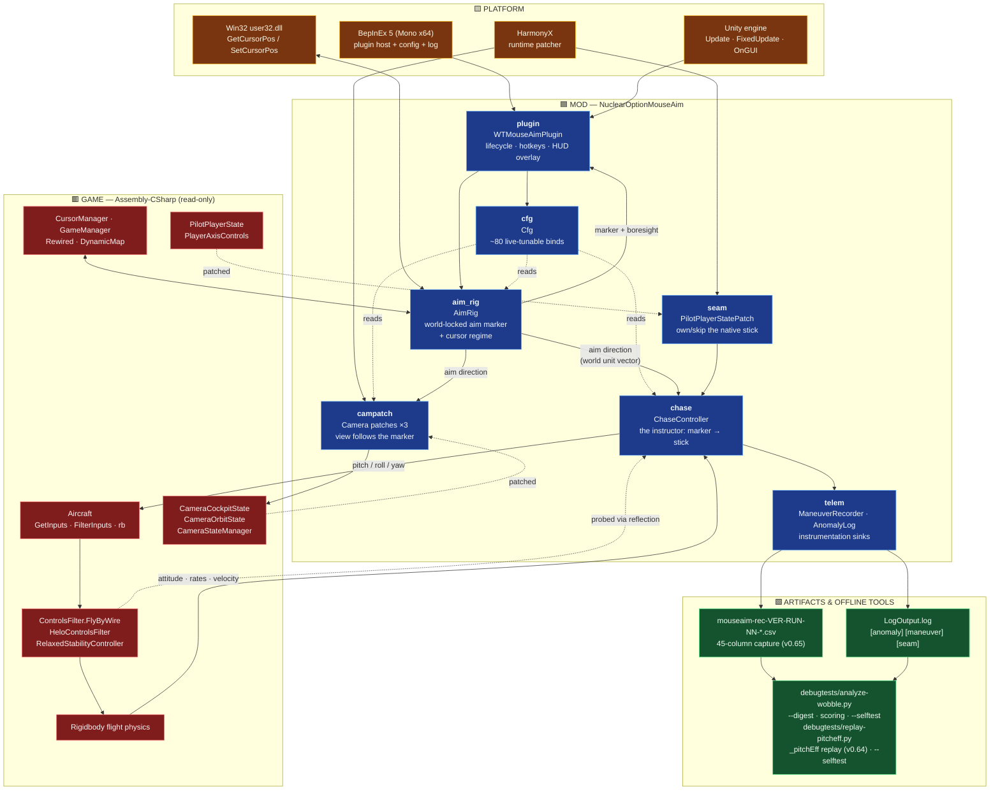
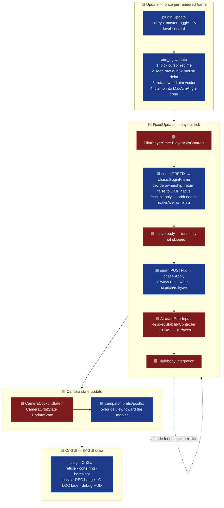
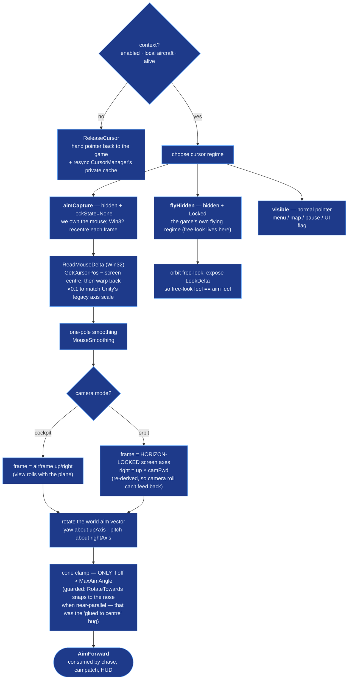
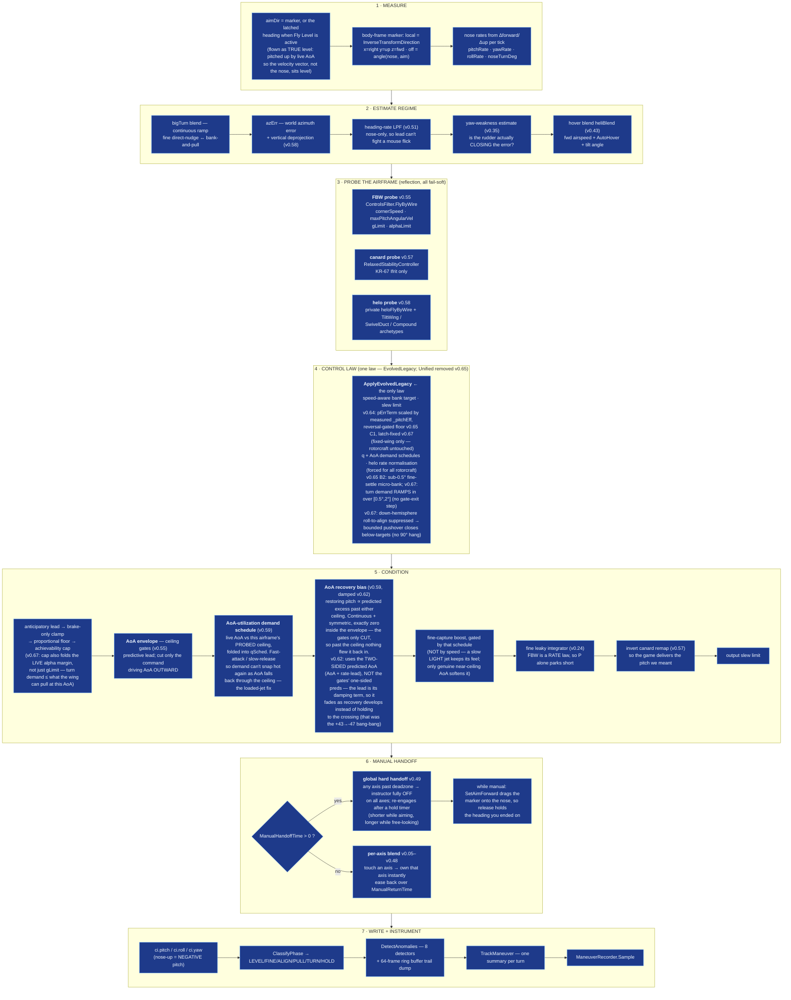
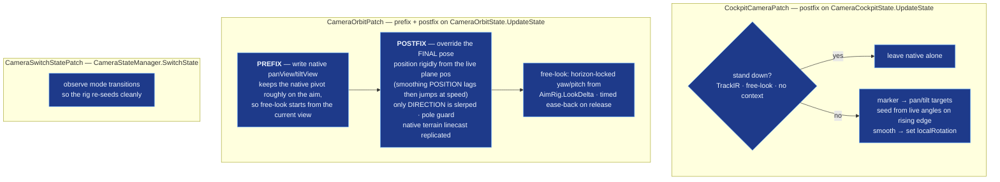
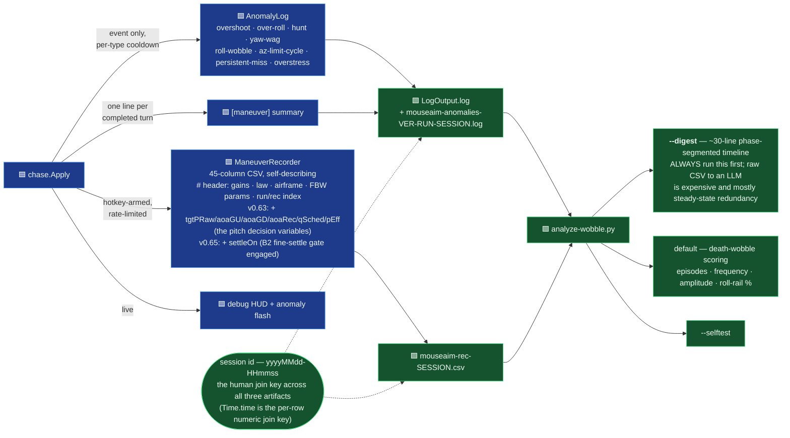
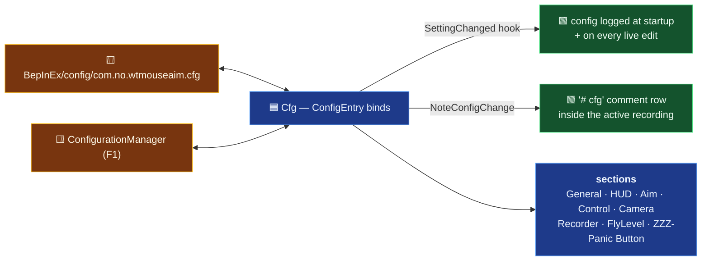

# Architecture — WT Mouse Aim

<!-- ARCH-VERSION: 0.68.0 -->

The system diagram for this mod. **L0** is the at-a-glance map; **L1** sections zoom into each box.
Every box carries a stable node id (`aim_rig`, `chase_apply`, …) — the [Node index](#node-index) maps
each id to the file and type that implements it, and that table is what keeps the diagram honest.

> **Agents: this file is part of the code.** When you change structure, add a subsystem, move a stage
> in the `Apply` pipeline, or add/remove a Harmony patch, update the matching L1 diagram and the node
> index in the *same* change. See [Keeping this current](#keeping-this-current).

**Colour convention, used in every diagram on this page:**

| | meaning |
|---|---|
| 🟦 **blue** | **Mod** — code in this repo |
| 🟥 **red** | **Game** — Nuclear Option `Assembly-CSharp` (read-only; we patch or read it) |
| 🟨 **amber** | **Platform** — Unity, BepInEx, Harmony, Win32 |
| 🟩 **green** | **Artifacts & offline tools** — logs, CSVs, the Python analyser |

---

## L0 — System map



**The one-sentence version:** the mouse moves a **world-locked point** in front of the aircraft
(`aim_rig`); an autopilot-like "instructor" (`chase`) computes the stick deflections that fly the
nose onto that point; a Harmony patch (`seam`) writes those deflections instead of the game's native
mouse-joystick input; the camera looks where the marker is (`campatch`); and everything the
instructor does is instrumented (`telem`) so misbehaviour is diagnosable offline rather than guessed at.

---

## L1.1 — Frame timeline (who runs when)

The single most load-bearing fact about this mod: **aiming and flying run on different clocks.**
The marker moves on the render frame (`Update`), the stick is written on the physics tick
(`FixedUpdate`), and the HUD draws in `OnGUI`.



**Why the prefix is conditional.** Returning `false` from the prefix skips the native body — which is
what stops the game's own mouse virtual-joystick from fighting us for the stick. But that same native
body also processes *view* axes, so skipping it in third-person killed free-look. Hence:
**skip native only in the cockpit**; in orbit let it run and simply overwrite the flight controls in
the postfix. Harmony runs postfixes even when a prefix skipped the original, so `Apply` always lands.

---

## L1.2 — `aim_rig`: the world-locked marker

The marker is **not** a joystick. It is a direction in *world space*. You place it; the aircraft flies
its nose onto it; the offset eases to zero on arrival. Nothing in the rig ever snaps it back to the
nose — the only two things that move it are the mouse nudge and the cone clamp.



**Why Win32 instead of Unity's mouse axis.** Unity's legacy `Mouse X/Y` is focus-gated — it stays dead
until the window receives a focus event (an alt-tab), so aiming was broken on a fresh launch. Reading
the OS cursor gives a true hardware delta from frame 1. The recentre-each-frame trick also means big
sweeps never clamp at the desktop edge. `lockState = None` during capture is essential: `Locked` would
let Unity warp the cursor too and zero our own delta.

**Writers of the aim vector** (there are only three, deliberately): the mouse nudge above; the cone
clamp; and `SetAimForward`, which the chase calls during manual flight so that releasing the stick
leaves the instructor holding the heading you ended on.

---

## L1.3 — `chase`: the instructor (the heart of the mod)

`ChaseController.Apply` is one pipeline per physics tick: measure → estimate regime → probe what the
airframe can do → pick a control law → condition the output → hand off to manual if the pilot is on
the stick → instrument.



### Why the probes exist

The mod does not model the aircraft — it **asks the game** what the aircraft can do, then commands only
that. The game's FBW reads pitch/yaw as a commanded **angular rate**, and that rate authority collapses
below corner speed; commanding more than the airframe can deliver is what produced the low-speed
oscillation and windup. Three airframe families need three different questions:

| probe | reads | fixes |
|---|---|---|
| **FBW** (v0.55) | `ControlsFilter.FlyByWire` public params + private `gLimit`/`alphaLimit` trio via `AccessTools` field refs | achievability cap + AoA ceiling |
| **canard** (v0.57) | `RelaxedStabilityController.canardRange` | KR-67 Ifrit's ~5.3 Hz fine-aim limit cycle — the game *replaces* pitch with a quadratic, locally-reversed remap before the FBW sees it, so the mod pre-inverts it |
| **helo** (v0.58) | private nested `heloFlyByWire` via `Traverse` + tilt/nozzle archetype components | rotorcraft rate normalisation; tilt angle drives the hover regime |

**Every probe fails soft.** A missing component, a disabled FBW, or a renamed field after a game update
leaves the probe not-ok and the previous version's behaviour exactly intact. That contract is
non-negotiable for new probes — reflection against game internals is the one part of this mod that a
patch can silently break.

**The FBW rate pair also feeds a measured signal (v0.60).** Beyond the static probe params, `Apply`
reads the FBW's *live* commanded-vs-achieved pitch rate (`GetTargetPitchAngVel` / `GetPitchAngVel` —
the same pair the recorder logs) and low-passes the **signed** ratio into `_pitchEff`, the pitch twin
of `_yawWeak`: fast-attack / slow-release so load, mush, density and damage all show up generically as
achieved &lt; commanded. **v0.64: the ratio is signed, not magnitude-only.** Through v0.63 both sides
were `Abs`'d, which blinded it to a REVERSED plant — the FS-12 departure case, where the airframe
pitches opposite the command at ~3x magnitude and the old estimator read a confident `1.00`. `Clamp01`
now floors a reversed plant to `0`. The noise gate stays on magnitude (gating on the signed command
would skip every nose-down frame). `ApplyEvolvedLegacy` (the only law) consumes it — it scales
`pErrTerm` by an `effFloor`-floored factor (fixed-wing only; the estimator is not measured for
`_collective`, so rotorcraft are untouched). **v0.65 C1: the floor is reversal-gated** — below a
`revThresh` (0.15) the floor is dropped and demand collapses to the measured near-0 value, so on a
reversed plant (`_pitchEff ≈ 0`) the law stops forcing 30% pitch into a plant moving the opposite way
(the sustained rec04/rec05 relay). Healthy and genuine low-q mush cases are byte-identical to v0.64.
**v0.67: the C1 floor could latch.** A gated-out command (`|cmd| < 0.05`, e.g. after C1 collapsed the
pitch to ~0) carries no information, and pure-holding `_pitchEff` there pinned a *transient* low-q mush
at ~0 forever — C1 kept pitch ×0, so the stick stayed ~0, so `cmd` stayed dead and it could never
re-measure (rec14 froze the pull ~4 s at railed bank). The dead-command branch now floors the estimate
at `Max(_pitchEff, revThresh)`: a latched-low estimate rises toward ~15% (the slow release tau) so the
pitch re-establishes a self-probe → `cmd > 0.05` → re-measure; a healthy estimate is untouched, so a
brief neutral stick never drags a good jet down. The v0.59 AoA recovery bias is scaled by it too,
unfloored — a reversed plant cannot be recovered by commanding more, and the traces show that term
sustaining the limit cycle. Fail-soft: holds its last value on any read miss (probe unavailable / manual
/ read error — distinct from the dead-command self-probe above, which only fires with a live FBW).

### The generality rule (the reason the probes carry so much weight)

**No per-airframe constants, ever.** Every gain, schedule and gate must key off either (a) a parameter
*probed from the game's own components* for the airframe being flown, or (b) *live physical state* —
dynamic pressure, AoA, measured rates and effectiveness. Loadout and mass are never constants; they
show up as achieved-vs-commanded discrepancy and must be handled that way.

A fix that only works because a tuned constant happens to suit one plane is **wrong even if it closes
the report**. Before shipping a control-law change, check it against a light jet at high q, a loaded
jet mushing near its alpha limit above corner speed, a low-limit STOL trainer, and a hovering helo.

This is what the v0.59 demand schedule is an instance of: `qSched` keyed off dynamic pressure *alone*,
so a loaded airframe needing high AoA to make its commanded G read as high-q while the plant was
actually mushing — gain stayed hot, the nose departed, and the gate plus damping relay-cycled it.
The fix folds *live* AoA against the *probed* ceiling into the same schedule, so it is airframe-
agnostic by construction. `GENERALITY-REVIEW.md` is the standing audit of the law against this rule.

---

## L1.4 — `campatch`: camera follow



**The v0.22 lesson encoded here:** steering the orbit camera purely through native `panView`/`tiltView`
left the view off the aim by up to ~25–33° of elevation-dependent error, because native's tilt orbits
the camera through an arm that already carries a built-in downward angle and *then* re-aims at the
plane. Not fixable with a better tilt formula. So the work is split: prefix keeps the native pivot
approximately right (for free-look hand-off), postfix overrides the final pose outright.

---

## L1.5 — `telem`: the instrumentation loop

Diagnostics here are **instrument-first** — the mod reports what it did rather than leaving you to
guess. This is the loop that turns "it felt wrong" into a number.



---

## L1.6 — `cfg`: configuration & live tuning



The tuning loop this enables: **fly → F1 → change a gain → feel it immediately → write the good value
back into `Cfg.cs` defaults.** A config change made mid-recording is stamped into the CSV, so a
recording always explains what it was flown with.

---

## Node index

The contract between the diagrams and the code. **Every `.cs` file and every top-level type in the
repo must appear here.** `debugtests/check-architecture.py` enforces exactly that.

| node id | implemented by | type(s) | role |
|---|---|---|---|
| `plugin` | `WTMouseAimPlugin.cs` | `WTMouseAimPlugin` | BepInEx entry point, hotkeys, IMGUI overlay, `PluginVersion` SoT, session id |
| `cfg` | `Cfg.cs` | `Cfg`, `ConfigurationManagerAttributes` | every config bind + F1 metadata |
| `aim_rig` | `AimRig.cs` | `AimRig`, `Guards` | world-locked marker, Win32 raw mouse, cursor regimes; `Guards` = "should the mod be passive" |
| `chase` | `ChaseController.cs` | `ChaseController` | the instructor: measure → estimate → probe → law → condition → handoff → write |
| `seam` | `ChaseController.cs` | `PilotPlayerStatePatch` | Harmony prefix/postfix on `PilotPlayerState.PlayerAxisControls` |
| `campatch` | `CameraPatches.cs` | `CockpitCameraPatch`, `CameraOrbitPatch`, `CameraSwitchStatePatch` | view follows the marker in cockpit + orbit |
| `telem` | `Recording.cs` | `ManeuverRecorder`, `AnomalyLog` | CSV capture + event-only anomaly sink |

### Game types we patch or read

| game type | how | where |
|---|---|---|
| `PilotPlayerState.PlayerAxisControls` | **patched** (prefix + postfix) | `seam` |
| `CameraCockpitState.UpdateState` | **patched** (postfix) | `campatch` |
| `CameraOrbitState.UpdateState` | **patched** (prefix + postfix) | `campatch` |
| `CameraStateManager.SwitchState` | **patched** (prefix + postfix) | `campatch` |
| `ControlsFilter.FlyByWire` | read via `AccessTools` field refs | `chase` FBW probe |
| `HeloControlsFilter.heloFlyByWire` | read via `Traverse` (private nested) | `chase` helo probe |
| `RelaxedStabilityController` | read via `AccessTools` field refs | `chase` canard probe |
| `TiltWingController`, `SwivelDuctSystem`, `CompoundHeloController` | `GetComponentInChildren` | `chase` archetype fingerprint |
| `CursorManager.visible` | read **and written** via reflection | `aim_rig` cache resync |
| `Aircraft`, `GameManager`, `CameraStateManager`, `Rewired`, `DynamicMap`, `RadialMenuMain`, `NuclearOption.UI.LeaderboardMenu`, `TargetCalc`, `PlayerSettings` | public API | various |

---

## Sign conventions

Verify against the decompiled source before changing any of these.

| quantity | convention |
|---|---|
| `local` | `InverseTransformDirection(aimDir)` — x = right, y = up, z = forward |
| `ci.pitch` | **nose-up = NEGATIVE** |
| `ci.roll` | positive = roll right |
| `ci.yaw` | positive = yaw right |
| `azErr` | positive = marker right of heading |
| `t.right.y` | negative = right wing down |
| FBW pitch/yaw | a commanded **angular rate**, not a deflection |

---

## Keeping this current

This diagram rots the moment code moves, and a stale map causes wrong-file edits. Three mechanisms,
weakest to strongest:

**1. The rule (in `CLAUDE.md`).** Structural changes update `ARCHITECTURE.md` in the *same* change —
same standing rule as `CLAUDE.md` itself. "Structural" means: a file added/removed/renamed; a
top-level type added/removed; a Harmony patch added/removed/retargeted; a stage added, removed, or
reordered in the `Apply` pipeline; a new game type read by reflection; a new artifact or offline tool.

**2. The checker (runs in seconds).**

```
python debugtests/check-architecture.py          # verify
python debugtests/check-architecture.py --fix-version   # sync the version stamp only
```

It fails if a `.cs` file or top-level type is missing from the node index, if the index names a type
that no longer exists, if a `[HarmonyPatch]` target isn't listed in the game-types table, or if the
`ARCH-VERSION` stamp has drifted from `PluginVersion`. It is stdlib-only and needs no game install —
same contract as the other tools in `debugtests/`.

**3. The gates.** Two, so this doesn't rely on anyone remembering:
- a **Stop hook** in the committed `.claude/settings.json` runs the checker when an agent finishes a
  turn and feeds any drift back to it (exit 2) before it can hand back — silent when clean, and
  end-of-turn rather than per-edit so a multi-step refactor isn't nagged mid-flight;
- **`release.ps1`** runs the checker before it builds, so a drifted diagram can't ship.

**When the checker passes but the diagram is still wrong** — a reordered pipeline stage, a changed
signal name, a law that now does something different — the checker cannot see that. Re-read the L1
section you touched. The node index is mechanically enforceable; the prose and the arrows are not.
